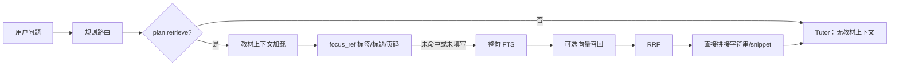

# MathStudyAgent v2.1｜架构图说明

这份说明配合 `MathStudyAgent v2.1｜问题-教材检索-反馈闭环.canvas` 使用，面向不熟悉代码的读者。

## 建议阅读顺序

先从 Canvas 左上角开始，沿主线向右阅读：学生提问 → 上下文 → 路由 → 教材筛选 → 数学回答 → 反馈。

然后分别查看四个重点：

1. `③ 路由与执行计划`：Agent 如何决定本轮要做什么。
2. `② Agent 上下文`：Agent 如何记住当前会话和上一轮内容。
3. `④ 教材进入系统` + `⑤ 每轮教材筛选`：教材如何被解析、索引、定位和筛选。
4. `⑥ 数学回答与验证` + `⑦ 输出、记录与反馈`：回答如何检查、保存和接受反馈。

## 关键术语的非技术解释

- 路由：决定这轮问题是直接解释、组合讲解，还是进入复杂证明/习题流程。
- 上下文：Agent 为了理解当前问题而读取的历史、当前页面、教材片段和会话状态。
- 精确定位：先按用户给出的定理、引理、标题或页码找原文。
- 混合召回：精确搜索、全文搜索和语义搜索一起找候选教材块，再合并排序。
- 硬门槛：发现数学错误、关键证明缺口、答非所问或教材事实无证据时，当前候选不能直接交付。
- 定向修正：只修正发现的问题，不把整份回答全部重写。

## 当前与设计层的区分

Canvas 中的实线内容来自交接文档和项目状态；带“当前实现与设计层需继续核对”或“⚠️”的内容，表示设计计划提出了机制，但现有可见代码还需要逐项确认接线范围。

目前特别需要保留的不确定项：

1. 结构化模型 Router 是否已经完整接入，还是当前主要使用确定性规则下限。
2. 设计中的完整 `SourceResolver` 候选/置信度/断言权限模型，与运行时实际返回的教材上下文之间的对应程度。
3. 多个风险评价器、硬门槛和定向重写是否全部已在 v2 默认路径中启用。
4. 用户反馈目前确定会入库和供质量检查查看，但没有证据表明它会自动训练 Agent 或即时修改 Prompt。

## 权威来源

- 工作区：`D:\MathStudyAgent\HANDOFF.md`
- 工作区：`D:\MathStudyAgent\V2_DESIGN_PLAN.md`
- 工作区：`D:\MathStudyAgent\PROJECT_STATE.md`
- 工作区：`D:\MathStudyAgent\DECISIONS.md`

本次只创建 Canvas 和说明笔记，没有修改 MathStudyAgent 的代码、数据库、配置、Windows 任务或服务。

