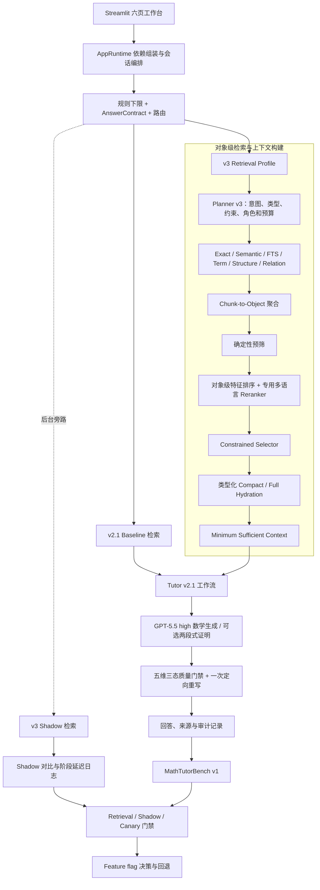
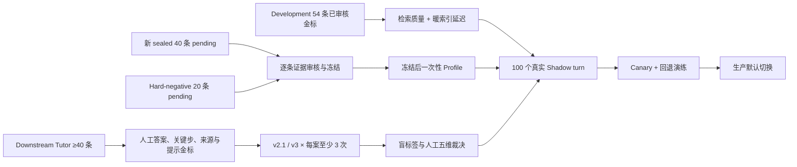

# MathStudyAgent v3.0｜架构说明

> [!summary] 文档定位
> 本文说明 MathStudyAgent v3.0 已落地的运行架构、检索与教学链路、评测证据链及发布边界。设计目标与实验方案见 [[MathStudyAgent v3.0｜智能检索重构与量化实验计划]]；development 冻结结果见 [[MathStudyAgent v3.0｜检索冻结验收报告 2026-08-20]]；Phase 3/4 状态见 [[MathStudyAgent v3.0｜Phase 3-4 端到端评测与 Shadow 进展 2026-08-20]]。v2.1 的历史结构可参照 [[MathStudyAgent v2.1｜架构图说明]]。

<!-- ai_provenance: source=codex; date=2026-08-20; verification=source-backed; retrieved_notes="content/非笔记内容/工作流程与系统运维/MathStudyAgent/MathStudyAgent v3.0｜智能检索重构与量化实验计划.md" -->

## 1. 架构结论

v3.0 不是在 v2.1 上继续堆叠检索通道，而是把“找到若干相关片段”重构为一条可审计的正确性链：

```text
学习提问
  → 规则下限与回答合同
  → Planner v3
  → 多通道候选召回
  → Chunk-to-Object 聚合
  → 对象级预筛与精排
  → 受约束动态选择
  → 类型化 Hydration
  → 最小充分上下文
  → Tutor 生成与质量门禁
  → 版本化评测、Shadow、Canary
```

核心变化有四项：

1. **排序身份由 chunk 变为数学对象。** Chunk 仍是不可变证据单元，但 Definition、Theorem、Proof、Example 等对象才是聚合、精排、选择和预算控制的主体。
2. **最终上下文由固定 Top-K 变为受约束集合。** Primary 与 Support 分离，第二、第三个对象只有在边际信息增益足够时才加入。
3. **回答质量由单次生成变为可验证流程。** 数学正确性、证明实质、核心目标、来源忠实度和教学策略分别判定，`unavailable` 不得视为通过。
4. **发布由功能开关变为证据门禁。** Development、sealed、hard-negative、下游 Tutor、Shadow 和 Canary 各自保留不可替代的证据边界。

## 2. 总体运行架构



当前生产边界是：正常回答仍走 baseline；v3 可以在评测 Profile 中显式运行，并通过 Shadow 在后台旁路执行。Shadow 不修改 Working Set、不改变回答，也不把后台选择注入 Tutor。

## 3. 分层职责

| 层 | 主要职责 | 关键边界 |
| --- | --- | --- |
| Streamlit UI | 教材管理、定位、检索调试、学习对话、质量检查、模型日志 | 页面只编排工作流，不绕过冻结与运行时校验 |
| Runtime | 组装数据库、Provider、检索、Tutor、评测与会话依赖 | 统一入口，避免页面各自创建不一致链路 |
| Policy / Routing | 规则下限、AnswerContract、是否检索、回答层级和提示策略 | Planner 不得弱化教学规则或直接回答数学内容 |
| Retrieval Planning | 生成完整语义查询、目标类型、正负约束、范围、角色与停止条件 | 不直接指定最终对象，不依据评测 case ID 写特殊规则 |
| Candidate Retrieval | Exact、Semantic、FTS、术语、结构与关系候选 | Semantic 负责语义与跨语言；FTS 负责原词、公式和精确短语 |
| Object Decision | 聚合、硬预筛、精排、动态选择、拒选与一次补检索 | 低置信候选不因填满预算而注入 |
| Evidence Hydration | 按对象类型装载 compact/full 证据并保留原始 block 映射 | 检索摘要不是教材引用来源 |
| Tutor / Quality | 单段或两段式数学生成、五维检查、一次定向重写、失败降级 | 数学正式结论不得静默降级给工具模型 |
| Evaluation / Release | 金标、盲评、版本指纹、Shadow、Canary、回退 | Development 通过不能替代未污染 sealed 与真实流量证据 |
| Persistence / Audit | SQLite、FTS5、Embedding cache、对象关系、运行与裁决记录 | 冻结数据只读；旧指纹运行不混入当前门禁 |

## 4. Planner v3 合同

`RetrievalPlanV3` 把查询理解从“关键词生成”提升为“检索意图规划”。计划至少表达：

- 是否需要教材检索；
- `exact_reference`、`semantic_discovery`、`similar_objects`、`dependency_lookup` 或 `comparison` 模式；
- 1–3 个保留数学语义的 Semantic query 及其角色；
- 目标对象类型、概念、关系意图和教材范围；
- required / negative constraints；
- Primary / Support 数量范围；
- 置信度、歧义原因和停止条件。

Exact reference、页码、标签和 Working Set 指代优先。唯一精确命中可以直接结束；精确解析失败或存在多个对象时，才进入受限 Semantic 消歧。关系边只能提供候选，不构成自动注入许可。

## 5. 对象级检索链

### 5.1 证据对象模型

底层解析产物仍以不可变教材 block 保存。对象注册表把连续或相关 block 组织成稳定对象：

- Definition；
- Theorem / Lemma / Proposition / Corollary；
- Proof；
- Example / Exercise；
- Remark 等辅助对象。

每个对象保存稳定 ID、类型、标签、章节、源 block 映射和边界置信度；对象之间可以记录 `prerequisite_of`、`uses`、`proves`、`illustrates` 等关系。删除、更新和重建通过版本化 manifest 与事件记录保持可追溯。

### 5.2 候选生成与聚合

Semantic 是模糊概念、机制、相似对象和跨语言检索的主召回；Exact、FTS、术语、结构和关系通道提供互补证据。多个 query、多个通道和同一对象的多个 chunk 先合并成对象候选，再计算：

- best / mean semantic score；
- query-role coverage；
- exact、FTS、term、relation 支持；
- 对象类型与目标类型的一致性；
- required / negative constraints 覆盖；
- anchor、章节与 Working Set 距离；
- 边界质量、冲突风险和重复程度。

确定性预筛只执行安全规则：保护唯一 exact、删除无对象身份的无效块、对象去重，以及应用类型和范围硬约束。

### 5.3 精排与动态选择

常规排序使用对象级特征。跨语言且确定性 Top-2 分差小于阈值时，对 compact object view 调用 `Qwen/Qwen3-Reranker-8B` 做 final selector；超时或失败时保持确定性结果。旧的 DeepSeek Flash listwise 默认关闭，只保留离线 bake-off / judge 用途。

Selector 不简单截取 Top-K，而是同时考虑相关性、角色覆盖、冗余、冲突与上下文成本。输出状态包括：

```text
resolved
ambiguous
unresolved
missing_dependency
```

显式单数提问优先限制为一个 Primary。低置信时最多允许一次指定缺失类型和概念的补检索；仍不足则返回澄清或 unresolved，不把“最不差”的对象强行注入。

### 5.4 Selective Hydration

Hydration 只发生在选择之后：

| 对象类型 | 默认装载内容 |
| --- | --- |
| Definition | 精确定义与必要符号 |
| Theorem / Lemma | 名称、假设、结论；默认不装载证明全文 |
| Example / Exercise | 条件、核心构造和关键结论 |
| Proof | 目标、关键技巧和 proof skeleton；需要时再加载全文 |
| Support | compact representation，默认不加载其证明 |

上下文同时受 Primary 数、Support 数和字符/token 预算约束。正常数学问答原则上不注入超过三个完整外部对象；比较、综述和多跳任务必须由 Planner 明确声明，并进入独立评测切片。

## 6. Tutor 与答案质量链

Tutor v2.1 的规则下限继续保留。AnswerContract 先确定目标、已知条件、允许提示层级、是否要求证明和教材证据需求，然后检索结果才进入生成阶段。

数学主生成由 Codex 订阅中的 `GPT-5.5 high` 承担；DeepSeek 只处理路由、状态和非数学辅助任务。严格模式下，数学生成不可静默切换到 DeepSeek。证明任务可采用“先构造、后独立检查”的两段式流程。

可选质量门禁把答案拆成五个独立维度：

1. 数学正确性；
2. 证明实质性；
3. 核心目标完成度；
4. 来源忠实度；
5. 教学策略合规性。

每维只能为 `passed`、`failed` 或 `unavailable`。失败时只允许一次定向重写，随后独立复核；仍失败或不可用时输出有限降级答案。该能力由 `TUTOR_QUALITY_GATE_ENABLED` 控制，目前生产默认关闭，等待下游盲评确认收益、成本和稳定性。

## 7. 数据、缓存与审计

| 数据域 | 主要内容 | 架构用途 |
| --- | --- | --- |
| 教材与 block | PDF 解析结果、章节、页码、不可变证据块 | 唯一可引用的教材事实来源 |
| 对象注册表 | TextbookObject、关系、manifest、对象事件 | 稳定检索身份与可回放边界 |
| Lexical index | SQLite FTS5、术语与结构索引 | 精确短语、公式、作者用语和低成本回退 |
| Embedding index | 三本教材的 Qwen3-Embedding-8B 向量及版本 manifest | Semantic 主召回 |
| Query cache | 按模型、维度和 query hash 持久化的查询向量 | 暖索引回放与跨进程复用 |
| Retrieval evaluation | 数据集、case、gold 角色、run、候选 trace、审核意见 | Development / sealed / hard-negative 门禁 |
| Tutor evaluation | dataset、case、run、blind label、人工裁决与证据包 | MathTutorBench v1 端到端门禁 |
| Provider audit | 模型调用、耗时、错误与经过清理的响应元数据 | 成本、失败和延迟归因 |

数据库迁移已到 Alembic `0016`。MathTutorBench 的答案、注入对象、运行 profile、重复序号、盲标签、延迟和证据包以不可变快照保存；Prompt、config、code 三项 SHA-256 指纹不一致的旧运行不会进入当前报告。

## 8. 评测与发布架构



严格门禁的证据不能互相替代：

- Development 用于诊断和调参；
- Historical holdout 只保留历史记录，不能重新充当 sealed；
- 新 sealed 与 hard-negative 必须先人工批准和冻结，再运行检索；
- 下游 Tutor 必须使用人工金标、真实注入证据和盲评裁决；
- 模型 judge 只能辅助，不能代替人工数学裁决；
- Shadow 只观察真实流量差异，达到数量后仍需人工检查新增硬失败；
- Canary 必须具备 feature flag 和可验证回退路径。

## 9. 调试台对应的证据工作流

### 9.1 检索测试台

检索调试按六步组织：

1. 即时运行真实检索链；
2. 把问题和人工确认对象写入 draft / pending case；
3. 审核教材证据、Primary、Acceptable、Forbidden、预算和说明；
4. 批量预热后运行 v3、Semantic、AI+FTS 或 default Profile；
5. 逐候选查看 gold 角色、对象类型、reranker、特征、入选/淘汰原因与阶段耗时；
6. 查看冻结门禁、自动失败阶段并保存 run 审核意见。

Sealed 数据集必须遵循：人工复核意见 → 全量 approved → freeze → prewarm / Profile。页面和后端共同拒绝提前运行；冻结后金标只读。

### 9.2 质量检查页

MathTutorBench 按五步组织：收集案例、审核金标、记录运行、盲评裁决、严格门禁。Approved case 可以自动采集 `v2.1 / v3 × 3`，支持按 case、profile、repeat 和代码版本幂等续跑。盲评页显示人工 gold 与实际证据包，但隐藏系统 profile；Context Utilization 必须由人工从实际注入对象中勾选，不能依赖模型自报。

### 9.3 Shadow 面板

Shadow 记录 baseline/v3 run ID、选择对象、resolution、选择是否变化、总延迟和阶段延迟。它不修改回答或 Working Set。达到 100 条只代表样本量门槛满足，不自动解锁 Canary。

## 10. Feature flags 与失败策略

| 开关 | 作用 | 当前发布含义 |
| --- | --- | --- |
| `TEXTBOOK_OBJECT_REGISTRY_ENABLED` | 对象注册表进入主检索 | 未完成 sealed 前不作为生产默认 |
| `TEXTBOOK_SEMANTIC_FUSION_ENABLED` | Semantic 与其他通道融合进入主链 | 未完成 sealed 前不作为生产默认 |
| `TEXTBOOK_RELATION_EXPANSION_ENABLED` | 关系边补充候选 | 必须独立验证，不允许无锚点扩展 |
| `TEXTBOOK_DEDICATED_RERANKER_ENABLED` | 专用对象精排 | Development 已验证跨语言歧义路径 |
| `TEXTBOOK_LLM_RERANKER_ENABLED` | LLM listwise 精排 | 默认关闭，仅离线实验 |
| `TUTOR_SUPPLEMENTAL_RETRIEVAL_ENABLED` | 一次受控补检索 | 等待端到端独立验收 |
| `TUTOR_QUALITY_GATE_ENABLED` | 五维三态答案门禁 | 当前关闭，等待盲评 |
| `TEXTBOOK_V3_SHADOW_ENABLED` | 后台旁路运行 v3 | 当前实际环境已开启，进度仍需真实流量积累 |

关键失败策略：

- Embedding 不可用时安全回退 FTS5，并明确记录降级原因；
- 专用 reranker 超时或失败时保留确定性排序；
- LLM 输出只能选择白名单 object ID，结构化失败不得生成新对象；
- 不满足置信度时返回 ambiguous / unresolved，不以填满预算掩盖失败；
- 质量维度不可用时不得标记为通过；
- 版本指纹变化后旧运行保留审计，但不进入新门禁。

## 11. 代码地图

| 路径 | 职责 |
| --- | --- |
| `src/math_tutor/services/runtime.py` | 依赖组装、正常回答、评测与 Shadow 编排 |
| `src/math_tutor/textbook_search/query_planner.py` | Planner v3 查询与约束生成 |
| `src/math_tutor/textbook_search/service.py` | 多通道召回、对象聚合、Profile 与 trace |
| `src/math_tutor/textbook_search/object_registry.py` | 对象注册、稳定身份和 manifest |
| `src/math_tutor/textbook_search/ranker.py` | 对象级特征、精排与动态选择 |
| `src/math_tutor/textbook_search/hydrator.py` | 类型化 compact/full Hydration |
| `src/math_tutor/textbook_search/evaluation.py` | 检索数据集、指标和门禁 |
| `src/math_tutor/textbook_search/eval_runner.py` | Profile 回放、预热与运行证据 |
| `src/math_tutor/textbook_search/evaluation_authoring.py` | Sealed / hard-negative 作者队列 |
| `src/math_tutor/tutor_v2/workflow.py` | Tutor 主流程 |
| `src/math_tutor/tutor_v2/quality_gate.py` | 五维三态门禁、定向重写与复核 |
| `src/math_tutor/tutor_v2/benchmark.py` | MathTutorBench 批量运行与续跑 |
| `src/math_tutor/db/schema.py` | 对象、评测、Provider 与会话数据模型 |
| `src/math_tutor/ui/pages/retrieval_lab.py` | 检索调试、金标、Profile、trace 与冻结门禁 |
| `src/math_tutor/ui/components/tutor_benchmark.py` | 下游案例、盲评与端到端门禁 |

## 12. 当前验收状态

截至 2026-08-20，架构实现与发布验收必须分开描述：

| 范围 | 状态 | 证据 |
| --- | --- | --- |
| Development 检索质量 | 通过 | 54 条：Recall 1.000、Top-1 0.889、Top-2 0.944、NDCG@5 0.942、Context Precision 0.880、预算 1.000、Forbidden / Duplicate 为 0 |
| GTM 259 跨语言切片 | 通过 | 17 条质量指标全部 1.000 |
| 暖索引延迟 | 通过 | Semantic base p95 344.278 ms；歧义 selector p95 2458.57 ms；触发率 5.56% |
| 公网冷 query 延迟 | 未通过生产口径 | 首次远程 Embedding 仍受供应商网络延迟影响 |
| 新 sealed retrieval 40 | 待人工 | 40 条 pending、0 run；必须逐条审核后冻结 |
| Hard-negative 20 | 待人工 | 20 条 pending、0 run；全部包含 Forbidden confuser |
| Downstream Tutor | 待人工与运行 | 当前真实会话草案 7 条，0 approved、0 run；正式门槛至少 40 条 |
| Shadow | 待真实流量 | 开关已启用，仍需累计并审计 100 个真实 turn |
| Canary / production 默认切换 | 未开始 | 依赖 sealed、下游盲评、Shadow 和回退演练 |

因此，v3.0 可以称为“架构与 development 检索门禁完成，发布证据链待闭环”，不能称为生产默认检索或端到端数学正确率已经提升。

## 13. 架构不变量

后续修改必须保持以下约束：

1. 规则下限不能被 Planner、检索结果或模型判断削弱。
2. 教材事实只能追溯到不可变 source block；summary 和 compact view 只能帮助检索与选择。
3. 对象选择必须保留候选、特征、理由、耗时和版本 trace。
4. `unavailable` 永远不等于 `passed`。
5. Sealed 必须先冻结、后运行，不能通过页面外接口绕过。
6. Shadow 永远不能修改回答、Working Set 或正常 Tutor 使用记录。
7. 模型 judge 只能辅助，人工金标和裁决仍是发布依据。
8. 不允许针对具体评测问题或 case ID 增加 boost。
9. Feature flag 的开启必须有对应证据、回退方案和版本化报告。

## 14. 维护入口

架构状态发生变化时，按以下顺序更新记录：

1. `D:\MathStudyAgent\PROJECT_STATE.md`：当前事实与门禁状态；
2. `D:\MathStudyAgent\HANDOFF.md`：接手动作、命令和未完成事项；
3. 对应 `docs/v3-*.md` 机器验收或阶段报告；
4. 本笔记的架构边界、Feature flags 与“当前验收状态”；
5. 检索测试台或质量检查页中的数据集说明、审核提示和失败阶段。

若代码、Prompt 或配置发生变化，应生成新指纹并重新运行相应门禁；旧结果只保留审计价值，不继续代表当前版本。
