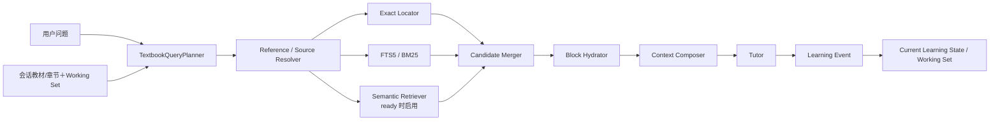

# 教材搜索 v1.0 方案

> v1.0 的目标是搭建教材搜索与 Working Set 的基本框架，修复当前最主要的断路，并为后续语义检索和学习进度理解保留稳定接口。本文是第一轮实施规格，不等于最终架构。

<!-- ai_provenance: source=codex; date=2026-08-11; verification=source-backed; retrieved_notes="教材搜索问题的解决.md, 当前系统问题.md" -->

相关文档：[[教材搜索问题的解决-方案总览]]、[[教材搜索问题的解决]]、[[当前系统问题]]。

## 1. v1.0 要解决的问题

当前默认 v2 链路存在以下直接故障：

1. `SourceRequirement` 依赖少量关键词，用户说“课本、书上、原题”时可能完全不启动检索。
2. 规则提取出的 `intent.target_reference` 没有传给教材检索器；只有用户手动填写 UI 的 `focus_ref` 才会尝试精确定位。
3. 检索器没有接收会话 `chapter_id`，无法利用当前章节和小节。
4. FTS 把整条问题作为精确短语，没有查询拆解和 BM25 排序。
5. 纯 FTS 命中后只向 Tutor 提供很短的 snippet，没有回读完整教材块和必要邻域。
6. 没有结构化来源状态，无法区分精确命中、多个候选、语义相似和未解析。
7. 当前教材有结构化块和 FTS，但语义索引可能为 0；系统没有稳定表达索引是否可用或过期。
8. 系统没有持久化的当前小节、活跃知识点和 Working Set，后续指代只能依赖整段对话历史。

v1.0 的完成标准不是“所有关联知识都能搜得很好”，而是：

> 精确引用和自然教材表达能够稳定触发搜索；搜索结果具有明确来源状态；Tutor 获得完整且受预算控制的教材上下文；系统开始保留当前学习位置和活跃知识对象；语义检索拥有正式接口和可观测的降级路径。

## 2. v1.0 范围

### 2.1 必须实现

- `TextbookSearchRequest`、`ResolvedSource`、`SearchContext` 等结构化协议；
- 检索触发、目标引用和章节信息的正确接线；
- 用户粘贴原文识别；
- focus、精确标签、页码、标题定位；
- 查询拆解后的 FTS5 / BM25；
- 完整教材块与邻域回读；
- 简单的候选融合、去重和上下文预算；
- Current Learning State 与基础 Working Set；
- 现有 Semantic Retriever 的统一接口、索引健康状态和安全降级；
- 检索 trace 与原始失败案例回归测试。

### 2.2 v1.0 不要求完整实现

- 高质量“相似例子/相关定理”语义排序；
- 完整知识图谱或 Dependency Retriever；
- 自动、精细、长期稳定的掌握度评估；
- 多教材和个人笔记联合检索；
- 专用 reranker；
- Tutor 自主多轮工具调用。

这些能力必须在总览架构中保留，但不能阻塞第一轮基本闭环。

## 3. v1.0 主流程



正常问题不需要为每一个框调用模型。v1.0 首选规则、解析器和数据库查询；只有查询无法被可靠拆解时，才预留结构化模型 Query Planner。

## 4. 核心数据结构

### 4.1 TextbookSearchRequest

```python
class TextbookSearchRequest(BaseModel):
    should_retrieve: bool
    source_requirement: SourceRequirement
    intent: str

    book_id: str
    chapter_id: str | None
    section_ref: str | None

    focus_ref: str | None
    target_references: list[str]
    reference_expressions: list[str]
    user_quotes: list[str]

    object_types: list[str]
    lexical_terms: list[str]
    semantic_query: str | None
    scope: str
    reason_codes: list[str]
```

触发规则至少覆盖：

- “教材、课本、书中、书上、原文、原题、文中、这一页、这段”；
- 已绑定教材中的结构化引用：`Exercise 2.1.5`、`Theorem 3.2`、`p.34` 等；
- 用户要求比较“课本上的例子/证明/定义”；
- UI 明确提供 focus；
- 当前问题包含可识别的教材题干引用。

`source_requirement` 和 `should_retrieve` 独立计算。即使回答主要依靠一般数学，只要问题明确锚定教材对象，也可以执行检索。

### 4.2 SourceCandidate 与 ResolvedSource

```python
class SourceCandidate(BaseModel):
    source_id: str
    block_id: str | None
    source_type: str
    score: float
    page: int | None
    raw_label: str | None
    canonical_label: str | None
    object_type: str | None
    chapter_id: str | None
    section_ref: str | None
    confidence: str
    reasons: list[str]


class ResolvedSource(BaseModel):
    status: str  # resolved / ambiguous / unresolved
    selected: SourceCandidate | None
    candidates: list[SourceCandidate]
    confidence: str
    mathematical_statement_complete: bool
    supports_book_facts: bool
    author_intent_support: str
```

### 4.3 SearchContext

Tutor 不再接收一个没有状态的字符串，而是接收结构化结果：

```python
class SearchContext(BaseModel):
    request: TextbookSearchRequest
    resolved_source: ResolvedSource
    active_blocks: list[ContextBlock]
    available_candidates: list[SourceCandidate]
    rendered_context: str
    warnings: list[str]
    index_status: dict[str, str]
```

工作流仍可先把 `rendered_context` 放入 Prompt，但 trace 和后续质量检查应保留完整结构。

## 5. Current Learning State 与基础 Working Set

v1.0 必须建立一个保守但真实可用的学习状态层。

### 5.1 CurrentLearningState

```python
class CurrentLearningState(BaseModel):
    session_id: str
    book_id: str
    chapter_id: str | None
    section_ref: str | None
    focus_object_id: str | None
    active_concepts: list[ConceptState]
    recent_source_ids: list[str]
    open_questions: list[str]
    updated_at: datetime
```

当前章来自会话绑定；当前小节优先来自精确命中块的 `heading_path`，其次来自最近一次高置信来源。不得在没有证据时静默选择整本书的第一个块。

### 5.2 ConceptState

```python
class ConceptState(BaseModel):
    concept_id: str
    label: str
    mastery_level: str       # unknown / exposed / developing / usable / stable
    confidence: float
    evidence_ids: list[str]
```

v1.0 只执行保守更新：

- 成功定位并讨论某对象：相关知识点至少进入 `exposed`；
- 用户明确表示仍不理解：可以记录 `developing` 或未解决卡点；
- 用户明确给出正确解释或完成题目：新增正向 evidence，但不直接跳到 `stable`；
- 没有明确证据时保持 `unknown`，不让模型凭印象升级或降级。

### 5.3 Working Set

v1.0 的 Working Set 建议限制为最多 20 项，并按角色分组：

- 1 个 `focus`；
- 最多 6 个 `active` 知识对象；
- 最多 6 个 `support` 对象；
- 最多 5 个 `recent` 对象；
- 最多 2 个 `open_question`。

条目激活分数由以下确定性因素组成：

- 是否是本轮精确来源；
- 是否位于当前小节；
- 是否最近被用户或 Tutor 明确提及；
- 对象类型是否符合本轮问题；
- 是否是当前对象的直接邻域。

v1.0 暂不依赖 embedding 计算 Working Set 激活度。

## 6. Query Planner 与检索触发

### 6.1 规则下限

先扩充并修正确定性规则：

1. 教材自然表达触发检索；
2. 精确编号在已绑定教材的会话中直接触发；
3. `intent.target_reference` 必须进入 SearchRequest；
4. 中文“这个、那个、这里、刚才、前面”不能依赖英文单词边界 `\b`；
5. 指代存在但 Working Set 无唯一候选时，将 resolution 标为 ambiguous；
6. 用户粘贴完整题目时登记 `user_quote`，不必等待教材定位成功才能解释题目。

### 6.2 查询拆解

对原始问题提取：

- 精确标签：`Exercise 2.1.5`；
- 对象类型：exercise / example / theorem；
- 英文术语和稳定数学符号；
- 中文概念词；
- 用户真正要求的关系，例如“类似例子”“相关定理”；
- 当前章节和小节。

不要把所有自然语言词都送入 FTS。停用词、礼貌表达和“还有什么”等请求词不应成为精确短语的一部分。

## 7. v1.0 检索器

### 7.1 Exact Locator

执行顺序：

1. 用户指定 focus；
2. `target_references` 中的规范化标签；
3. 页码；
4. 标题和 heading path；
5. 精确短语。

唯一且高置信精确标签直接成为 selected source。若 `Ex. 1.1` 无法根据块类型或小节标题消歧，应返回多个候选。

### 7.2 FTS5 / BM25

修改 repository，使其接收受控的查询计划，而不是始终把原问题包装为单一精确短语。

v1.0 至少支持：

- exact phrase；
- token AND/OR 组合；
- prefix；
- 必要的 NEAR；
- `ORDER BY bm25(document_blocks_fts)`；
- book 过滤；
- chapter/section 作为排序偏置。

SearchHit 必须返回 `block_id`、BM25 分数和用于调试的 snippet。snippet 不直接作为最终教材上下文。

### 7.3 Semantic Retriever

v1.0 继续使用现有 embedding service 和持久化向量，但放入统一 Retriever 接口：

```python
class Retriever(Protocol):
    async def search(self, request: TextbookSearchRequest) -> list[SourceCandidate]: ...
```

v1.0 行为：

- `ready`：执行 dense top-k，候选标记为 `semantic_match`；
- `missing` 或 `stale`：记录 warning，继续 exact＋BM25；
- `failed`：记录失败状态，不阻断回答；
- 精确标签已经高置信解决时，不为“证明已经找到”而无意义调用向量服务；
- 用户请求“类似例子/相关定理”时，即使存在精确锚点，也可以用该锚点正文生成 semantic query。

v1.0 暂不承诺语义检索质量已经达到生产标准，但接口、状态、候选类型和 trace 必须完整，以便 v1.1 直接升级。

## 8. 候选融合

v1.0 采用简单、可解释的优先级，不急于引入专用 reranker：

```text
唯一高置信 exact label
> 用户明确 focus
> 当前小节内 exact phrase
> 当前章节 BM25
> 整本书 BM25
> 通过最低门槛的 semantic candidate
```

需要融合时使用加权 RRF，但 exact 结果拥有更高权重。附加排序特征包括：

- 当前小节一致；
- 当前章节一致；
- 请求对象类型一致；
- 在 Working Set 中；
- 与已选候选重复。

语义分数的最低门槛先作为可配置项，并在 v1.1 的本地评测集中校准。低置信语义候选可以出现在 available candidates 中，但不能支持精确教材事实声明。

## 9. Block Hydrator 与 Context Composer

### 9.1 Hydrator

数据库 repository 增加：

```text
get_many(block_ids)
get_window(book_id, order_index, before, after)
get_section_blocks(book_id, heading_path)
```

根据对象类型加载最小必要邻域：

- 定义、定理、引理：完整陈述；
- 证明：同时加载对应命题陈述和紧邻证明块；
- 例子：完整例子，必要时加载前置定义；
- 习题：完整题干，若明确需要则加载书末提示；
- 普通段落：当前块和有限前后文。

### 9.2 Context Composer

按以下优先级分配预算：

1. 用户本轮问题和用户粘贴原文；
2. 已解析的当前对象；
3. 理解该对象所需的直接邻域；
4. Working Set 中的必要知识点；
5. 关联候选摘要；
6. 最近对话摘要。

Composer 负责：去重、完整块保护、字符/Token 预算、来源标签、page/label/block_id 元数据和 warnings。不得把 Top-K snippet 直接串联后交给 Tutor。

## 10. 与当前 v2 workflow 的接线

### 10.1 修改调用参数

当前 ContextLoader 的：

```python
(book_id, focus_ref, query) -> str
```

改为：

```python
(session_context, tutor_intent, user_message) -> SearchContext
```

其中必须包含：

- `book_id`；
- `chapter_id`；
- `focus_ref`；
- `intent.target_reference`；
- `conversation_history` 中的最近来源元数据；
- Current Learning State / Working Set 摘要。

### 10.2 工作流顺序

```text
规则路由下限
→ TextbookQueryPlanner
→ SourceResolver / Retrieval
→ SearchContext
→ AnswerContract
→ Tutor
→ Learning Event
→ Working Set 更新
```

AnswerContract 应根据 `ResolvedSource` 决定允许怎样声明教材事实，而不是只根据“计划是否检索”判断来源已经可靠。

### 10.3 失败策略

- 用户原文完整、教材定位失败：继续解释用户原文，不声明书中位置；
- exact 失败但 BM25/dense 有多个近似候选：标记 ambiguous，不冒充精确原文；
- 所有检索器失败：自包含数学问题仍可回答，并说明未确认教材位置；
- embedding 失败：回退 exact＋BM25；
- 数据库或结构索引异常：保留明确 warning，不静默选择第一个块。

## 11. 建议代码结构

可以新增独立命名空间，避免继续扩大 `AppRuntime._load_v2_context`：

```text
src/math_tutor/textbook_search/
├─ models.py
├─ query_planner.py
├─ reference_resolver.py
├─ source_resolver.py
├─ service.py
├─ candidate_ranker.py
├─ hydrator.py
├─ context_composer.py
├─ working_set.py
└─ retrievers/
   ├─ base.py
   ├─ exact.py
   ├─ lexical.py
   └─ semantic.py
```

持久化层建议增加：

```text
current_learning_states
working_set_items
learning_events
mastery_evidence
source_resolution_runs（也可先只写 trace）
```

v1.0 可以让 Working Set 使用现有 block ID；等后续数学对象模型稳定后再迁移 object ID。

## 12. 实施步骤

### Step 1：协议和接线

- 新增 SearchRequest、ResolvedSource、SearchContext、CurrentLearningState 模型；
- 修改 v2 workflow 和 ContextLoader 签名；
- 传入 `target_reference` 与 `chapter_id`；
- 增加来源自然表达和中文指代测试。

### Step 2：Exact＋BM25 基本检索

- 实现 Query Planner；
- 精确标签直达；
- 重写 FTS 查询与 BM25 排序；
- 建立 resolved / ambiguous / unresolved；
- 记录候选 trace。

### Step 3：正文 Hydration 与 Context Composer

- repository 增加批量读取和邻域窗口；
- 按块类型加载完整正文；
- 实现预算、去重和来源元数据；
- Tutor 改用 `SearchContext.rendered_context`。

### Step 4：基础 Working Set

- 建表并迁移；
- 从会话初始化教材与章节；
- 精确来源更新当前小节和 focus；
- 保存活跃对象、最近来源和保守掌握证据；
- 下一轮 Query Planner 读取 Working Set。

### Step 5：Semantic 接口与索引状态

- 包装现有 embedding service 为统一 Retriever；
- 明确 missing/stale/ready/failed；
- 结构修正后至少标记向量索引 stale；
- ready 时参与候选融合；
- 相关例子请求可以从当前对象生成 semantic query。

### Step 6：回归与可观测性

- 添加原始失败问题端到端测试；
- 添加无 embedding、FTS 零命中、多候选和用户原文测试；
- trace 展示 SearchRequest、候选、选中原因、注入 block ID 和 Working Set 更新。

## 13. v1.0 验收标准

### 路由与接线

- “课本、书上、原题、教材、文中”都能正确触发来源检索；
- `Exercise 2.1.5-a` 在用户未填写 `focus_ref` 时仍能定位 `Exercise 2.1.5`；
- v2 检索实际使用 session 的 `chapter_id`；
- 中文指代存在歧义时不会被标为高置信。

### 来源解析

- 用户粘贴完整题目会生成 `user_quote` candidate；
- 唯一高置信标签返回 resolved；
- `Ex. 1.1` 无法消歧时返回 ambiguous；
- 未定位时返回 unresolved，不能静默使用整本书第一个块。

### 检索与上下文

- 原始问题能定位题目块，而不是拿整条中文问题做短语 FTS；
- FTS 按 BM25 排序；
- Tutor 收到完整题目块和必要邻域，不是八个词的 snippet；
- 重复候选只注入一次；
- 上下文不超过配置预算。

### Working Set

- 会话能保存当前教材、章、小节、focus 和近期来源；
- 成功定位教材对象后，下一轮可以用“这道题/刚才的例子”找到 Working Set 候选；
- 知识点掌握状态带 confidence 和 evidence；
- 无证据时保持 unknown，不自动声称用户已经掌握。

### 语义接口

- 索引状态可见；
- 0 条 embedding 时 exact＋BM25 仍完整工作；
- ready 时 semantic candidates 能进入统一候选结构；
- semantic candidate 不得冒充精确教材来源。

## 14. v1.0 明确未实现的功能

完成 v1.0 后，以下项目仍属于后续工作：

1. **语义相关性质量尚未充分校准**：已有接口和可选召回，但“类似例子/相关定理”的准确率仍需 v1.1 评测集、阈值和类型化查询优化。
2. **没有正式 Dependency Retriever**：v1.0 只使用当前小节、邻域和显式标签，尚不能稳定沿“例子说明定义、证明使用引理”等关系扩展。
3. **掌握度仍是保守初版**：能够记录位置、知识点和证据，但尚未利用间隔复习、迁移任务和长期表现形成可靠画像。
4. **没有完整数学对象图谱**：Working Set 暂以 block/chunk 为对象；定理、证明、技巧和反例之间的显式关系以后再建。
5. **没有专用 reranker**：v1.0 使用强规则、BM25、语义分数、章节偏置和加权 RRF；是否增加 reranker 由评测决定。
6. **没有自主 Progressive Retrieval**：v1.0 只做一次候选召回和确定性正文加载，不允许 Tutor 自主进行多轮无边界搜索。
7. **不支持多教材与个人笔记联合检索**：检索范围仍以当前绑定教材为主。
8. **公式指纹和 OCR 高级修复未完成**：仅保留接口与后续扩展位置。

这些未实现项不会破坏 v1.0 的基本闭环，同时都能在不推翻协议的情况下继续演进。
