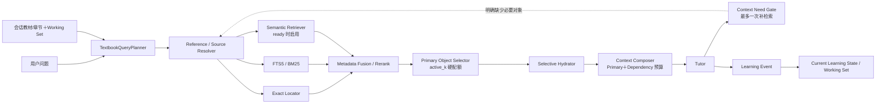

# 教材搜索 v1.0 方案

> v1.0 的目标是搭建教材搜索与 Working Set 的基本框架，修复当前最主要的断路，并为后续语义检索和学习进度理解保留稳定接口。本文是第一轮实施规格，不等于最终架构。

<!-- ai_provenance: source=codex; date=2026-08-11; verification=source-backed; retrieved_notes="教材搜索问题的解决.md, 当前系统问题.md"; external_inputs="two user-provided ChatGPT retrieval reviews" -->

相关文档：[[教材搜索问题的解决-方案总览]]、[[教材搜索问题的解决]]、[[当前系统问题]]。

## 1. v1.0 要解决的问题

当前默认 v2 链路存在以下直接故障：

1. `SourceRequirement` 依赖少量关键词，用户说“课本、书上、原题”时可能完全不启动检索。
2. 规则提取出的 `intent.target_reference` 没有传给教材检索器；只有用户手动填写 UI 的 `focus_ref` 才会尝试精确定位。
3. 检索器没有接收会话 `chapter_id`，无法利用当前章节和小节。
4. FTS 把整条问题作为精确短语，没有查询拆解和 BM25 排序。
5. 纯 FTS 命中后只向 Tutor 提供很短的 snippet，没有回读完整教材块和必要邻域。
6. 没有结构化来源状态，无法区分精确命中、多个候选、语义相似和未解析。
7. 当前教材有结构化块和 FTS，但语义索引可能为 0；系统没有稳定表达索引是否可用或过期。
8. 系统没有持久化的当前小节、活跃知识点和 Working Set，后续指代只能依赖整段对话历史。

v1.0 的完成标准不是“所有关联知识都能搜得很好”，而是：

> 精确引用和自然教材表达能够稳定触发搜索；候选召回、元数据精排、主要对象选择、正文加载和 Tutor 上下文之间具有硬边界；系统开始保留当前学习位置和活跃知识对象；语义检索拥有正式接口和可观测的降级路径。

## 2. v1.0 范围

### 2.1 必须实现

- `TextbookSearchRequest`、`ResolvedSource`、`SearchContext` 等结构化协议；
- 检索触发、目标引用和章节信息的正确接线；
- 用户粘贴原文识别；
- focus、精确标签、页码、标题定位；
- 查询拆解后的 FTS5 / BM25；
- 只对已选主要对象执行按类型正文/紧凑表示与必要邻域回读；
- `retrieval_mode` 与系统级 Retrieval Policy；
- 元数据级候选融合、去重和 Primary Object Selection；
- 按对象类型选择性 hydration；
- Primary Objects 与 Supporting Dependencies 的独立硬预算；
- Current Learning State 与基础 Working Set；
- 现有 Semantic Retriever 的统一接口、索引健康状态和安全降级；
- 检索 trace 与原始失败案例回归测试。

### 2.2 v1.0 不要求完整实现

- 高质量“相似例子/相关定理”语义排序；
- 完整知识图谱或 Dependency Retriever；
- 自动、精细、长期稳定的掌握度评估；
- 多教材和个人笔记联合检索；
- 专用学习型 reranker（但元数据级 rerank 是 v1.0 必需步骤）；
- Tutor 自主多轮工具调用。

这些能力必须在总览架构中保留，但不能阻塞第一轮基本闭环。

## 3. v1.0 主流程



正常问题不需要为每一个框调用模型。v1.0 首选规则、解析器和数据库查询；只有查询无法被可靠拆解时，才预留结构化模型 Query Planner。

==v1.0 的关键约束是：候选阶段只传 ID、类型、标签、位置、分数和短摘要；Primary Object Selector 完成后才允许读取正文。==

## 4. 核心数据结构

### 4.1 TextbookSearchRequest

```python
class TextbookSearchRequest(BaseModel):
    should_retrieve: bool
    source_requirement: SourceRequirement
    intent: str
    retrieval_mode: Literal[
        "none",
        "exact_reference",
        "similar_examples",
        "related_theorems",
        "similar_proofs",
        "dependency_lookup",
        "broad_discovery",
    ]

    book_id: str
    chapter_id: str | None
    section_ref: str | None

    focus_ref: str | None
    target_references: list[str]
    reference_expressions: list[str]
    user_quotes: list[str]

    object_types: list[str]
    lexical_terms: list[str]
    semantic_query: str | None
    scope: str
    reason_codes: list[str]
```

`retrieval_mode` 是 Retrieval Policy 的唯一入口，后续 Retriever、Selector、Hydrator 和 Composer 不再各自猜测检索任务。

触发规则至少覆盖：

- “教材、课本、书中、书上、原文、原题、文中、这一页、这段”；
- 已绑定教材中的结构化引用：`Exercise 2.1.5`、`Theorem 3.2`、`p.34` 等；
- 用户要求比较“课本上的例子/证明/定义”；
- UI 明确提供 focus；
- 当前问题包含可识别的教材题干引用。

`source_requirement` 和 `should_retrieve` 独立计算。即使回答主要依靠一般数学，只要问题明确锚定教材对象，也可以执行检索。

### 4.2 RetrievalPolicy

```python
class RetrievalPolicy(BaseModel):
    retrieval_mode: str
    candidate_k_min: int | None
    candidate_k_max: int | None
    rerank_k_min: int | None
    rerank_k_max: int | None
    active_k_min: int
    active_k_max: int
    primary_object_types: list[str]
    dependency_compact_k: int = 2
    dependency_full_k: int = 0
    max_supplement_rounds: int = 1
```

### 4.3 SourceCandidate 与 ResolvedSource

```python
class SourceCandidate(BaseModel):
    source_id: str
    block_id: str | None
    source_type: str
    score: float
    page: int | None
    raw_label: str | None
    canonical_label: str | None
    object_type: str | None
    chapter_id: str | None
    section_ref: str | None
    confidence: str
    reasons: list[str]


class ResolvedSource(BaseModel):
    status: str  # resolved / ambiguous / unresolved
    selected: SourceCandidate | None
    candidates: list[SourceCandidate]
    confidence: str
    mathematical_statement_complete: bool
    supports_book_facts: bool
    author_intent_support: str
```

### 4.4 SearchContext

Tutor 不再接收一个没有状态的字符串，而是接收结构化结果：

```python
class SearchContext(BaseModel):
    request: TextbookSearchRequest
    resolved_source: ResolvedSource
    primary_objects: list[ContextObject]
    supporting_dependencies: list[ContextObject]
    available_candidates: list[SourceCandidate]
    rendered_context: str
    warnings: list[str]
    index_status: dict[str, str]
```

工作流仍可先把 `rendered_context` 放入 Prompt，但 trace 和后续质量检查应保留完整结构。`available_candidates` 不得被渲染为完整正文。

## 5. Current Learning State 与基础 Working Set

v1.0 必须建立一个保守但真实可用的学习状态层。

### 5.1 CurrentLearningState

```python
class CurrentLearningState(BaseModel):
    session_id: str
    book_id: str
    chapter_id: str | None
    section_ref: str | None
    focus_object_id: str | None
    active_concepts: list[ConceptState]
    recent_source_ids: list[str]
    open_questions: list[str]
    updated_at: datetime
```

当前章来自会话绑定；当前小节优先来自精确命中块的 `heading_path`，其次来自最近一次高置信来源。不得在没有证据时静默选择整本书的第一个块。

### 5.2 ConceptState

```python
class ConceptState(BaseModel):
    concept_id: str
    label: str
    mastery_level: str       # unknown / exposed / developing / usable / stable
    confidence: float
    mastery_source: str      # user / system_default
    evidence_ids: list[str]
```

v1.0 的掌握度更新以用户手动标注为主：

- UI 允许用户把知识点标为 `unknown / exposed / developing / usable / stable`；
- 系统可以自动记录本轮讨论过哪些知识点，但不会据此自动改变 mastery level；
- 用户明确反馈仍不理解时，可以新增 open question，是否调整掌握等级仍由用户确认；
- 没有用户标注时保持 `unknown`；
- 自动掌握度推断和长期证据合并不属于 v1.0。

### 5.3 Working Set

v1.0 的 Working Set 建议限制为最多 20 个轻量对象卡片，并按角色分组：

- 1 个 `focus`；
- 最多 6 个 `active` 知识对象；
- 最多 6 个 `support` 对象；
- 最多 5 个 `recent` 对象；
- 最多 2 个 `open_question`。

条目激活分数由以下确定性因素组成：

- 是否是本轮精确来源；
- 是否位于当前小节；
- 是否最近被用户或 Tutor 明确提及；
- 对象类型是否符合本轮问题；
- 是否是当前对象的直接邻域。

v1.0 暂不依赖 embedding 计算 Working Set 激活度，也不把 20 个对象的正文放入 Prompt。Working Set 只用于指代解析、局部检索、排序特征和学习进度展示。

## 6. Query Planner 与检索触发

### 6.1 规则下限

先扩充并修正确定性规则：

1. 教材自然表达触发检索；
2. 精确编号在已绑定教材的会话中直接触发；
3. `intent.target_reference` 必须进入 SearchRequest；
4. 中文“这个、那个、这里、刚才、前面”不能依赖英文单词边界 `\b`；
5. 指代存在但 Working Set 无唯一候选时，将 resolution 标为 ambiguous；
6. 用户粘贴完整题目时登记 `user_quote`，不必等待教材定位成功才能解释题目。

### 6.2 查询拆解

对原始问题提取：

- 精确标签：`Exercise 2.1.5`；
- 对象类型：exercise / example / theorem；
- 英文术语和稳定数学符号；
- 中文概念词；
- 用户真正要求的关系，例如“类似例子”“相关定理”；
- 当前章节和小节。

同时必须输出一个 `retrieval_mode`：

- “这个定理是什么意思” → `exact_reference`；
- “还有没有类似的例子” → `similar_examples`；
- “这里还可以用什么定理” → `related_theorems`；
- “有没有类似的证明思路” → `similar_proofs`；
- “这里缺少哪个前置定义/引理” → `dependency_lookup`。

不要把所有自然语言词都送入 FTS。停用词、礼貌表达和“还有什么”等请求词不应成为精确短语的一部分。

## 7. v1.0 检索器

### 7.1 Exact Locator

执行顺序：

1. 用户指定 focus；
2. `target_references` 中的规范化标签；
3. 页码；
4. 标题和 heading path；
5. 精确短语。

唯一且高置信精确标签直接成为 selected source。若 `Ex. 1.1` 无法根据块类型或小节标题消歧，应返回多个候选。

### 7.2 FTS5 / BM25

修改 repository，使其接收受控的查询计划，而不是始终把原问题包装为单一精确短语。

v1.0 至少支持：

- exact phrase；
- token AND/OR 组合；
- prefix；
- 必要的 NEAR；
- `ORDER BY bm25(document_blocks_fts)`；
- book 过滤；
- chapter/section 作为排序偏置。

SearchHit 必须返回 `block_id`、BM25 分数和用于调试的 snippet。snippet 不直接作为最终教材上下文。

### 7.3 Semantic Retriever

v1.0 继续使用现有 embedding service 和持久化向量，但放入统一 Retriever 接口：

```python
class Retriever(Protocol):
    async def search(self, request: TextbookSearchRequest) -> list[SourceCandidate]: ...
```

v1.0 行为：

- `ready`：执行 dense top-k，候选标记为 `semantic_match`；
- `missing` 或 `stale`：记录 warning，继续 exact＋BM25；
- `failed`：记录失败状态，不阻断回答；
- 精确标签已经高置信解决时，不为“证明已经找到”而无意义调用向量服务；
- 用户请求“类似例子/相关定理”时，即使存在精确锚点，也可以用该锚点正文生成 semantic query。

v1.0 暂不承诺语义检索质量已经达到生产标准，但接口、状态、候选类型和 trace 必须完整，以便 v1.1 直接升级。

## 8. Retrieval Policy、元数据精排与 Primary Selection

### 8.1 有论文依据的默认策略表

v1.0 把下面的配额写成配置化系统策略：

| `retrieval_mode` | `candidate_k` | `rerank_k` | 最终主要对象（`active_k`） |
| --- | ---: | ---: | ---: |
| `similar_examples` | 20–30 | 5–6 | 3 个 example |
| `related_theorems` | 10–20 | 4–5 | 1–2 个 theorem |
| `similar_proofs` | 10–15 | 3–4 | 1–2 个 proof |
| `dependency_lookup` | 5–10 | 3–4 | 1–2 个必要依赖 |
| `exact_reference` | 按精确定位需要 | 通常 1 | 1 个目标对象 |

==这张表是有论文与受控实验依据的工程默认值。==数学 reasoning trace RAG、应用型 RAG、大规模定理语义检索、多文档数量控制实验和数学干扰上下文实验共同支持“候选搜索应较宽，但进入 Solver 的对象必须很少”。具体数值不是跨系统的数学定理，后续仍要在本项目上做 `k` 消融，但 v1.0 必须先以该表作为默认配置和硬边界。

这些数字是预算，不是凑数要求。候选不足或相关性不够时必须返回更少对象；不得为了填满 `active_k` 把低置信候选送入 Tutor。

系统始终满足：

```text
candidate_k >> rerank_k > active_k
```

### 8.2 Metadata / Lightweight Rerank

候选阶段只保存对象卡片，不读取完整正文。精排综合：

- exact、BM25、semantic 的原始排序；
- 当前小节和章节邻近度；
- 请求对象类型；
- Working Set 激活度；
- 来源置信度；
- 与锚点对象的关系；
- 与已选对象的重复程度。

可以使用加权 RRF 形成初始融合分数，再应用确定性类型、范围和多样性规则。v1.0 不要求专用学习型 reranker，但必须具有独立 rerank 阶段。

### 8.3 Primary Object Selector

Selector 根据 `retrieval_mode` 执行 `active_k`：

- 相似例子选择 3 个，优先形成“最相似＋互补＋有意义的差异/反例”；
- 相关定理选择 1–2 个，并验证条件和结论确实适用；
- 相似证明选择 1–2 个，防止多个相似 proof trace 重复占用上下文；
- 精确引用只选 1 个高置信目标；
- 依赖查找只选当前推理明确缺少的 1–2 个对象。

只有 Selector 选中的主要对象才允许进入 Hydrator。低置信语义候选可保留在 `available_candidates`，但不能支持精确教材事实声明。

## 9. Selective Hydrator 与 Context Composer

### 9.1 数据读取接口

数据库 repository 增加：

```text
get_many(block_ids)
get_window(book_id, order_index, before, after)
get_section_blocks(book_id, heading_path)
```

这些接口只接收 Selector 已批准的对象 ID 或 dependency budget 批准的依赖 ID。

### 9.2 按对象类型加载

Hydrator 生成不同粒度的表示，而不是统一读取完整教材页。

- **Example / Exercise**：题目或对象、核心构造、关键结论、与当前问题有关的解释；
- **Theorem / Lemma**：名称、假设、结论、当前相关性；默认不加载证明；
- **Proof**：证明目标、关键定理/技巧、proof skeleton、关键步骤；只有逐步分析时加载完整证明；
- **Definition**：精确定义和必要符号，不自动展开所有例子和备注；
- **普通段落**：当前块和有限前后文。

因此“检索到两个定理”只意味着注入两个 compact theorem representation，不等于加入两个完整教材页。

### 9.3 Primary 与 Dependency 双预算

```text
Primary Objects
  用户真正要求检索、比较或分析的对象

Supporting Dependencies
  理解 Primary Objects 必须依赖的定义、定理或 Lemma
```

Primary Objects 服从策略表的 `active_k`。Supporting Dependencies 默认预算：

```yaml
dependency_budget:
  full_objects: 0
  compact_objects: 2
```

依赖默认只提供 statement/compact representation，不展开完整证明或周边教材。依赖不能借机绕过 `active_k`。

### 9.4 Context Composer

按以下优先级分配预算：

1. 用户本轮问题和用户粘贴原文；
2. Primary Objects；
3. 最多 1–2 个 Supporting Dependencies；
4. 必要的来源元数据与 warning；
5. 最近对话的最小摘要。

Working Set 对象、rerank 后未选对象和其他语义候选只保留为元数据，不自动进入 Prompt。

Composer 负责去重、表示粒度、字符/Token 预算、来源标签、page/label/block_id 元数据和 warnings。目标是 `Minimum Sufficient Context`，一次普通回答通常只让 Tutor 看到约 2～5 个外部数学对象。

### 9.5 一次受控补充检索

只有出现以下状态才能补检索：

```text
missing_definition
missing_theorem
missing_lemma
ambiguous_reference
insufficient_evidence
```

请求必须给出 `needed_type` 和 `needed_concept`，最多增加 1–2 个 compact objects，整轮最多补充一次。不能因“可能还有更多内容”继续搜索。

## 10. 与当前 v2 workflow 的接线

### 10.1 修改调用参数

当前 ContextLoader 的：

```python
(book_id, focus_ref, query) -> str
```

改为：

```python
(session_context, tutor_intent, user_message) -> SearchContext
```

其中必须包含：

- `book_id`；
- `chapter_id`；
- `focus_ref`；
- `intent.target_reference`；
- `conversation_history` 中的最近来源元数据；
- Current Learning State / Working Set 摘要。

### 10.2 工作流顺序

```text
规则路由下限
→ TextbookQueryPlanner
→ Retrieval Policy
→ SourceResolver / Candidate Retrieval
→ Metadata Rerank
→ Primary Object Selector
→ Selective Hydrator
→ Context Composer
→ SearchContext
→ AnswerContract
→ Tutor
→ 必要时一次 Context Need 补检索
→ Learning Event
→ Working Set 更新
```

AnswerContract 应根据 `ResolvedSource` 决定允许怎样声明教材事实，而不是只根据“计划是否检索”判断来源已经可靠。

### 10.3 失败策略

- 用户原文完整、教材定位失败：继续解释用户原文，不声明书中位置；
- exact 失败但 BM25/dense 有多个近似候选：标记 ambiguous，不冒充精确原文；
- 所有检索器失败：自包含数学问题仍可回答，并说明未确认教材位置；
- embedding 失败：回退 exact＋BM25；
- 数据库或结构索引异常：保留明确 warning，不静默选择第一个块。

## 11. 建议代码结构

可以新增独立命名空间，避免继续扩大 `AppRuntime._load_v2_context`：

```text
src/math_tutor/textbook_search/
├─ models.py
├─ query_planner.py
├─ reference_resolver.py
├─ source_resolver.py
├─ service.py
├─ retrieval_policy.py
├─ metadata_reranker.py
├─ primary_selector.py
├─ hydrator.py
├─ hydration_profiles.py
├─ context_composer.py
├─ context_need.py
├─ working_set.py
└─ retrievers/
   ├─ base.py
   ├─ exact.py
   ├─ lexical.py
   └─ semantic.py
```

持久化层建议增加：

```text
current_learning_states
working_set_items
learning_events
mastery_evidence
source_resolution_runs（也可先只写 trace）
```

v1.0 可以让 Working Set 使用现有 block ID；等后续数学对象模型稳定后再迁移 object ID。

## 12. 研究依据与参数定位

默认策略表参考：

- [RAG over Thinking Traces Can Improve Reasoning Tasks](https://arxiv.org/abs/2605.03344)：支持使用结构化、紧凑的 reasoning trace 作为数学推理检索语料；
- [RAG+: Enhancing Retrieval-Augmented Generation with Application-Aware Reasoning](https://arxiv.org/abs/2506.11555)：支持把知识对象和应用案例分开组织并联合检索；
- [Semantic Search over 9 Million Mathematical Theorems](https://arxiv.org/abs/2602.05216)：支持大规模定理候选召回与少量最终返回分层处理；
- [More Documents, Same Length](https://arxiv.org/abs/2503.04388)：表明即使总长度和相关信息位置受控，文档数量本身也会增加多数模型的处理难度；
- [How Is LLM Reasoning Distracted by Irrelevant Context?](https://arxiv.org/abs/2505.18761)：表明无关上下文会干扰数学推理路径与计算；
- [Toward Optimal Search and Retrieval for RAG](https://arxiv.org/abs/2411.07396)：强调 Retriever 与 Reader 的指标和职责必须分离。

因此 v1.0 采用“搜索得宽、rerank 得中等、真正注入 Tutor 的数学对象很少”。上述研究支持该方向和少量上下文策略；表中的精确区间属于综合研究后形成的工程初值，而不是论文给出的跨系统常数。

## 13. 实施步骤

### Step 1：协议、模式与接线

- 新增 SearchRequest、RetrievalPolicy、ResolvedSource、SearchContext、CurrentLearningState 模型；
- 修改 v2 workflow 和 ContextLoader 签名；
- 传入 `target_reference` 与 `chapter_id`；
- 为典型问题输出稳定 `retrieval_mode`；
- 增加来源自然表达和中文指代测试。

### Step 2：Exact＋BM25 基本检索

- 实现 Query Planner；
- 精确标签直达；
- 重写 FTS 查询与 BM25 排序；
- 建立 resolved / ambiguous / unresolved；
- 记录候选 trace。

### Step 3：Metadata Rerank 与 Primary Selector

- 候选阶段禁止批量加载正文；
- 实现加权 RRF、类型/章节/Working Set 特征；
- 写入策略表与对象配额；
- 相似例子实施互补性和差异性选择；
- trace 记录 candidate、rerank 和 active 三层数量。

### Step 4：Selective Hydration 与 Context Composer

- repository 增加批量读取和邻域窗口；
- 按对象类型生成 compact/full representation；
- 实现 Primary 与 Dependency 双预算、去重和来源元数据；
- Tutor 改用 `SearchContext.rendered_context`。

### Step 5：基础 Working Set

- 建表并迁移；
- 从会话初始化教材与章节；
- 精确来源更新当前小节和 focus；
- 保存活跃对象、最近来源和用户掌握度标注；
- 下一轮 Query Planner 读取 Working Set。

### Step 6：Semantic 接口与索引状态

- 包装现有 embedding service 为统一 Retriever；
- 明确 missing/stale/ready/failed；
- 结构修正后至少标记向量索引 stale；
- ready 时参与候选融合；
- 相关例子请求可以从当前对象生成 semantic query。

### Step 7：一次受控补检索

- 定义 `ContextNeed` 结构；
- 只允许五种缺失状态触发；
- 最多补充一次、每次最多 1–2 个 compact objects；
- 禁止开放式“再多找一些”循环。

### Step 8：回归与可观测性

- 添加原始失败问题端到端测试；
- 添加无 embedding、FTS 零命中、多候选和用户原文测试；
- trace 展示 SearchRequest、retrieval mode、candidate/rerank/active 数量、选择角色、hydration profile、注入 block ID 和 Working Set 更新。
- 离线评测记录 `Context Precision`、`Context Utilization`、Token、延迟、数学正确率和错误定理引用率；
- 为 example/theorem/proof 分别运行 `k` 消融，验证 3/1–2/1–2 是否适合当前 Tutor。

## 14. v1.0 验收标准

### 路由与接线

- “课本、书上、原题、教材、文中”都能正确触发来源检索；
- `Exercise 2.1.5-a` 在用户未填写 `focus_ref` 时仍能定位 `Exercise 2.1.5`；
- v2 检索实际使用 session 的 `chapter_id`；
- 中文指代存在歧义时不会被标为高置信。

### 来源解析

- 用户粘贴完整题目会生成 `user_quote` candidate；
- 唯一高置信标签返回 resolved；
- `Ex. 1.1` 无法消歧时返回 ambiguous；
- 未定位时返回 unresolved，不能静默使用整本书第一个块。

### 检索与上下文

- 原始问题能定位题目块，而不是拿整条中文问题做短语 FTS；
- FTS 按 BM25 排序；
- 未进入 Primary Selector 的候选不会读取完整正文；
- `similar_examples` 默认执行 `20–30 → 5–6 → 3`；
- `related_theorems` 默认执行 `10–20 → 4–5 → 1–2`；
- `similar_proofs` 默认执行 `10–15 → 3–4 → 1–2`；
- Tutor 收到按对象类型压缩后的必要内容，不是八个词的 snippet，也不是整页无差别正文；
- dependency 默认最多 2 个 compact objects、0 个完整对象；
- 一次普通回答通常不超过 2～5 个外部数学对象；
- 重复候选只注入一次；
- 上下文不超过配置预算。

### Working Set

- 会话能保存当前教材、章、小节、focus 和近期来源；
- 成功定位教材对象后，下一轮可以用“这道题/刚才的例子”找到 Working Set 候选；
- 用户可以手动设置知识点掌握状态；
- 无用户标注时保持 unknown，不自动声称用户已经掌握。

### 语义接口

- 索引状态可见；
- 0 条 embedding 时 exact＋BM25 仍完整工作；
- ready 时 semantic candidates 能进入统一候选结构；
- semantic candidate 不得冒充精确教材来源。

### Progressive Retrieval

- 只有白名单缺失状态能触发补检索；
- 补检索必须指定对象类型与概念；
- 最多一轮、最多增加 1–2 个 compact objects；
- “也许还有更多内容”不能触发补检索。

### 上下文效率

- 评测集能够计算注入对象的 Context Precision；
- Tutor 或离线标注能够估计 Context Utilization；
- 长期出现 `injected=5, used=2` 时应判定 Composer 过宽；
- 默认配额修改必须附带下游数学正确率、Token 和延迟对比，而不能只看 Recall@K。

## 15. v1.0 明确未实现的功能

完成 v1.0 后，以下项目仍属于后续工作：

1. **语义相关性质量尚未充分校准**：已有接口和可选召回，但“类似例子/相关定理”的准确率仍需 v1.1 评测集、阈值和类型化查询优化。
2. **没有正式 Dependency Retriever**：v1.0 只使用当前小节、邻域和显式标签，尚不能稳定沿“例子说明定义、证明使用引理”等关系扩展。
3. **不自动推断掌握度**：v1.0 由用户手动标注，尚未利用间隔复习、迁移任务和长期表现形成可靠画像。
4. **没有完整数学对象图谱**：Working Set 暂以 block/chunk 为对象；定理、证明、技巧和反例之间的显式关系以后再建。
5. **没有专用学习型 reranker**：v1.0 已有元数据 rerank、加权 RRF、类型/章节/Working Set 特征和 Primary Selector；是否增加模型 reranker 由评测决定。
6. **没有自主 Progressive Retrieval loop**：v1.0 只允许一次白名单状态触发的受控补检索，不允许 Tutor 自主进行多轮无边界搜索。
7. **不支持多教材与个人笔记联合检索**：检索范围仍以当前绑定教材为主。
8. **公式指纹和 OCR 高级修复未完成**：仅保留接口与后续扩展位置。

这些未实现项不会破坏 v1.0 的基本闭环，同时都能在不推翻协议的情况下继续演进。

## 16. v1.0 完成报告（2026-08-11）

### 16.1 完成结论

教材搜索 v1.0 已在 `D:\MathStudyAgent` 完成搭建，并接入现有 Tutor v2.1 主链路。每一轮 v2 对话都会先执行轻量 SearchRequest 规划；没有教材检索信号时返回 `none`，不访问教材正文；有检索需求时依次执行候选召回、rerank、Primary Object Selector 和 Selective Hydrator。

本轮没有新增数据库迁移。Working Set 与当前学习状态复用已有 `current_workspaces.payload`，使用独立键 `textbook_search_learning_state`，保存时保留原有 `sol_thread_id` 等字段。

### 16.2 实际实现内容

新增 `src/math_tutor/textbook_search/` 子系统：

- `models.py`：SearchRequest、Candidate、ContextObject、SearchContext、Working Set、mastery 和索引状态协议；
- `query_planner.py`：精确引用、教材来源词、用户 blockquote、跨轮指代与七种 retrieval mode；
- `policy.py`：论文依据的 candidate/rerank/active 预算表；
- `ranker.py`：来源、对象类型、结构距离和去重的确定性 rerank；
- `hydrator.py`：只加载选中主对象并实施单对象/总上下文字符上限；
- `working_set.py`：当前教材、章、小节、焦点、知识点、近期来源与人工 mastery 持久化；
- `service.py`：精确标签、FTS/BM25、结构类型和可选 semantic candidates 的统一编排。

同时完成：

- FTS5 增加 BM25 排序与多 term OR 查询；
- DocumentBlockRepository 增加批量读取、邻域与按对象类型的预算查询；
- 精确标签即使没有“教材/课本”等来源词也会触发检索；
- 修复中文指代不能被 `\b` 正确识别的问题；
- Tutor v2 结果新增 `textbook_search` 与 `learning_state` 诊断；
- 学习页新增当前小节、焦点知识点和人工掌握水平界面；
- “这个定义/这道题/上面”等下一轮表达可以使用 Working Set 的焦点标签恢复来源。

### 16.3 预算实现

代码中的默认策略与计划保持一致：

| retrieval_mode | candidate_k | rerank_k | active_k |
|---|---:|---:|---:|
| similar_examples | 20–30 | 5–6 | 3 |
| related_theorems | 10–20 | 4–5 | 1–2 |
| similar_proofs | 10–15 | 3–4 | 1–2 |
| dependency_lookup | 5–10 | 3–4 | 1–2 |
| exact_reference | 依定位需要（当前上限 10） | 1 | 1 |

这些值在实现中是上限而不是填满目标；候选不足或质量不足时允许少于上限。

### 16.4 验证结果

- 修改前基线：251 tests passed；
- 修改后全量回归：258 tests passed；
- `uv run mypy src`：142 个源文件无错误；
- 本轮变更范围 `ruff check`：通过；
- 新增测试覆盖预算表、mode 识别、无信号不检索、用户引用、精确对象 hydration、Working Set 跨轮指代、无 embedding 的结构回退和人工 mastery；
- 对真实 `data/app.db` 做只读烟测：检测到 1 本 GTM 259，按 example/theorem 类型返回 5 个结构候选，按 theorem/compact 返回 5 个 BM25 候选；未向真实学习会话写入测试状态。

交接材料已写入 `D:\StudyMathAgent`，其中源代码路径仍明确指向 `D:\MathStudyAgent`，没有复制第二套代码。

### 16.5 与原计划的差异和未完成项

以下内容没有被伪装成“已完成”，将进入 v2.0：

1. **Dependency Retriever 尚未完成**：预算、类型和输出槽位已经存在，但 `supporting_dependencies` 当前不自动生成，尚无正式对象关系图。
2. **Progressive Retrieval 尚未实现**：当前每轮只有一次初始检索，没有白名单缺失状态与一次性补检索状态机。
3. **没有学习型 reranker**：当前是可解释的确定性 metadata/source/type rerank；semantic candidates 可以进入，但未用数学教材评测集校准阈值。
4. **没有索引 stale manifest**：语义索引可显示 ready/missing/failed/not_configured，但结构修正后的版本失效仍需 v2.0 处理。
5. **没有正式对象图与自动 mastery 证据聚合**：mastery 只由用户手动设置，这是有意保守而不是遗漏。
6. **候选层仍读取 ORM 完整行**：结构查询只读取 candidate_k 上限内的行，且未选对象不会进入 prompt；真正的 metadata-only projection 留给 v2.0 优化。
7. **Context Utilization 尚未自动测量**：本轮已暴露 selected/injected 诊断，但 Tutor 实际使用对象和离线消融 runner 尚未建设。

因此，v1.0 已完成最重要的可运行闭环和硬边界；高级相关性、依赖关系、受控补检索和学习证据链由《教材搜索v2.0计划书》继续规划。
