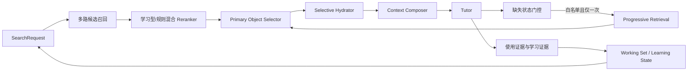

# 教材搜索 v2.0 计划书

## 1. 版本定位

v1.0 已经完成“有边界的教材检索闭环”：查询规划、候选召回、rerank、主对象选择、按需正文加载、Working Set、学习进度和 Tutor 接线均已存在。v2.0 不重写这条链路，而是在同一协议上解决四件事：

1. 用正式评测把语义相关性从“接口可用”提升为“质量可知”；
2. 用显式数学对象与依赖边回答“为什么相关、缺少什么前置”；
3. 在严格上限内允许一次受控补检索；
4. 用长期证据完善学习进度，而不是凭单轮对话猜掌握度。

v2.0 的核心目标不是塞入更多上下文，而是在数学正确率不下降的前提下，提高 `Context Precision`、`Context Utilization` 和跨轮连续性。

## 2. 必须继承的 v1.0 边界

- Working Set 是当前学习状态和轻量索引，不是长期 prompt 正文；
- Candidate Retrieval → Rerank → Primary Selector → Selective Hydrator → Context Composer 的硬边界保留；
- `candidate_k`、`rerank_k`、`active_k` 是上限，不要求填满；
- 语义候选与精确来源必须在 provenance 上可区分；
- 未进入 Primary Selector 的对象不得注入 Tutor；
- dependency 默认最多 2 个 compact objects、0 个 full objects；
- Progressive Retrieval 最多一次，必须由白名单缺失状态触发；
- mastery 不允许因一次回答或一次“看起来理解了”自动升级为 mastered。

## 3. 预算基线

下表继续作为 v2.0 的默认对照组。它们来自相关论文与工程经验的收敛结论；v2.0 可以通过消融实验收紧或微调，但不能无评测地扩大。

| retrieval_mode | candidate_k | rerank_k | 最终主要对象 |
|---|---:|---:|---:|
| similar_examples | 20–30 | 5–6 | 3 个 example |
| related_theorems | 10–20 | 4–5 | 1–2 个 theorem |
| similar_proofs | 10–15 | 3–4 | 1–2 个 proof |
| dependency_lookup | 5–10 | 3–4 | 1–2 个必要依赖 |
| exact_reference | 按精确定位需要 | 通常 1 | 1 个目标对象 |

## 4. v2.0 总体架构

新增能力都围绕现有 `SearchContext` 扩展，Tutor 不直接访问 FTS、向量库或对象图。

## 5. 数据架构

### 5.1 Textbook Object Registry

新增稳定数学对象层，建议字段：

- `object_id`、`book_id`、`block_ids`；
- `object_type`：definition/theorem/lemma/proof/example/exercise/remark；
- `canonical_label`、`heading_path`、`page_range`；
- `statement_text`、`body_text_ref`、`content_hash`；
- `parser_version`、`structure_version`、`confidence`。

对象注册表仍指向原始 block，不能取代来源忠实层。

### 5.2 Object Relations

建立带证据的关系表：

- `uses`：证明使用某定理/引理；
- `defines`：定义引入概念；
- `illustrates`：例子说明定义或定理；
- `prerequisite_of`：对象是另一对象的必要前置；
- `similar_to`：语义或结构相似；
- `contrasts_with`：反例、边界情形或对照概念。

每条边必须记录 `evidence_block_ids`、生成方法、置信度和审核状态。低置信自动边只能参与候选召回，不能作为教材事实直接陈述。

### 5.3 Index Manifest

为 lexical、embedding 和 relation index 保存 manifest：

- `book_content_hash`；
- `structure_version`、`chunk_version`、`embedding_model`；
- `built_at`、`status`、`error`；
- `object_count`、`chunk_count`。

结构修正后把相关索引标为 stale；查询时 stale 可降级但必须可见。

### 5.4 Learning Evidence

掌握状态由 evidence 聚合，而不是直接由 Tutor 写最终结论：

- 用户手动标记；
- 独立回忆是否成功；
- 练习是否在无提示下完成；
- 是否能解释关键条件；
- 间隔一段时间后的再次表现；
- 迁移到新题目的表现。

系统可建议状态变化，但 `mastered` 默认需要用户确认或多条跨时段强证据。

## 6. 语义检索升级

### 6.1 类型化查询

不同 mode 使用不同 query builder：

- similar_examples：保留数学结构、条件、目标和解法特征，弱化表面数字；
- related_theorems：抽取概念、假设、结论类型和适用范围；
- similar_proofs：抽取证明策略、关键构造、矛盾点和使用工具；
- dependency_lookup：从当前对象抽取未解释概念与被引用标签。

### 6.2 混合 Reranker

第一阶段保留确定性特征：精确标签、对象类型、章节距离、Working Set、来源质量。第二阶段加入可替换的学习型 reranker，对 10–30 个候选评分，不直接面对全库。

建议特征：

- embedding similarity；
- BM25；
- object type match；
- prerequisite/illustrates/uses 图距离；
- 当前章、小节和焦点对象距离；
- 已学习/未学习状态；
- 标签和来源置信度；
- 去重与多样性惩罚。

### 6.3 阈值与拒答

每个 mode 单独校准最低分和 margin。低于阈值时返回 unresolved 或说明“只找到弱相关候选”，不能为了填满 3 个例子而注入噪声。

## 7. Dependency Retriever

正式实现以下流程：

1. 从 Primary Object 提取显式引用与核心概念；
2. 查 Object Relations 的 `uses/prerequisite_of/defines`；
3. 结合当前 mastery 过滤已经稳定掌握且本轮不需要展开的对象；
4. rerank 后最多选择 1–2 个必要依赖；
5. 默认只注入 compact statement：名称、条件、结论和本轮用途；
6. 只有用户明确要求原文时，依赖对象才可升级为 full。

依赖选择需要输出“为什么需要它”，供诊断与评测使用。

## 8. Progressive Retrieval

Tutor 首轮只接收 Composer 给出的上下文。只有出现下列结构化状态之一，才能补检索：

- `missing_definition(concept)`；
- `missing_theorem(reference_or_concept)`；
- `missing_proof_target(reference)`；
- `source_ambiguity(reference)`；
- `insufficient_example_diversity(concept)`。

门控规则：

- 每回合最多触发一次；
- 必须指定对象类型与目标概念/标签；
- 追加最多 1–2 个 compact objects；
- 不得扩大到其他教材；
- “也许还有更多”或低置信自由文本不能触发；
- 补检索后不再递归。

## 9. Working Set 与学习进度 v2

Working Set 增加：

- 当前 section_id 与 section title 双轨；
- focus object、support objects、recently dismissed objects；
- 当前问题涉及的 knowledge point IDs；
- 对每个知识点的 mastery、confidence、evidence IDs 和 last_practiced_at；
- 本轮用了哪些依赖、哪些对象被 Tutor 实际引用；
- 切换章节/教材时的显式状态转换。

Prompt 只得到紧凑摘要，例如“当前在 2.3 节，焦点 Theorem 2.7；Definition 2.4 为 shaky”，不加载 Working Set 对象正文。

## 10. 可观测性与评测

每次检索记录：

- request/mode/source requirement；
- 各 retriever 的候选 ID、分数、版本与耗时；
- rerank 前后顺序；
- selected/rejected 及理由；
- hydration profile、注入字符数/token；
- Tutor 实际引用/使用的对象；
- 是否补检索；
- 最终数学正确率、来源忠实度和用户反馈。

核心指标：

- Exact Resolve Accuracy；
- Recall@candidate_k、NDCG@rerank_k；
- Context Precision、Context Utilization；
- 错误定理引用率；
- unresolved/ambiguous 校准；
- Tutor 数学正确率；
- token、p50/p95 延迟；
- 跨轮指代成功率；
- mastery calibration。

正式评测集先建设 80–150 条真实查询，并包含难负例：相同编号不同对象、相近表述不同条件、相似例子但解法不同、定理名称相似但不可用、OCR 标签噪声。

## 11. 分阶段实施

### v2.0.1：评测与索引生命周期

- Search trace 持久化；
- 建立评测集与离线 runner；
- 增加 index manifest/stale；
- 建立当前预算表基线。

完成条件：所有预算调整都有离线报告，结构修正后不会静默使用旧 embedding。

### v2.0.2：类型化语义与 rerank

- mode-specific query builder；
- 类型过滤和多样性；
- 可插拔学习型 reranker；
- 每种 mode 的阈值与拒绝策略。

完成条件：相较 v1.0，相关性指标显著提升，且 active 对象数和 token 不上升。

### v2.0.3：对象图与依赖检索

- Textbook Object Registry；
- Object Relations 与证据；
- Dependency Retriever；
- compact dependency composer。

完成条件：依赖命中可解释、可追溯，默认不注入完整依赖正文。

### v2.0.4：受控补检索与学习证据

- 缺失状态 schema 与一次性门控；
- Working Set v2；
- learning evidence 和 mastery 建议；
- UI 展示证据与允许用户修正。

完成条件：补检索不递归、不越界；掌握状态有证据链且可撤销。

## 12. v2.0 验收标准

1. 精确引用、相似例子、相关定理、相似证明、依赖查询都有独立评测切片；
2. 默认预算仍满足 `20–30→5–6→3` 等基线，低质量候选可少于上限；
3. semantic/FTS/graph/exact provenance 全程保留；
4. 结构修正后索引进入 stale，不能显示 ready；
5. Primary Objects 与 Dependency Objects 分开计数和渲染；
6. dependency 默认 compact <= 2、full = 0；
7. Progressive Retrieval 每回合最多一次且只能由白名单状态触发；
8. Working Set 能准确表达当前教材、章、小节、知识点与掌握证据；
9. mastery 变化可解释、可撤销，单轮模型判断不能直接标 mastered；
10. 与 v1.0 相比，数学正确率不下降，Context Precision/Utilization 至少一项显著改善，token 与 p95 延迟在预算内；
11. 全量回归、迁移测试、索引重建测试和真实教材烟测通过；
12. 交接文档记录数据迁移、回滚方式、评测结果和仍未解决的问题。

## 13. 风险与控制

- **对象图错误放大**：所有自动边保存证据与置信度，低置信边不支持教材事实断言；
- **reranker 过拟合**：教材、章节和查询类型分层切分评测集；
- **上下文重新膨胀**：Primary 与 Dependency 双预算，Composer 保留硬上限；
- **学习画像越权**：自动系统只积累 evidence 和建议，用户可查看和纠正；
- **索引版本漂移**：manifest、content hash 和 stale 状态成为发布门槛；
- **补检索失控**：结构化缺失状态、一次上限、禁止递归。

## 14. 与 v1.0 的关系

v1.0 继续作为可运行基线和回退路径。v2.0 的每个阶段必须能单独启用，并通过 feature flag 回退到 v1.0 的规则 rerank、结构回退和单次 Composer。只有当评测和真实教材烟测同时通过后，新的语义 reranker、对象图或补检索才进入默认路径。
