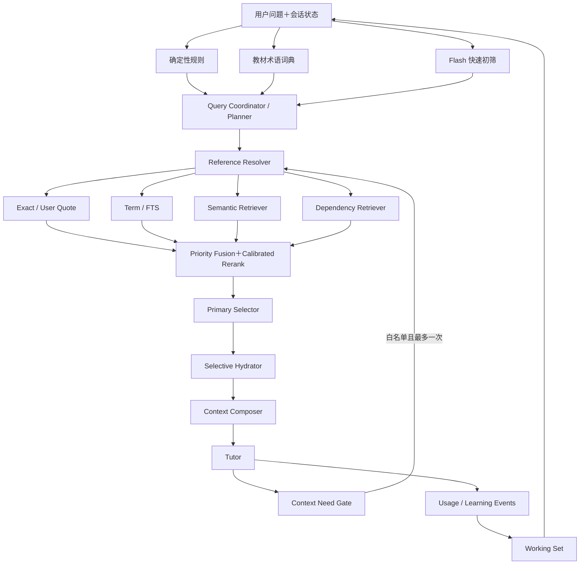

# 教材搜索 v2.0 计划书

> [!note] 2026-08-11 重校准
> ==本版以已经运行的 v1.5、真实数据库和当前代码为基线。v2.0 不再把“增加更多模块”当作升级，而把目标收敛为：建立可评测、可泛化、以数学对象为单位、允许证据不足时拒绝的教材检索系统。==

相关文档：[[教材搜索问题的解决-方案总览]]、[[教材搜索v1.5方案]]、[[教材搜索v1.0方案]]。

## 1. 版本定位

v1.5 已经解决最紧急的入口问题：系统能够识别教材语言，导入逐小节术语词典，并让规则、词典、快速初筛和完整 Planner 协同工作；跨语言查询可以生成教材语言检索词；无锚点时不再从全书开头填充对象；对象预算已经是上限而不是凑数要求。

因此 v2.0 不应回到“再换一个 Prompt”或“直接增加 Top-K”的思路，也不应同时建设完整知识图谱、自动掌握度、专用学习型 reranker 和全局学习记忆。v2.0 的核心任务是把 v1.5 从少量成功案例推进到以下状态：

> **Evidence-calibrated Mathematical Object Retrieval：查询理解、候选召回、对象选择和补充检索都由可追溯证据与正式评测约束，并且对未见查询和未见教材仍能成立。**

v2.0 的主成功指标不是“返回了多少对象”，而是：正确小节和数学对象是否进入候选、Primary 是否准确、无关对象是否被拒绝、Tutor 是否实际使用了注入对象，以及跨语言和关系型查询是否仍满足来源纪律。

## 2. v1.5 的真实基线

### 2.1 已经成立的能力

- 语言识别、术语词典和三级查询理解已进入正式链路；
- 中文教材与英文教材均已完成阻塞式词典回填；
- 确切标签、词典锚点、FTS、结构邻近和可选 semantic 召回已经接入统一 `SearchContext`；
- Primary Selector 只接受强或中等证据，相关性不足可以少返回或 `unresolved`；
- 四个 v1.5 盲测均命中正确小节或指定对象；
- “伯努利位移”已经暴露并修复了跨语言 Planner 漏译与理解型排序问题；
- Alembic 0008、Ruff、Mypy 和当前 278 项测试均已通过。

### 2.2 不能被 `ready` 掩盖的问题

当前数据库只包含两本正式教材：中文《实分析讲义》和英文 GTM 259。两书词典分别为 388 与 78 个词条；GTM 259 有 75 个小节，平均每节约一个词条。`term_index_status=ready` 只能证明所有小节完成并且已接受词条的证据有效，不能证明隐含术语召回充分。

当前 `retrieval_test_cases` 只有 12 条历史记录，其中包含旧失败、手工测试和四个盲测，远不足以校准 Planner、跨语言翻译、排序阈值和 `unresolved`。现有成功证明链路能够工作，不证明它已经泛化。

两本教材当前都没有 `document_embeddings` 记录；Semantic Retriever 与本地持久化接口虽然存在，但外部 embedding 探针此前返回 HTTP 401。因此语义检索目前是代码能力，不是已经验收的生产能力。

排序仍依赖固定权重和少量查询意图提示，`service.py` 中还存在针对“更换测度”文本形态的手工 boost。它可以保留为 v1.5 回归保护，但不能成为 v2.0 默认路径的长期依据。v2.0 发布前必须用一般化特征替换这类测试样例特例。

当前检索单位主要仍是 block/chunk；没有稳定的 Textbook Object Registry、对象关系表或真正的 Dependency Retriever。`supporting_dependencies` 仍是协议预留字段。Working Set 在检索完成后立即吸收 Primary，尚未区分“被召回”“被注入”“被 Tutor 使用”和“被用户确认学过”。

## 3. v2.0 范围与非目标

### 3.1 v2.0 必须完成

1. 建立可重复的离线评测集、runner、指标和发布门禁；
2. 建立稳定数学对象注册表，使术语、标签、statement、proof 和来源块可以可靠关联；
3. 让 Exact、词典、FTS 与多语言 Semantic Retrieval 在版本化索引下共同工作；
4. 用可解释特征、分 mode 阈值和难负例校准 Primary Selection 与 `unresolved`；
5. 实现证据可追溯的 0-hop/1-hop Dependency Retrieval 与选择性 hydration；
6. 在上述能力通过验收后，向主 Tutor 开放最多一次、白名单化的受控补充检索；
7. 修正 Working Set 事件语义，避免把“检索到”误写成“已经学习或掌握”。

### 3.2 v2.0 明确不做

- 不建设跨教材的完整数学知识图谱；
- 不训练自有 reranker；只有离线评测证明必要时才接入可替换的现成 reranker；
- 不自动把知识点升级为 `mastered`；
- 不把全部历史对话、个人笔记和错题统一放入全局向量库；
- 不让 Tutor 自由选择数据库、任意改写检索预算或递归搜索；
- 不为每一个 Retriever 分别调用一次大模型；
- 不把第三本 held-out 教材的成功等同于已经解决所有教材格式问题。

全局数学学习记忆和跨课程掌握度属于 v2.x 后续，不是 v2.0 发布前置。

## 4. 必须保持的系统不变量

1. **Reference resolution precedes semantic retrieval**：明确编号、页码、用户原文和当前 focus 优先于相似度猜测。
2. **Local retrieval precedes global retrieval**：Working Set、当前小节和当前章节优先，证据不足才扩大到全书。
3. **Wide Retrieval, Narrow Active Context**：`candidate_k >> rerank_k > active_k`，只有 Primary 和必要 Dependency 被 hydration。
4. 所有对象预算都是上限；低相关时少返回或 `unresolved`。
5. Exact、用户原文和已验证术语锚点不能被无条件 RRF 或模型评分稀释。
6. Planner 负责生成检索计划，不负责宣告某教材对象已经相关；最终对象仍由程序和证据门槛选择。
7. Query Planner 可以增加检索要求，不能取消规则确定的教材来源下限。
8. `ready` 必须拆成“流水线可查询”与“质量是否达标”两个维度。
9. 任何自动生成的术语或对象关系必须保存证据；低置信关系不能作为教材事实直接表述。
10. Tutor 不直接访问 FTS、embedding 表或关系表，只能接收 Composer 输出或调用受控教材搜索工具。
11. 四个 golden 查询和未来 sealed acceptance 集不能进入 Prompt，也不能形成按查询文本编写的生产分支。
12. Primary、Dependency 和补检索对象分别计数，不能互相借预算。

## 5. 目标架构



导入侧为查询侧提供四类派生资产：Textbook Object Registry、Math Term Dictionary、Index Manifest 和带证据的 Object Relations。它们都指回原始 `document_blocks`；任何派生资产都不能取代教材来源忠实层。

## 6. 数据与状态设计

### 6.1 Textbook Object Registry

新增 `textbook_objects`，最小字段包括：

- `object_id`、`book_id`、`section_id`、`source_block_ids`；
- `object_type`：definition/theorem/lemma/proposition/corollary/proof/example/exercise/remark；
- `canonical_label`、`display_name`、`heading_path`、`page_range`；
- `statement_block_ids`、`proof_block_ids`、`body_block_ids`；
- `content_hash`、`structure_version`、`parser_version`、`confidence`；
- `status`：active/stale/superseded/invalid。

`object_id` 是持久化标识，不直接等于易变化的 block ID。重新导入时用规范标签、标题路径和 statement hash 对齐旧对象；无法唯一对齐时生成新对象并把旧对象标记为 superseded，不静默复用错误关系。

术语词典增加 `object_ids`。术语证据仍指向原始 block，但“该术语对应哪个定义、定理或例子”由对象注册表表达。结构解析先确定性生成所有显式编号对象，再允许模型补充名称和隐含概念。

### 6.2 词典质量状态

`term_index_status=ready` 继续表示流水线完成、证据校验通过。另增 `term_quality_status`：

```text
unassessed / pass / warn / fail
```

质量报告按教材语言、对象类型和小节统计：显式命名对象覆盖率、别名有效率、每节词条分布、空词典小节、模型回退率和拒绝原因。英文教材不能只因为 75/75 小节运行成功就显示“词典质量已通过”。

### 6.3 Object Relations

v2.0 只实现有明确用途的关系：

- `defines`：定义引入概念；
- `uses`：proof/example 显式引用定理、引理或定义；
- `illustrates`：例子明确说明定义或定理；
- `proves`：proof 属于某 statement；
- `prerequisite_of`：由前三类证据推导出的必要前置。

每条边保存 `evidence_block_ids`、生成方法、置信度、审核状态和 schema version。`similar_to` 先作为动态语义分数，不在 v2.0 中持久化为教材事实边。

### 6.4 Index Manifest

为 lexical、embedding、term 和 relation 派生资产保存统一 manifest：

- `book_content_hash`、`object_schema_version`、`chunk_version`；
- 模型、维度、归一化方法和 provider；
- `status`：missing/building/ready/stale/failed；
- 对象数、chunk 数、构建时间、错误和续跑游标。

教材内容、对象结构、切片规则、embedding 模型或维度变化时，相应资产必须进入 `stale`。查询可以回退到仍有效的通道，但诊断和 UI 必须显示降级，不能把 stale 当作 ready。

### 6.5 评测与检索追踪

扩展 `retrieval_test_cases` 或新增规范化评测表，保存：数据集分区、期望小节/对象、可接受替代、禁止对象、对象上限、期望 Planner 路径、证据等级和人工判定版本。

每次检索运行保存各通道候选、原始分数、特征、融合后顺序、selected/rejected 原因、阈值版本、hydration 表示、注入字符数、Tutor 实际引用对象和补检索记录。模型日志与检索 trace 用 run ID 关联，但不复制未脱敏的密钥或系统凭据。

## 7. 评测先行

### 7.1 数据集结构

建立两个互不混用的集合：

- `development`：允许查看答案，用于调整规则、权重和阈值；
- `sealed_acceptance`：答案不进入 Prompt、不用于按查询写规则，只在发布门禁运行。

v2.0 发布集至少包含 80 条人工判定查询，覆盖不少于三本教材；至少一本教材整本作为 held-out。建议切片为：

- 精确编号、标题、页码和用户原文；
- 同语言单术语与定义理解；
- 中文问英文、英文问中文和 mixed 查询；
- 多概念、关系型和“如何推出”；
- 类似例子、相关定理和相似证明；
- 当前 focus、上一轮对象和指代消解；
- OCR 噪声、同号异物、相似名称与条件不同的难负例；
- 应当 `unresolved`、应当澄清和应当少返回的查询。

每条样本至少标注：正确 section、Primary object IDs、可接受 alternatives、forbidden objects、最大 Primary 数和期望 resolution status。关系型样本还需标注关系方向与必要 Dependency。

### 7.2 指标

离线检索指标与 Tutor 指标分开：

- Query routing accuracy、Planner 调用率和跨语言术语有效率；
- Exact Resolve Accuracy；
- Section Recall@candidate_k、Object Recall@candidate_k；
- MRR、NDCG@rerank_k；
- Primary Precision/Recall 与 forbidden-object rate；
- `resolved/ambiguous/unresolved` 的 precision、recall 和校准；
- Context Precision：注入对象中被 Tutor 实际使用的比例；
- Context Utilization：所需证据是否实际进入推理；
- 来源忠实度、定理条件错误率和数学正确率；
- 模型调用数、token、p50/p95 延迟和失败回退率。

### 7.3 发布门禁

绝对安全门槛：

1. 现有四个 golden 与“伯努利位移”回归全部通过；
2. sealed 集不得出现按查询文本编写的 special case，Prompt 泄漏扫描为零；
3. 精确引用不能因 semantic/fusion 降级；
4. forbidden-object rate 为零；若有争议样本必须先重新判定，不能放宽为“差不多相关”；
5. 无合格证据时能够返回 `unresolved` 或少对象；
6. embedding 未真实建成时不能宣称 hybrid retrieval 完成。

相对质量门槛：v2.0 在 held-out 集上的 Primary NDCG 或 Primary F1 至少一项相对 v1.5 有正向改善，bootstrap 置信区间不得包含明显负回归；Exact Resolve、数学正确率和来源忠实度不得下降。固定 `k` 不因指标压力扩大，延迟和模型调用增加必须在独立预算报告中说明。

## 8. Query Understanding v2

v1.5 的规则＋词典＋快速初筛＋完整 Planner 保留，不重新设计为单一 Agent。v2.0 增加以下合同：

- `TermResolution` 同时保存用户原词、教材语言词、来源（词典/Planner/翻译补偿）、验证状态和置信度；
- 跨语言 Planner 漏词时的 focused translation 仍是故障补偿，但其输出必须经词典、目录或 FTS 命中验证；
- Planner 可以建议 section 和对象类型，但不能把建议直接写成 resolved；
- 关系意图结构化为 `uses/defines/illustrates/proves/prerequisite` 与方向；
- triage 是否节省成本、是否误跳过 Planner 由评测决定，不因模型“轻量”就默认有效；
- 同语言、唯一术语、唯一对象、无关系意图且所有信号一致时继续走快速路径；
- triage/Planner 失败时仍保守进入规则与证据检索，不静默返回 `none`。

翻译结果可以按 `book_id + source_language + normalized_term + schema_version` 缓存，但缓存必须保留生成模型和验证证据；教材更新或术语 schema 变化时失效。

## 9. Hybrid Retrieval 与可解释排序

### 9.1 召回通道

1. **Exact/User Quote**：标签、页码、标题、用户粘贴原文和当前 focus；
2. **Term Dictionary**：规范术语、同语言别名、定义块和对象锚点；
3. **FTS5**：教材语言短语、编号、别名展开、NEAR 和必要的词元组合；
4. **Semantic**：跨语言、表述不同、相似例子、证明策略与 OCR 噪声；
5. **Relation**：从已确认对象执行 0-hop/1-hop 依赖扩展。

Semantic 通道只有在真实 provider 烟测、维度验证、两本现有教材重建和 held-out 查询评测全部通过后才进入默认路径。HTTP 401 或空索引时保持 FTS 路径完整，并将状态标为 missing/failed。

### 9.2 Priority Fusion

Exact、用户原文和已验证词典锚点先进入不可稀释的优先层；FTS、semantic 和 relation 在普通候选层融合。不能把唯一精确引用与二十个弱语义候选放进无条件 RRF 后重新竞争。

第一版 v2 排序只使用可审计特征：

- 来源等级与证据有效性；
- 词法、短语和 semantic 分数；
- 对象类型与关系方向；
- section/chapter/Working Set 距离；
- statement/definition/proof 角色；
- 重复度、互补性和 hard-negative 冲突；
- 索引质量状态。

固定权重必须来自 development 集消融，不来自单条查询调试。`_anchored_query_boost` 一类按具体问法编写的生产特例应在通用特征达到回归门槛后删除。只有确定性特征无法达到 held-out 门槛时，才比较 cross-encoder 或 LLM reranker；新增模型必须证明收益大于延迟和错误成本。

### 9.3 阈值与拒绝

每个 retrieval mode 独立校准最低证据等级、最低分、top-1/top-2 margin 和允许对象类型。阈值版本写入 trace。Primary 选择不以候选列表非空为成功条件；仅有低置信 semantic 相似项时返回弱候选诊断或 `unresolved`，不能冒充教材目标。

## 10. Dependency Retrieval 与最小充分上下文

Dependency Retriever 只从已经选定的 Primary 出发：

1. 读取显式交叉引用、object relation 和 statement 中未解释概念；
2. 只扩展 0-hop/1-hop；
3. 验证关系证据与方向；
4. 根据本轮问题选择必要而非“可能相关”的依赖；
5. 最多加入 2 个 compact Dependency，默认 0 个 full Dependency；
6. 输出 `why_needed`，并在 Tutor 未使用时记录为 context waste。

在掌握度证据仍不可靠时，不能仅凭模型猜测过滤依赖。只有用户明确确认或存在跨时段强证据时，才可把某依赖视为已掌握并省略；否则由本轮问题和上下文充分性决定。

Hydrator 按对象类型生成不同表示：definition/theorem 默认 statement；proof 默认 skeleton；example/exercise 默认题目、核心构造和结论；只有用户明确要求原文或逐步证明时才加载 full body。

## 11. 主 Tutor 的一次受控补充检索

长期方案 3 在 v2.0 中只落地为晚期、受控能力，不改变初始检索链路。Tutor 可返回下列 `ContextNeed` 之一：

```text
missing_definition(concept)
missing_theorem(reference_or_concept)
missing_proof_target(reference)
source_ambiguity(reference)
insufficient_example_diversity(concept)
```

门控规则：

- 每回合最多一次，补检索后禁止递归；
- 必须绑定当前 `book_id`，指定 needed type、term/reference 和原因；
- 程序重新执行证据门槛与对象预算，Tutor 不能指定 SQL、任意 section 或最终分数；
- 最多补入 1–2 个 compact objects；
- 补检索没有合格对象时必须返回 unresolved/clarification，不能扩大到其他教材；
- 工具调用、候选、选择理由和最终使用情况全部进入 trace；
- feature flag 默认关闭，只有 2.0.1–2.0.3 通过后才在 sealed 集中开启。

## 12. Working Set 与学习事件边界

v2.0 将以下事件分开记录：

```text
retrieved → selected → injected → cited_by_tutor → user_engaged → user_confirmed
```

检索服务只写 retrieval trace；不能仅因一个对象成为 Primary 就把它视为已学习。Working Set 可以记录当前 focus、最近注入对象和最近实际引用对象，但知识点 mastery 不随检索自动变化。

当前状态至少保存 `section_id + section_title`、focus object、support objects、recently dismissed objects 和最近成功解析的 reference。指代解析优先使用用户明确 focus 与 `cited_by_tutor` 对象，再使用仅注入但未使用的对象。

完整 Learning Evidence、间隔复习和自动 mastery 建议移到 v2.x 后续；v2.0 只建立不污染未来证据链的事件语义。

## 13. 分阶段实施

### 2.0.0：基线冻结与评测基础

- 冻结 v1.5 数据库快照、Prompt hash、模型版本、预算和 12 条历史记录；
- 建立 development/sealed schema、离线 runner、trace 和切片报告；
- 扩充到至少 80 条人工判定样本和第三本 held-out 教材；
- 建立 Prompt 泄漏与 query-specific special case 检查；
- 记录 v1.5 的准确率、unresolved、模型调用数和延迟基线。

完成条件：没有基线报告不得调整权重、阈值、Planner 路径或对象预算。

### 2.0.1：对象注册表与词典质量

- 新建 Textbook Object Registry 与 Alembic migration；
- 把 statement、proof、example、exercise 与来源块稳定关联；
- `math_terms` 关联 object IDs；
- 新增 term quality report 和 `unassessed/pass/warn/fail`；
- 回填两本现有教材，并验证重建、续跑、superseded 和失败恢复。

完成条件：所有显式编号对象可定位到稳定 object ID；GTM 259 的词典质量有人工样本评测，UI 不再把 pipeline ready 当作质量通过。

### 2.0.2：版本化 Hybrid Retrieval

- 修复有效 embedding 凭据或选择经过批准的 provider；
- 建立 manifest/stale 与分批续跑；
- 完成两本现有教材和 held-out 教材的真实 embedding；
- 实现 Exact 优先层、FTS/semantic 普通候选层和可解释融合；
- 校准跨语言、类似例子、相关定理和证明策略切片。

完成条件：数据库存在非空、版本一致的 embedding；semantic 在 held-out 上带来可测收益，失败时 FTS 路径完整降级。

### 2.0.3：Primary 校准、依赖与 Context Composer

- 分 mode 校准阈值、margin 和 hard negatives；
- 删除 query-specific 排序特例；
- 建立证据关系和 Dependency Retriever；
- 实现对象类型化 hydration、Primary/Dependency 双预算；
- 记录 Tutor 实际引用与 context waste。

完成条件：sealed 集通过；forbidden-object rate 为零；Dependency 可解释、默认 compact ≤ 2 且 full = 0；Active Context 不因 semantic 和 relation 增长而膨胀。

### 2.0.4：受控补检索与状态事件

- 实现 `ContextNeed` schema、白名单和一次性工具门控；
- 修正 Working Set 的 retrieved/injected/cited 事件语义；
- 对比“无补检索/允许一次补检索”的正确率、利用率、延迟和失败模式；
- UI 展示补检索原因、对象和证据，并允许用户看到 unresolved。

完成条件：补检索不递归、不越教材、不绕过预算；仅在确有缺失证据的切片上改善结果；无收益或延迟不可接受时保持 feature flag 关闭，不阻塞 2.0 核心发布。

## 14. v2.0 完成标准

1. v1.5 全部既有回归通过，四个 golden 仍在 Prompt 外；
2. 至少 80 条人工判定评测、三本教材和一个整书 held-out 切片可重复运行；
3. Textbook Object Registry、term quality、index manifest 和 relation schema 均由 Alembic 正式迁移；
4. 显式对象能稳定定位，statement 与 proof 不再仅靠相邻 block 猜测；
5. embedding 真实非空、版本一致并通过 provider 烟测；否则只能发布 2.0.1，不能宣称完整 v2.0；
6. Exact/用户原文/词典强锚点不被 semantic 降权；
7. query-specific 生产特例清零，权重与阈值有消融报告；
8. Primary 仅含强或中等证据，forbidden-object rate 为零，弱证据返回少对象或 unresolved；
9. Primary、Dependency 和补检索对象分别满足硬预算；
10. Dependency 关系有证据与 `why_needed`，低置信边不支持教材事实陈述；
11. Tutor 使用率可追踪，Working Set 不再把“检索到”视为“学会”；
12. 受控补检索最多一次、白名单化、不可递归并可由 feature flag 回退；
13. held-out 检索质量相对 v1.5 改善，数学正确率、Exact Resolve 和来源忠实度不下降；
14. Ruff、Mypy、完整 pytest、migration、索引重建、真实模型/embedding 烟测全部通过；
15. 按项目 `AGENTS.md` 重新部署 Streamlit，健康检查和部署凭证成功；
16. HANDOFF 记录 migration、重建、回滚、评测报告与仍未解决问题。

## 15. 风险与控制

- **少量样本过拟合**：development/sealed 分离、整书 held-out、禁止 query-specific 分支；
- **词典“完成”冒充“高召回”**：独立 quality status 与人工样本覆盖率；
- **对象 ID 漂移**：持久对象 ID、重导入对齐和 superseded 状态；
- **semantic 看似先进但无真实索引**：非空数据库记录、manifest 和真实烟测作为发布门槛；
- **融合稀释强证据**：Exact/用户原文/词典锚点使用不可稀释的优先层；
- **对象关系错误放大**：证据块、置信度、审核状态和 1-hop 上限；
- **上下文膨胀**：Primary/Dependency/补检索三套独立预算和 usage trace；
- **Planner 成本增加**：按查询切片评测 triage 价值，简单路径继续跳过完整 Planner；
- **Tutor 工具失控**：白名单 schema、一次上限、禁止跨书和禁止递归；
- **学习状态污染**：检索事件与学习证据分表，mastery 不由本轮检索更新。

## 16. 回退与版本关系

v1.5 保留为可运行回退路径。v2.0 每阶段独立 feature flag：object registry、semantic fusion、relation expansion 和 Tutor supplemental retrieval 可以分别关闭。关闭任何新模块时，规则、词典、精确定位、FTS、预算上限和 unresolved 纪律仍必须工作。

数据库 migration 只新增派生表和状态，不覆盖原始教材 block。回滚代码前先将新索引标记为 inactive，不删除原始来源和 v1.5 词典。只有离线评测与真实 Streamlit 烟测同时通过，某阶段才进入默认路径。

## 17. 研究与设计依据

- [[教材搜索问题的解决-方案总览]]：目标行为、来源优先级、Wide Retrieval/Narrow Context、对象预算和 Progressive Retrieval 边界；
- [[教材搜索v1.5方案]]：语言识别、术语词典、三级查询理解、跨语言检索和证据纪律；
- [Mathematical Information Retrieval](https://aclanthology.org/C16-1221/)：数学术语整体匹配、类型词典与查询扩展；
- [A Comparative Study of Query and Document Translation for Cross-Language Information Retrieval](https://aclanthology.org/1998.amta-papers.41/)：跨语言查询翻译；
- [SQLite FTS5](https://www.sqlite.org/fts5.html)：词元、短语、NEAR 与应用层查询展开；
- [Qwen3 Embedding](https://arxiv.org/abs/2506.05176)：多语言与跨语言 embedding 能力；
- [More Documents, Same Length](https://arxiv.org/abs/2503.04388) 与 [How Is LLM Reasoning Distracted by Irrelevant Context?](https://arxiv.org/abs/2505.18761)：多对象和无关上下文对推理的干扰；
- [Toward Optimal Search and Retrieval for RAG](https://arxiv.org/abs/2411.07396)：Retriever 指标与下游回答表现需要分开评测。

<!-- ai_provenance: source=codex; date=2026-08-11; verification=checked; retrieved_notes="教材搜索问题的解决-方案总览.md, 教材搜索v1.5方案.md, 教材搜索v2.0计划书.md"; local_evidence="D:/MathStudyAgent current worktree and data/app.db" -->
