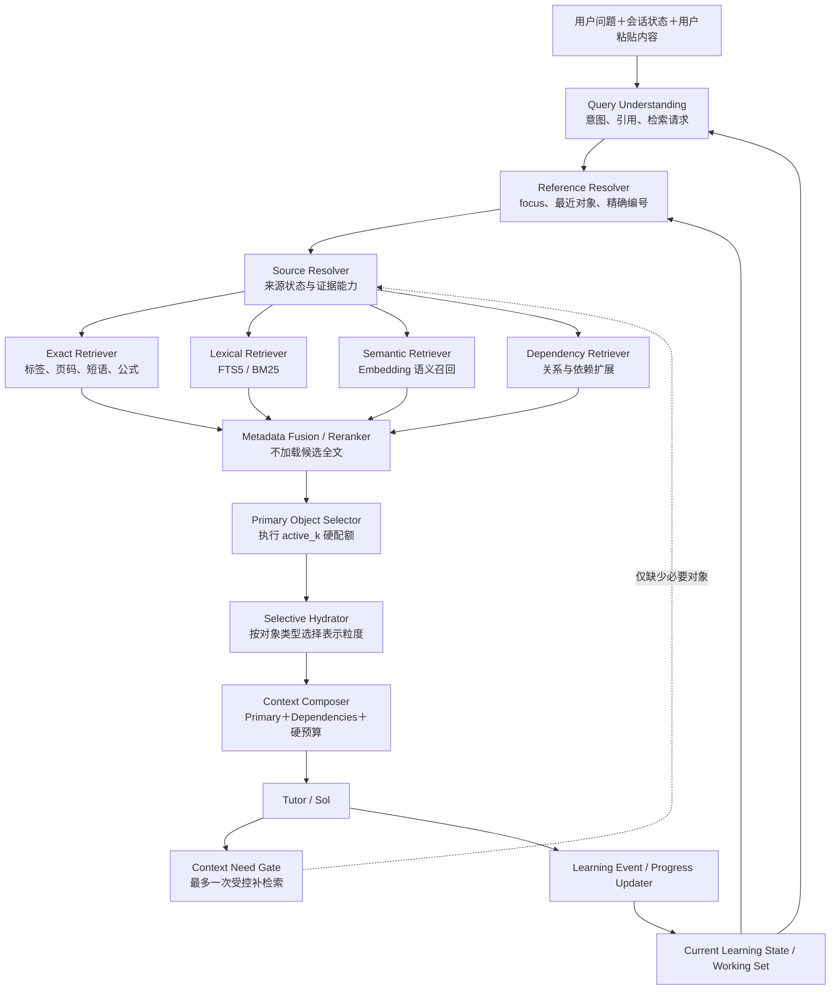

# 教材搜索问题的解决：方案总览

> 本文定义 MathStudyAgent 教材搜索与学习上下文系统的目标架构。它不是一次性版本清单，而是后续若干轮实现都应遵守的总体边界。

<!-- ai_provenance: source=codex; date=2026-08-11; verification=source-backed; retrieved_notes="教材搜索问题的解决.md, 当前系统问题.md"; external_inputs="two user-provided ChatGPT retrieval reviews" -->

相关文档：[[教材搜索问题的解决]]、[[当前系统问题]]、[[教材搜索v1.0方案]]、==[[教材搜索v1.5方案]]、[[教材搜索v2.0计划书]]==。

## 1. 结论与核心决策

教材搜索不能被理解为“把用户问题丢进向量数据库，再取 Top-K”。它需要同时解决四件事：

1. **识别用户正在指什么**：例如“这道题”“刚才的例子”“Exercise 2.1.5”。
2. **定位可靠的教材来源**：区分用户粘贴原文、当前页面、精确标签、全文命中和语义相似候选。
3. **理解当前学习状态**：知道用户正在学哪本书、哪一章、哪一节、哪些知识点，以及这些知识点大致掌握到什么程度。
4. **控制进入模型的上下文**：只加载当前回答真正需要的正文和依赖，避免把大量相似片段无差别塞进 Prompt。

因此最终系统由两个相互配合、但职责不同的核心组成：

- **Working Set / Current Learning State**：描述“用户当前正在学什么、正在处理什么、掌握到哪里”。
- **Context Retrieval Engine**：描述“面对本轮问题，应从教材中找什么、找到了什么、哪些内容可以进入回答”。

两条长期原则必须保留：

> Reference resolution precedes semantic retrieval：能够解析用户所指对象时，先解析对象，不用语义相似度猜测。

> Local retrieval precedes global retrieval：先在 Working Set、当前小节和当前章节中寻找，再逐步扩大到整本教材和未来的全局知识库。

同时，**语义搜索是目标架构的必要组成部分**。它可以在第一版中只保留基本能力和正式接口，但不能从设计中删除，因为“寻找相似例子、相关定理、相同证明技巧和跨章节联系”无法仅靠精确编号或关键词稳定完成。

还必须建立第三条系统级原则：

> ==Wide Retrieval, Narrow Active Context：候选召回可以宽，但完整正文加载和 Tutor Active Context 必须窄。==

系统严格区分三个数量：

- `candidate_k`：Retriever 在索引中宽范围召回的候选数；
- `rerank_k`：进入元数据级精排、去重和多样性选择的候选数；
- `active_k`：最终作为主要数学对象进入 Tutor 上下文的数量。

关系应始终满足：

```text
candidate_k >> rerank_k > active_k
```

Working Set 同样不等于 Prompt。它是 5～20 个对象构成的学习状态和局部索引层；一次普通回答真正注入 Tutor 的外部数学对象，默认应保持在约 2～5 个以内。

## 2. 目标行为

系统最终应支持三类不同任务。

### 2.1 精确来源定位

用户说：

> Exercise 2.1.5 除了课本上面的例子外，还有什么例子？

系统应先解析 `Exercise 2.1.5`，直接定位教材中的题目块，并识别用户粘贴的题干是一个可用于数学解释的来源。不能因为用户没有填写 UI 中的 `focus_ref`，就退化为对整条中文问题做精确短语 FTS。

### 2.2 当前上下文中的指代解析

用户继续说：

> 刚才那个例子为什么是非平凡因子？

系统应优先从 Working Set 中寻找最近活跃、类型为 example 的对象，并结合当前题目和最近回答解析指代。只有 Working Set 中存在多个合理候选时，才进入澄清或更宽范围搜索。

### 2.3 关联知识发现

用户问：

> 有没有和这个例子类似的其他例子？它和前面哪些定理有关？

系统应以当前对象为锚点进行语义检索和结构关系扩展，优先召回：

- 同类型的其他例子；
- 被该例子使用或说明的定义、定理；
- 使用相同构造或证明技巧的对象；
- 当前章节之外但语义高度相关的内容。

这类任务是语义搜索、类型过滤和未来 Dependency Retriever 的主要使用场景。

## 3. 总体架构



这里不是每个框都对应一个 Agent 或一次模型调用。大部分模块应是确定性服务、数据库查询或轻量排序逻辑。只有在规则无法可靠理解自然语言检索意图时，才需要一次结构化模型调用。

架构中的硬边界是：**先用 ID、类型、标签、章节、分数和短摘要完成选择，再为已经选中的少量对象加载正文**。禁止把 5～8 个候选全部展开后再让 Context Composer 删除，也禁止把 Hydrator 的中间结果顺手传给 Tutor。

## 4. Current Learning State 与 Working Set

### 4.1 两者的职责

`CurrentLearningState` 是会话级、可持久化的学习进度事实；`WorkingSet` 是从这些事实中选出的当前高活跃对象集合。

Current Learning State 至少应记录：

```text
当前教材
当前章
当前小节
当前教材位置或对象
正在学习的知识点
近期问题与未解决卡点
各知识点的掌握状态、置信度和证据
最近成功解析的教材来源
```

Working Set 只保留当前推理最可能需要的少量对象卡片，典型规模为 5～20 个对象：

```text
Current Focus
  当前定义 / 定理 / 例子 / 习题 / 证明

Active Knowledge Points
  当前小节核心概念
  本轮问题涉及的概念

Supporting Objects
  必要定义、前置定理、相关例子

Recent Objects
  最近几轮实际引用过的教材对象

Open Questions
  尚未解决的卡点或待验证结论
```

对象卡片默认只保存 ID、类型、标签、所在章/节、激活度、掌握标注和一段短摘要。正文仍在教材对象存储中，只有对象被 Primary Object Selector 或 dependency budget 选中时才加载。Working Set 的主要作用是：

- 解析“这个定理”“刚才的例子”等指代；
- 确定局部检索范围；
- 为候选排序提供当前章节、知识点和最近性特征；
- 保存当前学习进度，而不是扩大 Prompt。

### 4.2 Working Set 条目

第一阶段可以直接以现有 `DocumentBlock.id` 或 `RetrievalChunk.id` 作为对象 ID，避免立即建立全新的知识本体。条目至少包含：

```python
class WorkingSetItem:
    object_id: str
    block_id: str | None
    object_type: str
    role: str              # focus / active / support / recent / open_question
    title_or_label: str
    chapter_id: str | None
    section_ref: str | None
    activation_score: float
    last_mentioned_at: datetime
    mastery_level: str
    mastery_confidence: float
    mastery_evidence_ids: list[str]
```

### 4.3 掌握水平不能凭空猜测

掌握水平应采用“状态＋置信度＋证据”，不能让模型看见用户问过一次问题就断言用户不会，也不能因为用户说“懂了”就永久标记为完全掌握。

建议初始层级：

- `unknown`：没有足够证据；
- `exposed`：已经接触或阅读；
- `developing`：能部分解释，但仍有明显卡点；
- `usable`：能在相近任务中正确使用；
- `stable`：经过间隔或迁移任务验证，表现稳定。

可以产生证据的事件包括：

- 用户明确表示理解或仍不理解；
- 用户对定义或定理作出解释；
- 用户完成一道需要该知识点的题；
- 用户在新情境中正确迁移；
- 用户反馈回答没有解决问题；
- Tutor 发现明确的概念混淆。

长期可以允许模型提出 `ProgressUpdateProposal`，但实际写入必须由保守规则合并。低置信推断只作为提示，不直接覆盖已有高置信状态。

> [!important] 当前版本决策
> ==自动推断掌握水平不是近期优先项。v1.0 以用户手动标注为主，只自动维护教材、章、节、focus、活跃知识点和最近来源；没有用户证据时保持 `unknown`。==

### 4.4 状态更新时机

每轮结束后生成 Learning Event：

```text
本轮定位了哪些教材对象
讨论了哪些知识点
用户暴露了什么卡点
是否完成了练习或证明
是否出现新的掌握证据
下一轮应保留哪些 Working Set 条目
```

系统再根据事件更新 Current Learning State 和 Working Set。完整对话正文仍保存在会话历史中，但不会全部进入每轮 Prompt。

## 5. Query Understanding

查询理解输出一个小型、教材搜索专用的结构，而不是一个无边界的通用 Agent：

```python
class TextbookSearchRequest:
    should_retrieve: bool
    source_requirement: str
    intent: str
    retrieval_mode: str
    explicit_references: list[str]
    reference_expressions: list[str]
    user_quoted_statements: list[str]
    requested_object_types: list[str]
    lexical_terms: list[str]
    semantic_query: str | None
    relation_intents: list[str]
    scope: str
    book_id: str
    chapter_id: str | None
    section_ref: str | None
```

`retrieval_mode` 使用稳定枚举：

```text
none
exact_reference
similar_examples
related_theorems
similar_proofs
dependency_lookup
broad_discovery
```

它负责选择 Retrieval Policy，避免 Exact、Semantic、Hydrator 和 Composer 各自重新猜测用户要找什么。

必须把三个概念分开：

- `source_requirement`：哪些教材相关声明必须有证据；
- `should_retrieve`：本轮是否执行教材检索；
- `resolution_status`：实际找到了精确来源、多个候选，还是没有找到。

识别到已绑定教材中的结构化引用，例如 `Exercise 2.1.5`、`Theorem 3.2`，本身就足以触发检索，不应要求同时出现“教材”二字。

==从 v1.5 起，Query Understanding 采用三级协同，而不是“规则失败后才调用模型”：确定性规则与教材术语词典始终先执行；轻量模型只做快速初筛，回答是否需要进一步分析；只要出现关系型、多对象、跨语言、歧义或规则冲突，完整 Planner 即使在规则已经命中时仍需运行。规则构成不可降低的检索下限，Planner 只能补充检索词、对象类型和小节锚点。==

==教材语言与术语词典在导入阶段生成。语言识别从教材块中分层抽取至多 50,000 个汉字或拉丁字母；词典逐小节保存规范术语、同语言别名、证据块和小节锚点。查询与教材语言不同的时候，由 Planner 生成教材语言检索词，再由词典和目录校验；最终回答仍跟随用户语言，并保留教材原词。详细设计见 [[教材搜索v1.5方案]]。==

<!-- ai_provenance: source=codex; date=2026-08-11; verification=source-backed; retrieved_notes="教材搜索问题的解决-方案总览.md" -->

## 6. Reference Resolver

Reference Resolver 解决“用户指的是哪个对象”，其候选优先来自：

1. 用户本轮明确给出的标签、页码或标题；
2. UI 中明确选择的当前对象；
3. Working Set 中符合对象类型的最近对象；
4. 最近成功解析的来源；
5. 当前小节和章节中的同类型对象。

候选排序主要使用：对象类型匹配、最近性、当前小节一致性、句法提示和最近对话角色。这里不必默认使用 embedding。

无法唯一解析时返回候选与歧义原因。若不同候选会导致不同答案，应请求澄清；若可以给出兼容解释，则可以先回答共同部分，同时说明未确认具体对象。

## 7. Source Resolver 与来源纪律

来源优先级：

1. 用户明确粘贴的原文、题干或公式；
2. 当前 UI/focus 与 Working Set 中已确认对象；
3. 规范化后的精确标签或页码；
4. 精确短语和公式特征；
5. 当前小节、章节偏置的 BM25；
6. 语义向量召回；
7. 未来的关系与依赖扩展；
8. 未解析。

Source Resolver 应返回：

```python
class ResolvedSource:
    status: str                  # resolved / ambiguous / unresolved
    selected: SourceCandidate | None
    candidates: list[SourceCandidate]
    confidence: str
    mathematical_statement_complete: bool
    supports_book_facts: bool
    author_intent_support: str
```

不同来源允许支持的断言不同：

- 用户粘贴了完整题目：可以解释和求解，但不能因此声称已确认书中页码。
- 精确教材块且结构校验通过：可以声明教材编号、位置和原文内容。
- 只有语义相似候选：可以作为相关材料，但不能冒充用户所指的精确原文。
- 完全未定位：自包含数学问题仍可回答，但必须避免虚构教材事实。

## 8. 分层检索与 Retrieval Policy

### 8.1 检索范围

检索按以下范围逐级扩大：

- `L0`：当前消息、用户引用原文、上一轮回答；
- `L1`：Working Set；
- `L2`：当前小节；
- `L3`：当前章节；
- `L4`：当前教材；
- `L5`：未来的多教材、历史错题和全局知识库。

精确引用可以直接跳到相应范围；模糊查询则从局部开始，在候选不足或置信度不够时扩大范围。

### 8.2 有研究依据的默认对象配额

以下表格是 MathStudyAgent 的正式默认 Retrieval Policy：

| `retrieval_mode` | `candidate_k` | `rerank_k` | 最终主要对象（`active_k`） |
| --- | ---: | ---: | ---: |
| `similar_examples` | 20–30 | 5–6 | 3 个 example |
| `related_theorems` | 10–20 | 4–5 | 1–2 个 theorem |
| `similar_proofs` | 10–15 | 3–4 | 1–2 个 proof |
| `dependency_lookup` | 5–10 | 3–4 | 1–2 个必要依赖 |
| `exact_reference` | 按精确定位需要 | 通常 1 | 1 个目标对象 |

==这些配额不是任意的产品数字，而是有数学 RAG、定理语义检索、多文档 RAG 和干扰上下文研究支持的工程初值。==已有实验共同指向：Retriever 为保证召回应搜索较宽的候选集合，但 Reader/Solver 同时看到过多半相关对象会降低正确率；数学推理尤其容易受到干扰信息影响。数学 reasoning trace 检索和应用型 RAG 的实验也支持少量、结构化且互补的最终上下文。

研究并没有证明一个跨模型、跨教材普适的固定最优 `k`。因此该表是系统默认值和硬上限策略的起点，后续通过本地 `k` 消融实验校准，但在没有新证据前，任何实现不得把 `candidate_k` 误作 Tutor 的正文数量。

表中的数量是检索预算和默认目标，不是凑数要求。高质量候选不足时应返回更少对象，不能为了填满 `candidate_k`、`rerank_k` 或 `active_k` 引入低相关内容。

### 8.3 Retrieval Policy 的执行规则

- `exact_reference`：唯一高置信标签直接选择 1 个目标对象，不运行无意义的语义 Top-K。
- `similar_examples`：宽召回后选择 3 个具有不同作用的例子，优先形成“最相似案例＋互补案例＋有意义的差异或反例”，避免三个近乎重复的例子。
- `related_theorems`：默认只选择 1–2 个信息密度最高且条件真正适用的定理。
- `similar_proofs`：默认只选择 1–2 个主证明；依赖定理和引理使用独立的小预算。
- `dependency_lookup`：只查当前推理明确缺少的对象，不进行开放式发现。
- `broad_discovery`：允许更宽召回，但仍必须在进入 Hydrator 前转换为一个具体的 Primary Object 配额。

### 8.4 候选召回器

**Exact Retriever** 负责标签、页码、标题、精确短语和未来的公式指纹。唯一且高置信的精确标签直接成为主候选，不进入会稀释强信号的无条件 RRF。

**Lexical Retriever** 负责 FTS5 / BM25。Query Planner 拆出规范化编号、关键术语、短语、前缀、NEAR 组合、公式稳定符号和对象类型；结果加入小节、章节和页面邻近度。

**Semantic Retriever** 负责中文问英文、语义相近但词面不同的例子、相关定理和证明技巧、OCR 噪声及跨章节联系。向量文本包含规范化标签、标题路径、块类型和正文；查询包含锚点对象、请求类型和关系意图。

**Dependency Retriever** 逐步处理下列轻量关系：

```text
theorem requires definition
proof uses lemma / technique
example illustrates definition
counterexample refutes converse
exercise practices concept
```

第一阶段可以从相邻块、显式交叉引用和块类型推导关系；以后再形成稳定知识图谱。关系扩展通常限制为 0-hop＋1-hop。

所有召回器在候选阶段默认只返回：对象 ID、类型、标签、章/节、分数、短摘要或命中片段、来源置信度。此阶段不批量读取完整正文。

## 9. Metadata Rerank、Primary Selection 与 Selective Hydration

### 9.1 Metadata / Lightweight Rerank

候选融合不能只看语义分数。排序综合：

- 精确引用强度；
- 词法和语义相关度；
- 对象类型匹配；
- 当前小节、章节和 Working Set 邻近度；
- 来源置信度与索引健康状态；
- 与当前对象的关系；
- 与已经选择对象的重复度和互补性。

Rerank 阶段只处理轻量对象卡片。专用学习型 reranker 可以后加，但“元数据级精排＋去重＋多样性选择”是架构中的必经阶段。

### 9.2 Primary Object Selector

Primary Object Selector 根据 `retrieval_mode` 强制执行 `active_k`。只有被选中的主要对象才能进入 Hydrator。

Primary selection 应优先选择能够提供不同数学作用的对象，而不是机械取得分最高的若干重复项。若找 3 个例子，应记录每个例子的选择角色；若找定理，应验证其假设和结论确实与当前问题有关。

### 9.3 按对象类型选择性加载

Hydrator 不统一展开教材页，而生成对象类型对应的数学表示。

**Example / Exercise**

- 题目或对象；
- 核心构造；
- 关键结论；
- 与当前问题有关的解释；
- 默认不加载无关的整节正文。

**Theorem / Lemma**

- 名称和规范化标签；
- 假设；
- 结论；
- 与当前问题的关系；
- 除非明确询问证明，默认不加载完整证明。

**Proof**

- 证明目标；
- 关键定理或技巧；
- proof skeleton 和关键步骤；
- 只有逐步分析证明时才读取完整 proof block。

**Definition**

- 精确定义；
- 必要符号说明；
- 不自动展开全部例子和备注。

### 9.4 Primary Objects 与 Supporting Dependencies

Active Context 分成两层：

```text
Primary Objects
  用户本轮真正要求查找、比较或分析的对象

Supporting Dependencies
  理解或使用 Primary Objects 必须依赖的定义、定理或 Lemma
```

Primary Objects 服从表中的 `active_k`。Supporting Dependencies 使用独立预算：

```yaml
dependency_budget:
  full_objects: 0
  compact_objects: 2
```

依赖默认只给 statement 或 compact representation，不加载完整证明及周边教材正文。任何依赖扩展都不得绕过主要对象配额，导致十几个数学对象同时进入 Tutor。

### 9.5 Context 三层结构与最小充分上下文

Context Composer 将结果分为：

- `Active Context`：真正进入 Tutor Prompt 的正文或 compact representation；
- `Available Candidates`：已经发现但未加载的对象 ID、类型和元数据；
- `Background Index`：仅存在于检索系统中。

Working Set 的 5～20 个对象通常只出现在后两层；只有本轮必要对象进入 Active Context。

Composer 的目标是 **Minimum Sufficient Context**，不是填满上下文窗口。初始工程目标为：一次普通回答的外部完整/紧凑数学对象总数通常为 2～5 个，且大多数对象必须在最终解释或推理中实际发挥作用。

### 9.6 受控 Progressive Retrieval

第一轮只提供初始最小上下文。只有 Tutor 或确定性检查返回下列状态之一时，才允许一次补充检索：

```text
missing_definition
missing_theorem
missing_lemma
ambiguous_reference
insufficient_evidence
```

补充请求必须给出 `needed_type` 和 `needed_concept`，最多增加 1–2 个 compact objects。不能因为“也许还有更多相关材料”继续搜索；当前阶段最多补充一次，随后必须回答、澄清或明确证据不足。

## 10. 索引与数据一致性

教材原始文本、结构化块、FTS 和向量索引必须区分源数据与派生数据。

索引状态至少包含：

- `missing`：没有建立；
- `building`：正在构建；
- `ready`：版本一致且可查询；
- `stale`：教材块或切分版本已经变化；
- `failed`：构建失败并记录可恢复原因。

教材重新导入、结构修正、切分规则变化、embedding 模型或维度变化时，必须自动重建相应派生索引，或明确标记 stale。向量构建需要分批、断点恢复、局部重试和版本号。

语义索引不可用时，系统必须完整保留用户原文、精确定位和 BM25 路径；不能因为向量服务失败而阻断一般数学回答。

## 11. 建议的数据与服务边界

可以逐步形成以下持久化对象：

```text
current_learning_states
working_set_items
learning_events
mastery_evidence
source_resolution_runs
retrieval_candidates
document_blocks
document_embeddings
object_relations（后续）
```

服务边界建议：

```text
LearningStateService
WorkingSetService
TextbookQueryPlanner
ReferenceResolver
SourceResolver
ExactRetriever
LexicalRetriever
SemanticRetriever
DependencyRetriever
CandidateRanker
ContextHydrator
ContextComposer
ProgressUpdater
```

这些服务共享结构化协议，但不要求每个服务拥有独立模型或 Agent。

## 12. 可观测性与评测

每次检索应记录：

- 原始问题与结构化 SearchRequest；
- 当前学习位置与检索范围；
- 每个召回器的候选和原始分数；
- 融合、过滤和选择原因；
- 最终注入 Prompt 的 block ID；
- `candidate_k`、实际召回数、`rerank_k`、`active_k` 和依赖对象数；
- 每个主要对象的选择角色与 hydration profile；
- 来源状态与允许支持的声明；
- 索引版本、健康状态和耗时。

本地评测集至少覆盖：

- 精确编号及别名；
- 用户粘贴题目；
- 当前对象指代；
- 中文问英文；
- 相似例子和相关定理；
- OCR 噪声；
- 跨章节关联；
- 多个相似对象消歧；
- 无结果和低相关负例。

分别报告 exact top-1、BM25、dense 和 hybrid 的 Recall@5、MRR；对关联知识检索还应报告对象类型正确率和人工相关性。除此之外，必须评价 Retriever 之后的上下文控制：

- `Context Precision = relevant_injected_objects / injected_objects`；
- `Context Utilization = used_objects / injected_objects`；
- 外部对象数量、Token、延迟与回答正确率；
- 错误定理引用率和无用依赖比例；
- `example k = 1,2,3,4,5`、`theorem k = 1,2,3,4`、`proof k = 1,2,3` 的下游数学正确率消融。

`actually_used` 初期可由 Tutor 的结构化来源声明与离线人工标注估计。系统可把 `Context Precision / Utilization ≥ 0.7` 作为待验证的工程目标，但不得把 0.7 写成论文证明的普适阈值。

专用 reranker 只有在评测证明值得时再加入；即使没有专用模型，元数据级 rerank 和 Primary Object Selection 也必须存在。

## 13. 研究依据与参数定位

本方案中的“宽召回、窄注入”和默认对象配额参考下列研究：

- [RAG over Thinking Traces Can Improve Reasoning Tasks](https://arxiv.org/abs/2605.03344)：表明结构化 reasoning traces 可以成为数学与代码推理的有效检索语料，支持使用紧凑、诊断性表示而非堆叠原始长文本。
- [RAG+: Enhancing Retrieval-Augmented Generation with Application-Aware Reasoning](https://arxiv.org/abs/2506.11555)：把知识对象与应用案例联合检索，支持区分定理/定义知识与例子/方法应用。
- [Semantic Search over 9 Million Mathematical Theorems](https://arxiv.org/abs/2602.05216)：在约 920 万条定理陈述上研究语义搜索，说明大规模候选召回与最终返回的少量定理是两个不同层次。
- [More Documents, Same Length: Isolating the Challenge of Multiple Documents in RAG](https://arxiv.org/abs/2503.04388)：在控制总长度和相关信息位置时，增加文档数量仍会让多数模型表现下降，证明多对象本身就是推理负担。
- [How Is LLM Reasoning Distracted by Irrelevant Context?](https://arxiv.org/abs/2505.18761)：受控数学 benchmark 表明无关上下文会影响推理路径选择和算术准确性。
- [Toward Optimal Search and Retrieval for RAG](https://arxiv.org/abs/2411.07396)：强调 Retriever 与 Reader 是不同系统，检索指标和下游回答表现不能混为一谈。
- ==[Mathematical Information Retrieval](https://aclanthology.org/C16-1221/)：数学检索中的类型词典、最长序列匹配和查询扩展支持把数学多词术语作为整体处理。==
- ==[A Comparative Study of Query and Document Translation for Cross-Language Information Retrieval](https://aclanthology.org/1998.amta-papers.41/)：跨语言检索需要显式处理查询或文档翻译，支持在用户语言与教材语言不一致时先生成教材语言检索词。==
- ==[SQLite FTS5](https://www.sqlite.org/fts5.html)：FTS5 的词元化与短语查询能力决定了词典别名和多查询展开仍需在应用层显式管理。==

这些论文支持总体方向，但不会共同推出表中每一个精确数字。`20–30 → 5–6 → 3`、`10–20 → 4–5 → 1–2` 是结合研究结果与数学对象信息密度形成的工程默认值，必须在 MathStudyAgent 自己的教材、embedding、reranker 和 Tutor 模型上继续校准。

## 14. 分阶段路线

### 教材搜索 v1.0：基本闭环

- 修复检索触发和 `target_reference` 接线；
- 建立结构化 SearchRequest、ResolvedSource 和 SearchContext；
- 实现用户原文、focus、精确标签、BM25、元数据级 rerank、Primary Object Selector、选择性 hydration 和上下文硬预算；
- 建立基本 Current Learning State 与 Working Set；
- 保留并接入现有 Semantic Retriever 接口，显式处理 missing/stale/ready；
- 写入 `retrieval_mode` 与默认 `candidate_k / rerank_k / active_k` 策略；
- Working Set 只维护对象卡片；掌握水平以用户手动标注为主；
- 完成原始失败案例的端到端回归。

### ==教材搜索 v1.5：语言感知的规则、初筛与 Planner 协同==

- ==导入时完成教材语言识别，并阻塞生成逐小节、证据可验证的数学术语词典；==
- ==规则、词典匹配和轻量快速初筛共同运行，关系型或跨语言问题进入完整 Planner；==
- ==删除无锚点的全书同类型对象填充，检索预算只作为上限，相关性不足时返回更少对象或 `unresolved`；==
- ==四个现有失败案例只作为盲测，不写入 Planner Prompt；实现与验收见 [[教材搜索v1.5方案]]。==

### ==教材搜索 v2.0：可评测的数学对象检索==

- ==先建立 development/sealed 评测、完整 trace 和 held-out 教材，禁止继续用单条查询特例校准生产排序；==
- ==建立稳定 Textbook Object Registry，把术语、statement、proof、example 和来源块连接起来，并把“流水线 ready”与“质量达标”分开；==
- ==在版本化 manifest 下完成 Exact/词典/FTS/Semantic 的优先融合，只有真实非空 embedding 与 held-out 收益通过后才启用 semantic 默认路径；==
- ==实现有证据的 0-hop/1-hop Dependency Retrieval、Primary/Dependency 双预算和对象类型化 hydration；==
- ==最后才向主 Tutor 开放一次白名单补充检索，同时把 retrieved、injected、cited 与真正学习证据分开。完整计划见 [[教材搜索v2.0计划书]]。==

### 后续版本：全局数学学习记忆

- 多教材与个人笔记联合检索；
- 跨课程知识关系；
- 错题、证明技巧和历史对话的统一对象化；
- 基于间隔、迁移任务和长期表现的掌握度更新；
- 经过评测后决定是否引入专用 reranker 或更完整的知识图谱。

### ==方案 3 的实施位置：v2.0.4 主 Tutor 受控补充检索==

==方案 3 不再作为没有前置条件的独立远期功能，而进入 v2.0 最后阶段。只有评测集、对象注册表、证据阈值和 Dependency Retrieval 已通过后，才向主 Tutor 暴露教材搜索工具；每回合最多申请一次白名单补充检索，不能绕过证据等级、对象预算、教材范围和失败返回，也不取代 v1.5 的初始查询理解链路。若消融实验没有收益，该 feature flag 保持关闭。==

<!-- ai_provenance: source=codex; date=2026-08-11; verification=checked; retrieved_notes="教材搜索问题的解决-方案总览.md, 教材搜索v1.5方案.md, 教材搜索v2.0计划书.md"; local_evidence="D:/MathStudyAgent current worktree and data/app.db" -->

## 15. 不应提前实现的内容

以下内容属于可能的后续升级，不应成为 v1.0 的前置条件：

- 多 Agent 协作检索；
- Tutor 自主进行十几轮搜索；
- 一开始就建立完整数学知识图谱；
- 把所有历史对话切块后放进全局向量库；
- 未经评测就增加专用 reranker；
- 为每种 Retriever 单独调用一次大模型；
- 因检索失败而拒绝本可由用户原文或一般数学推理回答的问题。

目标不是把系统做得最复杂，而是让它逐步形成可靠的局部理解、教材依据、关联发现和学习进度记忆。
