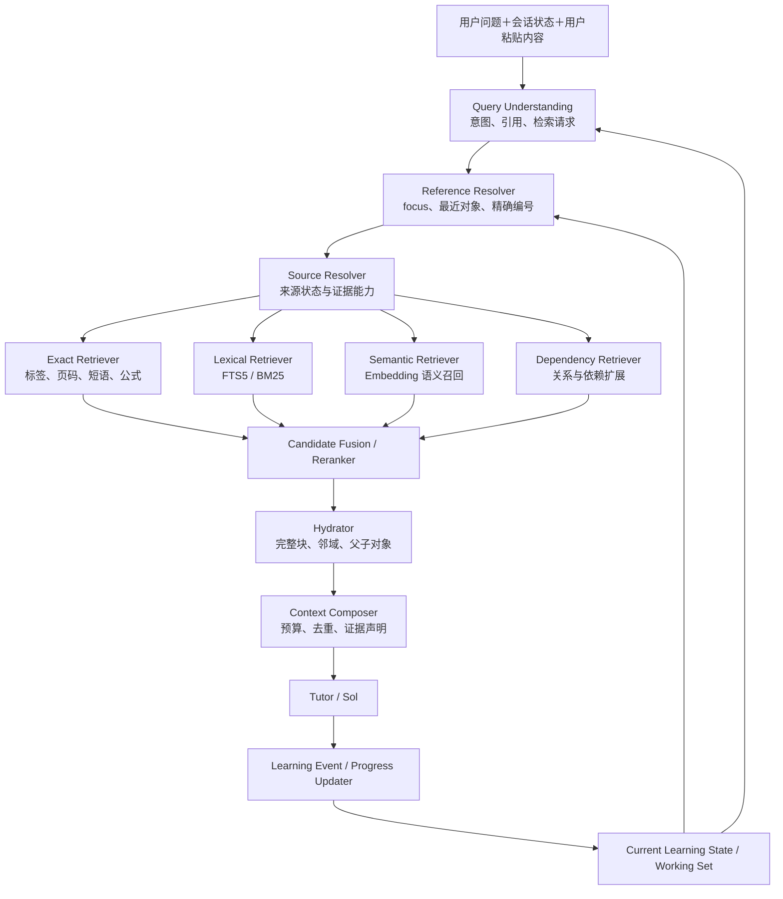

# 教材搜索问题的解决：方案总览

> 本文定义 MathStudyAgent 教材搜索与学习上下文系统的目标架构。它不是一次性版本清单，而是后续若干轮实现都应遵守的总体边界。

<!-- ai_provenance: source=codex; date=2026-08-11; verification=source-backed; retrieved_notes="教材搜索问题的解决.md, 当前系统问题.md" -->

相关文档：[[教材搜索问题的解决]]、[[当前系统问题]]、[[教材搜索v1.0方案]]。

## 1. 结论与核心决策

教材搜索不能被理解为“把用户问题丢进向量数据库，再取 Top-K”。它需要同时解决四件事：

1. **识别用户正在指什么**：例如“这道题”“刚才的例子”“Exercise 2.1.5”。
2. **定位可靠的教材来源**：区分用户粘贴原文、当前页面、精确标签、全文命中和语义相似候选。
3. **理解当前学习状态**：知道用户正在学哪本书、哪一章、哪一节、哪些知识点，以及这些知识点大致掌握到什么程度。
4. **控制进入模型的上下文**：只加载当前回答真正需要的正文和依赖，避免把大量相似片段无差别塞进 Prompt。

因此最终系统由两个相互配合、但职责不同的核心组成：

- **Working Set / Current Learning State**：描述“用户当前正在学什么、正在处理什么、掌握到哪里”。
- **Context Retrieval Engine**：描述“面对本轮问题，应从教材中找什么、找到了什么、哪些内容可以进入回答”。

两条长期原则必须保留：

> Reference resolution precedes semantic retrieval：能够解析用户所指对象时，先解析对象，不用语义相似度猜测。

> Local retrieval precedes global retrieval：先在 Working Set、当前小节和当前章节中寻找，再逐步扩大到整本教材和未来的全局知识库。

同时，**语义搜索是目标架构的必要组成部分**。它可以在第一版中只保留基本能力和正式接口，但不能从设计中删除，因为“寻找相似例子、相关定理、相同证明技巧和跨章节联系”无法仅靠精确编号或关键词稳定完成。

## 2. 目标行为

系统最终应支持三类不同任务。

### 2.1 精确来源定位

用户说：

> Exercise 2.1.5 除了课本上面的例子外，还有什么例子？

系统应先解析 `Exercise 2.1.5`，直接定位教材中的题目块，并识别用户粘贴的题干是一个可用于数学解释的来源。不能因为用户没有填写 UI 中的 `focus_ref`，就退化为对整条中文问题做精确短语 FTS。

### 2.2 当前上下文中的指代解析

用户继续说：

> 刚才那个例子为什么是非平凡因子？

系统应优先从 Working Set 中寻找最近活跃、类型为 example 的对象，并结合当前题目和最近回答解析指代。只有 Working Set 中存在多个合理候选时，才进入澄清或更宽范围搜索。

### 2.3 关联知识发现

用户问：

> 有没有和这个例子类似的其他例子？它和前面哪些定理有关？

系统应以当前对象为锚点进行语义检索和结构关系扩展，优先召回：

- 同类型的其他例子；
- 被该例子使用或说明的定义、定理；
- 使用相同构造或证明技巧的对象；
- 当前章节之外但语义高度相关的内容。

这类任务是语义搜索、类型过滤和未来 Dependency Retriever 的主要使用场景。

## 3. 总体架构



这里不是每个框都对应一个 Agent 或一次模型调用。大部分模块应是确定性服务、数据库查询或轻量排序逻辑。只有在规则无法可靠理解自然语言检索意图时，才需要一次结构化模型调用。

## 4. Current Learning State 与 Working Set

### 4.1 两者的职责

`CurrentLearningState` 是会话级、可持久化的学习进度事实；`WorkingSet` 是从这些事实中选出的当前高活跃对象集合。

Current Learning State 至少应记录：

```text
当前教材
当前章
当前小节
当前教材位置或对象
正在学习的知识点
近期问题与未解决卡点
各知识点的掌握状态、置信度和证据
最近成功解析的教材来源
```

Working Set 只保留当前推理最可能需要的少量内容，典型规模为 5～20 个对象：

```text
Current Focus
  当前定义 / 定理 / 例子 / 习题 / 证明

Active Knowledge Points
  当前小节核心概念
  本轮问题涉及的概念

Supporting Objects
  必要定义、前置定理、相关例子

Recent Objects
  最近几轮实际引用过的教材对象

Open Questions
  尚未解决的卡点或待验证结论
```

### 4.2 Working Set 条目

第一阶段可以直接以现有 `DocumentBlock.id` 或 `RetrievalChunk.id` 作为对象 ID，避免立即建立全新的知识本体。条目至少包含：

```python
class WorkingSetItem:
    object_id: str
    block_id: str | None
    object_type: str
    role: str              # focus / active / support / recent / open_question
    title_or_label: str
    chapter_id: str | None
    section_ref: str | None
    activation_score: float
    last_mentioned_at: datetime
    mastery_level: str
    mastery_confidence: float
    mastery_evidence_ids: list[str]
```

### 4.3 掌握水平不能凭空猜测

掌握水平应采用“状态＋置信度＋证据”，不能让模型看见用户问过一次问题就断言用户不会，也不能因为用户说“懂了”就永久标记为完全掌握。

建议初始层级：

- `unknown`：没有足够证据；
- `exposed`：已经接触或阅读；
- `developing`：能部分解释，但仍有明显卡点；
- `usable`：能在相近任务中正确使用；
- `stable`：经过间隔或迁移任务验证，表现稳定。

可以产生证据的事件包括：

- 用户明确表示理解或仍不理解；
- 用户对定义或定理作出解释；
- 用户完成一道需要该知识点的题；
- 用户在新情境中正确迁移；
- 用户反馈回答没有解决问题；
- Tutor 发现明确的概念混淆。

模型可以提出 `ProgressUpdateProposal`，但实际写入必须由保守规则合并。低置信推断只作为提示，不直接覆盖已有高置信状态。

**用户更新: 这一个功能不急着实现, 可以用户自己标注** 

### 4.4 状态更新时机

每轮结束后生成 Learning Event：

```text
本轮定位了哪些教材对象
讨论了哪些知识点
用户暴露了什么卡点
是否完成了练习或证明
是否出现新的掌握证据
下一轮应保留哪些 Working Set 条目
```

系统再根据事件更新 Current Learning State 和 Working Set。完整对话正文仍保存在会话历史中，但不会全部进入每轮 Prompt。

## 5. Query Understanding

查询理解输出一个小型、教材搜索专用的结构，而不是一个无边界的通用 Agent：

```python
class TextbookSearchRequest:
    should_retrieve: bool
    source_requirement: str
    intent: str
    explicit_references: list[str]
    reference_expressions: list[str]
    user_quoted_statements: list[str]
    requested_object_types: list[str]
    lexical_terms: list[str]
    semantic_query: str | None
    relation_intents: list[str]
    scope: str
    book_id: str
    chapter_id: str | None
    section_ref: str | None
```

必须把三个概念分开：

- `source_requirement`：哪些教材相关声明必须有证据；
- `should_retrieve`：本轮是否执行教材检索；
- `resolution_status`：实际找到了精确来源、多个候选，还是没有找到。

识别到已绑定教材中的结构化引用，例如 `Exercise 2.1.5`、`Theorem 3.2`，本身就足以触发检索，不应要求同时出现“教材”二字。

## 6. Reference Resolver

Reference Resolver 解决“用户指的是哪个对象”，其候选优先来自：

1. 用户本轮明确给出的标签、页码或标题；
2. UI 中明确选择的当前对象；
3. Working Set 中符合对象类型的最近对象；
4. 最近成功解析的来源；
5. 当前小节和章节中的同类型对象。

候选排序主要使用：对象类型匹配、最近性、当前小节一致性、句法提示和最近对话角色。这里不必默认使用 embedding。

无法唯一解析时返回候选与歧义原因。若不同候选会导致不同答案，应请求澄清；若可以给出兼容解释，则可以先回答共同部分，同时说明未确认具体对象。

## 7. Source Resolver 与来源纪律

来源优先级：

1. 用户明确粘贴的原文、题干或公式；
2. 当前 UI/focus 与 Working Set 中已确认对象；
3. 规范化后的精确标签或页码；
4. 精确短语和公式特征；
5. 当前小节、章节偏置的 BM25；
6. 语义向量召回；
7. 未来的关系与依赖扩展；
8. 未解析。

Source Resolver 应返回：

```python
class ResolvedSource:
    status: str                  # resolved / ambiguous / unresolved
    selected: SourceCandidate | None
    candidates: list[SourceCandidate]
    confidence: str
    mathematical_statement_complete: bool
    supports_book_facts: bool
    author_intent_support: str
```

不同来源允许支持的断言不同：

- 用户粘贴了完整题目：可以解释和求解，但不能因此声称已确认书中页码。
- 精确教材块且结构校验通过：可以声明教材编号、位置和原文内容。
- 只有语义相似候选：可以作为相关材料，但不能冒充用户所指的精确原文。
- 完全未定位：自包含数学问题仍可回答，但必须避免虚构教材事实。

## 8. 分层检索

### 8.1 检索范围

检索按以下范围逐级扩大：

- `L0`：当前消息、用户引用原文、上一轮回答；
- `L1`：Working Set；
- `L2`：当前小节；
- `L3`：当前章节；
- `L4`：当前教材；
- `L5`：未来的多教材、历史错题和全局知识库。

精确引用可以直接跳到相应范围；模糊查询则从局部开始，在候选不足或置信度不够时扩大范围。

### 8.2 Exact Retriever

负责标签、页码、标题、精确短语和未来的公式指纹。唯一且高置信的精确标签应直接成为主候选，不进入会稀释强信号的无条件 RRF。

### 8.3 Lexical Retriever

FTS 查询不能再把整条自然语言问题包装成一个完整短语。Query Planner 应拆出：

- 规范化教材编号；
- 英文或中文关键术语；
- 可用的短语、前缀和 NEAR 组合；
- 公式中的稳定符号；
- 对象类型过滤条件。

结果使用 BM25 排序，并加入小节、章节和页面邻近度作为排序特征。

### 8.4 Semantic Retriever

语义检索负责词面检索难以完成的任务：

- 中文提问匹配英文教材；
- 查找语义相近但用词不同的例子；
- 找到与当前例子相关的定理、定义或证明技巧；
- OCR 损坏或概念只被间接描述的内容；
- 跨章节知识联系。

向量文本应包含规范化标签、标题路径、块类型和正文。查询向量可以加入当前对象摘要、请求的对象类型和关系意图。例如“找类似例子”应对 example 类型加权，而不是只搜索包含“例子”的文本。

语义结果必须经过最低可靠性判断，并保留其来源类型为 `semantic_match`。阈值和权重应由本地评测集校准，而不是凭经验写死。

### 8.5 Dependency Retriever

后续版本逐步增加轻量关系：

```text
theorem requires definition
proof uses lemma / technique
example illustrates definition
counterexample refutes converse
exercise practices concept
```

第一阶段可以从相邻块、显式交叉引用和块类型推导关系；以后再形成稳定知识图谱。关系扩展通常限制为 0-hop＋1-hop，避免无限扩散。

## 9. 候选融合与 Context Composer

候选融合不能只看语义分数。建议综合：

- 精确引用强度；
- 词法和语义相关度；
- 对象类型匹配；
- 当前小节、章节和 Working Set 邻近度；
- 是否是所选对象的父项、证明、例子或依赖；
- 与已选内容的重复度；
- 来源置信度和索引健康状态。

召回阶段只选择标识符和元数据。随后由 Hydrator 回读：

- 完整教材块；
- 必要的前后邻域；
- 定理陈述与其证明；
- 习题题干与提示；
- 当前问题真正需要的定义或依赖。

Context Composer 再把内容分为：

- `Active Context`：实际进入 Tutor Prompt 的少量正文；
- `Available Candidates`：已发现但尚未加载的对象元数据；
- `Background Index`：只保留在检索系统中。

初期采用确定性的“两阶段加载”，不立即实现 Tutor 自主十几轮调用工具。以后若确实需要 Progressive Loader，可以允许一次受预算限制的补充检索。

## 10. 索引与数据一致性

教材原始文本、结构化块、FTS 和向量索引必须区分源数据与派生数据。

索引状态至少包含：

- `missing`：没有建立；
- `building`：正在构建；
- `ready`：版本一致且可查询；
- `stale`：教材块或切分版本已经变化；
- `failed`：构建失败并记录可恢复原因。

教材重新导入、结构修正、切分规则变化、embedding 模型或维度变化时，必须自动重建相应派生索引，或明确标记 stale。向量构建需要分批、断点恢复、局部重试和版本号。

语义索引不可用时，系统必须完整保留用户原文、精确定位和 BM25 路径；不能因为向量服务失败而阻断一般数学回答。

## 11. 建议的数据与服务边界

可以逐步形成以下持久化对象：

```text
current_learning_states
working_set_items
learning_events
mastery_evidence
source_resolution_runs
retrieval_candidates
document_blocks
document_embeddings
object_relations（后续）
```

服务边界建议：

```text
LearningStateService
WorkingSetService
TextbookQueryPlanner
ReferenceResolver
SourceResolver
ExactRetriever
LexicalRetriever
SemanticRetriever
DependencyRetriever
CandidateRanker
ContextHydrator
ContextComposer
ProgressUpdater
```

这些服务共享结构化协议，但不要求每个服务拥有独立模型或 Agent。

## 12. 可观测性与评测

每次检索应记录：

- 原始问题与结构化 SearchRequest；
- 当前学习位置与检索范围；
- 每个召回器的候选和原始分数；
- 融合、过滤和选择原因；
- 最终注入 Prompt 的 block ID；
- 来源状态与允许支持的声明；
- 索引版本、健康状态和耗时。

本地评测集至少覆盖：

- 精确编号及别名；
- 用户粘贴题目；
- 当前对象指代；
- 中文问英文；
- 相似例子和相关定理；
- OCR 噪声；
- 跨章节关联；
- 多个相似对象消歧；
- 无结果和低相关负例。

分别报告 exact top-1、BM25、dense 和 hybrid 的 Recall@5、MRR；对关联知识检索还应报告对象类型正确率和人工相关性。Reranker 只有在评测证明值得时再加入。

## 13. 分阶段路线

### 教材搜索 v1.0：基本闭环

- 修复检索触发和 `target_reference` 接线；
- 建立结构化 SearchRequest、ResolvedSource 和 SearchContext；
- 实现用户原文、focus、精确标签、BM25、完整块回读和上下文预算；
- 建立基本 Current Learning State 与 Working Set；
- 保留并接入现有 Semantic Retriever 接口，显式处理 missing/stale/ready；
- 完成原始失败案例的端到端回归。

### v1.1：可用的学习状态与语义召回

- 更可靠的小节定位和活跃知识点抽取；
- Learning Event 与掌握证据更新；
- 向量索引自动重建、批处理和状态管理；
- 建立语义检索评测集，校准阈值和融合权重；
- 支持“类似例子”“相关定理”的类型化语义搜索。

### v1.2：关联关系与渐进加载

- 增加定理—证明、定义—例子、习题—知识点等轻量关系；
- 引入 0-hop＋1-hop Dependency Retrieval；
- 增强 Context Composer 的依赖选择和去重；
- 在必要时允许一次受控的补充检索。

### 后续版本：全局数学学习记忆

- 多教材与个人笔记联合检索；
- 跨课程知识关系；
- 错题、证明技巧和历史对话的统一对象化；
- 基于间隔、迁移任务和长期表现的掌握度更新；
- 经过评测后决定是否引入专用 reranker 或更完整的知识图谱。

## 14. 不应提前实现的内容

以下内容属于可能的后续升级，不应成为 v1.0 的前置条件：

- 多 Agent 协作检索；
- Tutor 自主进行十几轮搜索；
- 一开始就建立完整数学知识图谱；
- 把所有历史对话切块后放进全局向量库；
- 未经评测就增加专用 reranker；
- 为每种 Retriever 单独调用一次大模型；
- 因检索失败而拒绝本可由用户原文或一般数学推理回答的问题。

目标不是把系统做得最复杂，而是让它逐步形成可靠的局部理解、教材依据、关联发现和学习进度记忆。
