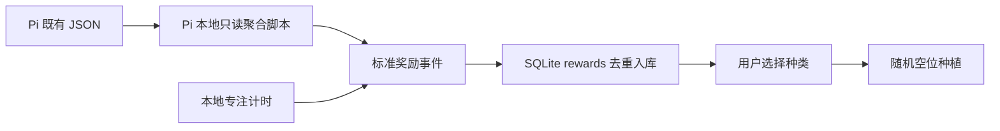

# 我的专注花园：数据来源与处理

<!-- ai_provenance: source=codex; date=2026-08-03; verification=checked; retrieved_notes="非笔记内容/工作流程与系统运维/树莓派行为数据与接口索引.md,非笔记内容/工作流程与系统运维/PI_SERVER_HANDOFF.md" -->

## 总体原则

游戏不直接读取手机原始日志、ActivityWatch 全量事件或 Obsidian 笔记。它只读取树莓派已经形成的结构化结果，并在 Pi 本地完成筛选、标准化、去重和种植。



## 四类奖励数据

### 1. 主动接受系统介入

来源：

```text
/home/conrad/workspace/activitywatch-advisor/
  data/computer_interventions/responses/**/*final.json
```

当前代码条件：

- `decision == "accepted"`，因此排除 `forced`、`ignored`、`declined`、`already_locked` 和 `skipped`；
- `executions` 中至少一项 `status == "success"`；
- 用 `request_id` 生成 `pi:intervention:<request_id>`。

这统计的是用户主动点击接受且至少有一个网站封锁命令成功的次数，不是系统检测次数，也不是被动或强制介入次数。

### 2. 主动寻求 AI 帮助并完成

来源：

```text
data/next_action/responses/**/*.json
data/next_action/outcomes/**/*.json
```

当前代码先收集 `result == "accepted"` 的 response，再要求同一 `suggestion_id` 存在 `result == "completed"` 的 outcome。只有这个闭环才生成：

```text
pi:next-action:<suggestion_id>
```

因此不能把“接受任务数”和“完成回执数”相加；二者必须通过同一个建议 ID 配对。

### 3. 早睡估计

来源：

```text
data/statistics/daily_life/*.json
```

读取 `phone_sleep_boundary`，要求：

- `status == "resolved"`；
- `quality == "high"`；
- `last_phone_use_at_night` 不晚于 `config/settings.json` 的 `early_sleep_cutoff`，当前为 `00:30`。

事件 ID 为 `pi:early-sleep:<period>`。它只表示高质量的“夜间最后手机活动”估计，不等于医学意义或传感器确认的真实入睡时间。

### 4. 本地专注累计

来源是本地表 `focus_sessions`。计时自然结束后，`duration_minutes` 与此前余数相加，每满 40 分钟生成一份 `focus_completed` 奖励，余数写回 `counters.focus_credit_minutes`。

取消或 Cold Turkey 执行失败的 session 不计入已完成专注，也不发奖励。

## Pi 本地读取与 Windows 兼容

实现文件在 Pi 为 `/home/conrad/services/focus-garden/focus_garden/pi_sync.py`。正式 systemd 服务设置 `FOCUS_GARDEN_PI_LOCAL=1`，直接在 Pi 本机临时执行只读聚合脚本，不创建或修改 activitywatch-advisor 文件。

```text
python3 -
```

Windows 开发副本仍保留原 SSH 路径作为兼容入口，但不再承载正式存档。脚本只输出 JSON 到 stdout。每个结果统一为：

```json
{
  "id": "pi:<rule>:<stable-source-id>",
  "type": "intervention_accepted | ai_help_completed | early_sleep",
  "occurred_at": "ISO-8601",
  "reason": "人类可读的发放原因",
  "source": "pi",
  "payload": {}
}
```

## 本地入库、去重与种植

`rewards.id` 是主键，导入使用 `INSERT OR IGNORE`。因此每次启动页面自动同步、或手动点击同步时，即使重新扫描全部历史 JSON，也不会重复发奖。

用户选择种类后：

1. 服务端确认 `species_id` 存在于 `config/plants.json`；
2. 确认奖励存在且状态为 `pending`；
3. 枚举当前花园空位；只有完全填满时，边长才从 `5` 增至 `7`、`9`……；
4. 以 `SHA-256(reward_id + species_id)` 生成固定随机种子，从空位中选一个位置；
5. 写入 `garden_plants`，并把奖励改为 `planted`。

这种“随机”对同一奖励和同一种类是可复现的，便于排障；数据库事务和唯一约束保证同一奖励只能种一次、一个位置只能放一株。

## 展示统计的口径

- 奖励页按 `occurred_at` 倒序展示，并保留发放原因。
- 花园的日、周、月、年筛选在浏览器端按 `planted_at` 计算，不是按奖励发生时间计算。
- `/api/bootstrap` 返回的奖励历史最多 200 条，专注历史最多 50 条。
- 当前同步每次都会扫描上述 Pi 历史目录；数据量继续增长后需要增量游标或专用摘要文件。

## 2026-08-07：任务待安排数据流

==任务数据仍以 Obsidian Markdown 为唯一事实源。网页在 Pi 仅写 mutation queue；无 `⏳` 的 create/update 在有效视图中标为 `unassigned`，由电脑 Pi Context Sync 写入 `ToDo-任务集合.md` 顶部的 `# ⚠️ 树莓派新增 · 待正式安排`，并保留尾部 `^blockid`。有安排日时，同一桌面写入器将该行移至 `ToDo-已经规划好的任务.md`；Pi 不读取或修改 Vault 文件。==

<!-- ai_provenance: source=codex; date=2026-08-07; verification=local-and-pi-tests-plus-live-endpoints; retrieved_notes="非笔记内容/工作流程与系统运维/PI_SERVER_HANDOFF.md" -->
