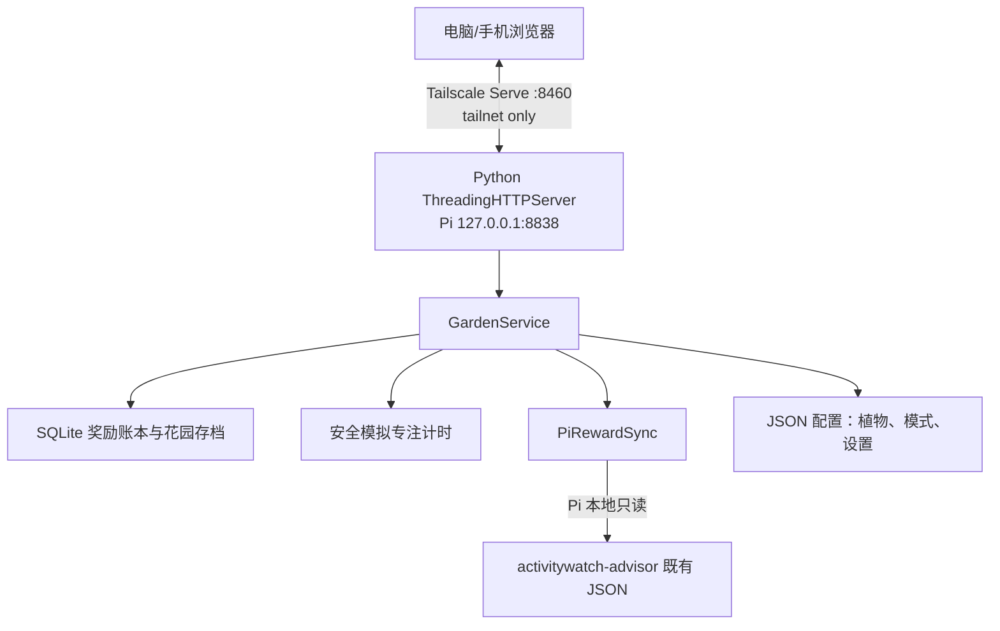
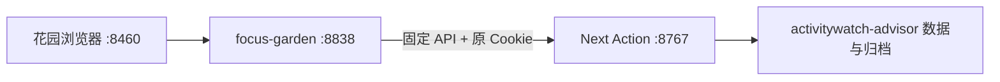

# 我的专注花园：游戏架构

<!-- ai_provenance: source=codex; date=2026-08-03; verification=checked; retrieved_notes="非笔记内容/工作流程与系统运维/PROJECT_STATE.md,非笔记内容/工作流程与系统运维/PI_SERVER_HANDOFF.md" -->

## 运行结构

整个应用没有 Node 构建步骤、第三方 Web 框架或云服务。Pi 正式运行时依赖 Python 标准库、SQLite 和 Tailscale；Windows 开发副本仍可使用 SSH 与 Cold Turkey。

## 目录职责

| 路径 | 职责 |
|---|---|
| `app.py` | 参数解析、绑定 loopback、启动浏览器和后台计时核对线程 |
| `launch.pyw` | 无控制台启动，日志写入 `data/app.log` |
| `focus_garden/server.py` | 服务编排、HTTP API、静态文件、输入校验 |
| `focus_garden/database.py` | SQLite schema、事务、奖励、种植、专注累计 |
| `focus_garden/pi_sync.py` | Pi 数据只读聚合和标准奖励事件转换 |
| `focus_garden/cold_turkey.py` | allowlist 校验和 Cold Turkey 命令执行 |
| `config/settings.json` | 数据库、Pi 主机、早睡阈值、Cold Turkey 模式与路径 |
| `config/focus_profiles.json` | 专注模式及其 block 组合 |
| `config/plants.json` | 可种植对象注册表，是新增植物/蘑菇的主要接口 |
| `static/index.html` | 页面结构与侧边栏 |
| `static/app.js` | 状态、API 调用、计时、统计、种植弹窗和花园渲染 |
| `static/style.css` | 基础像素风主题与响应式布局 |
| `static/garden-isometric.css` | 草方块拼接、植物缩放、层级、背景与阴影 |
| `static/assets/` | 本机素材；不应对外分发 |
| `tests/` | 数据库、服务、URL 编码、扩园、蘑菇资产测试 |

## Next Action 菜单（2026-08-04，已部署）

==花园服务新增一个固定、同 Pi loopback 的 Next Action 代理：只允许当前建议、生成建议、建议反馈/结果、近三条报告、报告反馈、问题反馈和登录这些既有接口。它不接受客户端提供任意上游 URL，也不读取 Next Action 的数据目录、密码或环境变量。==

==首次进入菜单时，用户仍在花园页面输入原有 Next Action 密码；代理只将其转交给 `127.0.0.1:8767`，并把该服务返回的签名登录 cookie 原样交回浏览器。cookie 与密码都不写入花园 SQLite、配置或日志。==

<!-- ai_provenance: source=codex; date=2026-08-04; verification=checked; retrieved_notes="非笔记内容/工作流程与系统运维/我的专注花园/02-游戏架构.md,非笔记内容/工作流程与系统运维/树莓派 Next Action Web架构.md" -->

## 数据库模型

SQLite 使用 WAL、外键和进程内可重入锁。

| 表 | 关键字段 | 含义 |
|---|---|---|
| `rewards` | `id`, `type`, `reason`, `source`, `status` | 奖励事实和待种/已种状态 |
| `garden_plants` | `reward_id`, `species_id`, `x`, `y`, `planted_at` | 一份奖励对应一株植物和唯一坐标 |
| `focus_sessions` | `duration_minutes`, `ends_at`, `status`, `cold_turkey_json` | 专注计时与封锁执行回执 |
| `counters` | `garden_size`, `focus_credit_minutes` | 当前奇数边长和 40 分钟累计余数 |

当前没有显式 schema version 或迁移工具；以后改表结构时不能只修改 `CREATE TABLE IF NOT EXISTS`，需要补迁移逻辑。

## HTTP API

| 方法与路径 | 作用 |
|---|---|
| `GET /api/health` | 健康检查 |
| `GET /api/bootstrap` | 一次返回目录、模式、花园、奖励、专注和统计 |
| `GET /api/garden` | 只返回花园尺寸和种植物 |
| `POST /api/rewards/sync` | 触发 Pi 只读同步并导入新奖励 |
| `POST /api/focus/start` | 校验 5—180 分钟，启动专注和 Cold Turkey |
| `POST /api/focus/cancel` | 停止游戏计时记录；不解除 Cold Turkey |
| `POST /api/rewards/{encoded_id}/plant` | 消耗待种奖励并种植所选种类 |

API 没有独立登录认证，安全边界是只绑定 Pi 的 `127.0.0.1`，再由 Tailscale Serve `:8460` 仅向已认证 Tailnet 设备转发。不要改成 `0.0.0.0`，也不要为 8460 启用 Funnel。

## 专注执行链

==Pi 正式服务设置 `FOCUS_GARDEN_DRY_RUN=1`。手机或电脑从网页开始的专注只计时和结算奖励，不会锁定 Windows 网站；确认框和状态页会显示“安全模拟”。若需要真实 Cold Turkey，仍应使用 Windows 开发副本，并确保它不写入 Pi 权威存档。==

1. 浏览器根据服务端模式显示确认信息，并提交时间和 profile。
2. 服务端限制时长为 5—180 分钟，并拒绝未知 profile。
3. Pi 安全模拟模式只记录 `simulated` 执行结果，不读取 Windows 路径，也不锁网站。
4. 后台线程每 2 秒检查结束时间；自然到期时完成 session 并结算累计分钟。
5. Windows 开发副本若显式使用 live 模式，才会读取 computer-intervention-agent allowlist 并调用 Cold Turkey 官方命令行；该模式不应与 Pi 同时写存档。

应用关闭后再启动，仍会根据数据库中的 `ends_at` 补做自然结束结算。但系统时钟变化、休眠和跨时区行为尚无专项测试。

## 花园渲染

前端把用户提供的 `grass_cube_user.png` 作为每格完整草方块，按等距投影顺序交错排列。逻辑尺寸由格子数计算，外层最大宽度受页面限制，因此花园从 `5×5` 扩大时，每个方块和植物会自动缩小。

植物按行列和 `z-index` 排序；每株由前景、暗色深度副本和落地阴影构成立体感。==种植弹窗按每项的 `tier` 分为“初级”和“高级”两个标签页，不再按花/树苗与蘑菇拆分；缺少 `tier` 的旧条目按初级处理。图鉴页标题卡片下方也有独立的“初级 / 高级”按钮，默认只展示初级，点击后仅重绘对应等级的图鉴卡片。==日/周/月/年只是过滤已种植物，不会改变真实存档。

## 素材现状

- 12 种花、6 种树苗和 2 种基础蘑菇来自本机 Minecraft Education Edition 资源。
- 15 种低等级蘑菇从本机 Steam 游戏 Mushroom Nook 的 `C:\steam\steamapps\common\Mushroom Nook\Mushroom Nook\Mushroom Nook_Data\data.unity3d` 中提取，输出到 `D:\MyFocusGarden\static\assets\mushrooms\`。提取工具为安装在 `D:\anaconda` 环境中的 UnityPy 1.25.3；游戏运行时不依赖 UnityPy。
- 草方块使用用户提供的透明 PNG。
- ==2026-08-05 的高级目录还包含用户提供的蜂巢、盛开的杜鹃花丛、玫瑰丛、竹笋、南瓜、向日葵、牡丹和丁香透视 PNG；它们与原版贴图同样只限私人 Pi 服务使用。==
- 所有素材只限本机个人使用，不属于可发布资产。
- Pi 上的贴图只通过 Tailnet-only 页面提供，不进入公网或 Syncthing 存档目录。
