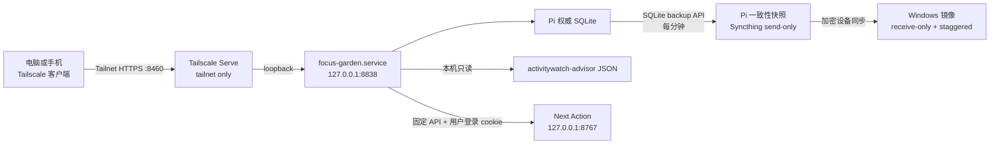

# 我的专注花园：Pi 迁移验收与恢复清单

<!-- ai_provenance: source=codex; date=2026-08-03; verification=checked; retrieved_notes="非笔记内容/工作流程与系统运维/我的专注花园/00-交接总览.md,非笔记内容/工作流程与系统运维/我的专注花园/04-运维与扩展手册.md,非笔记内容/工作流程与系统运维/PROJECT_STATE.md,非笔记内容/工作流程与系统运维/DECISIONS.md,非笔记内容/工作流程与系统运维/NEXT_STEPS.md,非笔记内容/工作流程与系统运维/PI_SERVER_HANDOFF.md" -->

本文记录 2026-08-03 已完成迁移的最终状态。它用于快速判断“服务是否仍按设计运行”、接管故障处理，以及在不制造双写的前提下恢复存档。

## 1. 最终架构



关键原则：

- Pi 是唯一正式写入端；电脑和手机访问同一个网页实例。
- 活跃 SQLite 不做双向文件同步；同步对象是 SQLite backup API 生成的一致性快照。
- 受版权保护的贴图只在个人 Windows 与私人 Pi 中存在，不进入存档同步目录。
- 专注花园只使用 Tailscale Serve，不使用 Funnel，不监听局域网或公网地址。
- ==Next Action 合并后，花园只向 Pi loopback 的 `127.0.0.1:8767` 转发固定接口；不得将其替换成任意远程 URL，也不得在花园保存 Next Action 密码。==

## 2. 权威路径与服务

| 对象 | 位置或名称 |
|---|---|
| 手机/电脑入口 | `https://pi.taild4d3f7.ts.net:8460/` |
| 应用服务 | `focus-garden.service` |
| 应用监听 | `127.0.0.1:8838` |
| Pi 应用目录 | `/home/conrad/services/focus-garden` |
| Pi 权威数据库 | `/home/conrad/services/focus-garden/data/focus-garden.sqlite3` |
| 备份服务与定时器 | `focus-garden-backup.service`、`focus-garden-backup.timer` |
| Pi 快照目录 | `/home/conrad/workspace/focus-garden-archive` |
| Syncthing 文件夹 ID | `focus-garden-archive` |
| Windows 镜像 | `D:\MyFocusGardenArchive\focus-garden.sqlite3` |
| Windows 开发副本 | `D:\MyFocusGarden` |
| 正常桌面快捷方式 | `C:\Users\15345\Desktop\我的专注花园.lnk` |
| 迁移前回滚快捷方式 | `C:\Users\15345\Desktop\我的专注花园-迁移前Windows版.lnk` |

## 3. 手机访问

1. 手机连接 Tailscale，并确认使用与 Pi 相同的 Tailnet。
2. 打开 `https://pi.taild4d3f7.ts.net:8460/`。
3. 若打不开，先排除手机 Tailscale/VPN 冲突，再检查 Pi 服务与 Serve 状态。
4. 不要通过开放路由器端口、Funnel 或公网代理解决访问问题。

手机访问不需要复制数据库或素材到手机。Tailnet 身份是当前访问边界，应用本身没有额外登录页面。

## 4. 安全验收

必须同时满足：

- `ss` 显示应用只监听 `127.0.0.1:8838`；
- `tailscale serve status` 将 `:8460` 标记为 `tailnet only`；
- `:8460` 代理目标为 `http://127.0.0.1:8838`；
- 专注花园没有出现在 Funnel 路由中；
- Syncthing GUI 仍只监听 `127.0.0.1:8384`；
- Pi 快照目录不含 `static/assets/` 或贴图副本；
- 配置、文档与日志中没有密码、token、私钥或 Syncthing API key。
- ==登录 Next Action 后，花园只转交该服务签发的 cookie；代理不读取 `web.env` 或 Next Action 数据目录。==

服务器上其他历史 Funnel 路由与专注花园无关；不得把它们误认为 8460 已公开。

## 5. 存档同步验收

设计状态：

| 端 | Syncthing 类型 | 作用 |
|---|---|---|
| Pi | Send Only | 发送一致性快照，不接收电脑覆盖 |
| Windows | Receive Only | 接收 Pi 快照，不反向写权威存档 |
| Windows 版本策略 | Staggered | 保留被替换的历史版本，便于恢复 |

Pi 检查：

```bash
systemctl status focus-garden-backup.timer --no-pager
systemctl status syncthing@conrad.service --no-pager
syncthing cli config folders focus-garden-archive dump-json
python3 /home/conrad/services/focus-garden/scripts/audit_save.py \
  /home/conrad/workspace/focus-garden-archive/focus-garden.sqlite3
sha256sum /home/conrad/workspace/focus-garden-archive/focus-garden.sqlite3
```

Windows 检查：

```powershell
python D:\MyFocusGarden\scripts\audit_save.py `
  D:\MyFocusGardenArchive\focus-garden.sqlite3
Get-FileHash -Algorithm SHA256 `
  D:\MyFocusGardenArchive\focus-garden.sqlite3
```

2026-08-03 最终验收：两端快照 SHA-256 均为 `A53589A3668135E66EAFB2B96FCB356DCF15C6DD7ED563B106C46B05EA4934F1`；完整性为 `ok`，含 9 条奖励、8 株植物、1 份待种、0 个运行中计时。该数字和哈希是当时快照，之后会随正常使用变化。

## 6. 日常健康检查

```bash
systemctl is-active focus-garden.service focus-garden-backup.timer \
  syncthing@conrad.service tailscaled.service
curl -fsS http://127.0.0.1:8838/api/health
journalctl -u focus-garden.service -u focus-garden-backup.service \
  --no-pager -n 100
ss -lntp | grep -E ':(8460|8838) '
tailscale serve status
```

预期：四项均为 `active`，健康检查返回 `{"status": "ok"}`，8838 仅为 loopback，8460 仅绑定 Tailscale 地址且显示 `tailnet only`。

## 7. 专注模式边界

Pi systemd 服务设置：

```text
FOCUS_GARDEN_PI_LOCAL=1
FOCUS_GARDEN_DRY_RUN=1
```

因此：

- 奖励同步直接读取 Pi 本地 JSON，不 SSH 回自己；
- 手机或电脑网页发起专注时只计时并结算奖励；
- Pi 不会调用 Windows Cold Turkey，网页会显示“安全模拟”；
- 迁移前 Windows 副本仍可用于开发，但不得与 Pi 同时形成两个正式存档。

若未来需要从手机启动真实 Windows 封锁，应单独设计最小权限 Windows agent，只允许预定义 allowlist，不能让 Pi 下发任意 shell 命令。

## 8. 恢复流程

恢复前不得直接覆盖唯一副本。

1. 确认 Windows 镜像或 `.stversions` 中候选快照通过 `audit_save.py`。
2. 停止 Pi 应用：`sudo systemctl stop focus-garden.service`。
3. 把当前 Pi 数据库另存到带时间戳的私人备份目录。
4. 将候选快照上传到 Pi 临时路径，再以 `conrad:conrad`、权限 `600` 安装到权威数据库路径。
5. 启动应用：`sudo systemctl start focus-garden.service`。
6. 检查 `/api/health`、`/api/bootstrap`、奖励数、植物数和页面贴图。
7. 手动启动一次备份服务，确认新快照重新同步到 Windows。

恢复期间保持 Syncthing 文件夹方向不变。不要为了“让文件回来”临时改成 Send & Receive。

## 9. Windows 回滚边界

迁移前快捷方式只用于应急回滚，不是日常第二入口。若必须回滚到 Windows：

1. 先停止 Pi 的 `focus-garden.service`；
2. 用最新一致性快照恢复 Windows 本地数据库；
3. 验证本地数据库完整性与页面内容；
4. 明确宣布 Windows 成为新的唯一写入端后，才可启动旧快捷方式；
5. 在重新设计同步方向前，不得同时恢复 Pi 写入。

## 10. 已完成与待办

已完成：

- Pi systemd 正式部署；
- Tailscale tailnet-only HTTPS 访问；
- 手机访问链路建立；
- Pi 本地奖励读取；
- SQLite 一致性快照；
- Pi → Windows 单向 Syncthing；
- Windows staggered 版本保留；
- 桌面快捷方式切换；
- Python 7 项测试、前端语法、systemd、HTTPS、素材与存档完整性验收。

待办：

- 做一次不覆盖权威存档的临时恢复演练；
- ==2026-08-04 Next Action 花园菜单已部署并改为免密码；Pi 端 8 项 Python 测试、8838 健康检查和花园代理接口 200 检查通过。Next Action 公网 `:10000` Funnel 已撤除，后续仅在 Tailnet 内验收建议与反馈闭环。==
- ==2026-08-05 植物目录扩展验收：变更前备份位于 `/home/conrad/workspace/backups/focus-garden-plant-catalog-20260805-132244/`；Pi 端目录为 29 种，9 张新增 Minecraft 本机纹理均存在，`focus-garden.service` 重启后为 active，`127.0.0.1:8838/api/health` 与 Tailnet `:8460/api/bootstrap` 均正常。未改变数据库、备份定时器、Syncthing 方向、端口或 Serve/Funnel 边界。==
- ==2026-08-05 目录校正验收：此前的 29 种目录已被 32 种版本取代，种植标签改为初级 18 种 / 高级 14 种。备份位于 `/home/conrad/workspace/backups/focus-garden-tier-catalog-20260805-182844/`；Pi 已核对所有引用素材、删除撤销贴图并重启 `focus-garden.service`。`/api/health` 与 Tailnet `/api/bootstrap` 均确认正常；数据库、备份定时器、Syncthing 方向、端口和 Serve/Funnel 边界未改变。==
- ==2026-08-05 图鉴筛选验收：备份位于 `/home/conrad/workspace/backups/focus-garden-catalog-tabs-20260805-183917/`；图鉴标题下方的初级 / 高级菜单已部署，默认初级，点击后仅显示对应等级。Tailnet 首页及其实际引用的 `/app.js` 已确认包含筛选容器和 `data-catalog-tier` 处理逻辑；服务重启后健康检查正常。==
- 如确有需要，再设计手机触发 Windows Cold Turkey 的最小权限桥接；
- 长期逐步用原创素材替换第三方贴图。

<!-- ai_provenance: source=codex; date=2026-08-04; verification=checked; retrieved_notes="非笔记内容/工作流程与系统运维/我的专注花园/05-Pi迁移验收与恢复清单.md,非笔记内容/工作流程与系统运维/树莓派 Next Action Web架构.md" -->

<!-- ai_provenance: source=codex; date=2026-08-05; verification=checked; retrieved_notes="非笔记内容/工作流程与系统运维/我的专注花园/05-Pi迁移验收与恢复清单.md" -->
