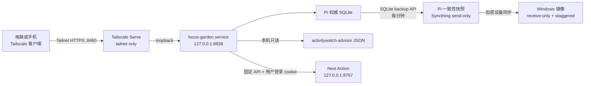

# 我的专注花园：Pi 迁移验收与恢复清单

<!-- ai_provenance: source=codex; date=2026-08-03; verification=checked; retrieved_notes="非笔记内容/工作流程与系统运维/我的专注花园/00-交接总览.md,非笔记内容/工作流程与系统运维/我的专注花园/04-运维与扩展手册.md,非笔记内容/工作流程与系统运维/PROJECT_STATE.md,非笔记内容/工作流程与系统运维/DECISIONS.md,非笔记内容/工作流程与系统运维/NEXT_STEPS.md,非笔记内容/工作流程与系统运维/PI_SERVER_HANDOFF.md" -->

本文记录 2026-08-03 已完成迁移的最终状态。它用于快速判断“服务是否仍按设计运行”、接管故障处理，以及在不制造双写的前提下恢复存档。

## 1. 最终架构



关键原则：

- Pi 是唯一正式写入端；电脑和手机访问同一个网页实例。
- 活跃 SQLite 不做双向文件同步；同步对象是 SQLite backup API 生成的一致性快照。
- 受版权保护的贴图只在个人 Windows 与私人 Pi 中存在，不进入存档同步目录。
- 专注花园只使用 Tailscale Serve，不使用 Funnel，不监听局域网或公网地址。
- ==Next Action 合并后，花园只向 Pi loopback 的 `127.0.0.1:8767` 转发固定接口；不得将其替换成任意远程 URL，也不得在花园保存 Next Action 密码。==

## 2. 权威路径与服务

| 对象 | 位置或名称 |
|---|---|
| 手机/电脑入口 | `https://pi.taild4d3f7.ts.net:8460/` |
| 应用服务 | `focus-garden.service` |
| 应用监听 | `127.0.0.1:8838` |
| Pi 应用目录 | `/home/conrad/services/focus-garden` |
| Pi 权威数据库 | `/home/conrad/services/focus-garden/data/focus-garden.sqlite3` |
| 备份服务与定时器 | `focus-garden-backup.service`、`focus-garden-backup.timer` |
| Pi 快照目录 | `/home/conrad/workspace/focus-garden-archive` |
| Syncthing 文件夹 ID | `focus-garden-archive` |
| Windows 镜像 | `D:\MyFocusGardenArchive\focus-garden.sqlite3` |
| Windows 开发副本 | `D:\MyFocusGarden` |
| 正常桌面快捷方式 | `C:\Users\15345\Desktop\我的专注花园.lnk` |
| 迁移前回滚快捷方式 | `C:\Users\15345\Desktop\我的专注花园-迁移前Windows版.lnk` |

## 3. 手机访问

1. 手机连接 Tailscale，并确认使用与 Pi 相同的 Tailnet。
2. 打开 `https://pi.taild4d3f7.ts.net:8460/`。
3. 若打不开，先排除手机 Tailscale/VPN 冲突，再检查 Pi 服务与 Serve 状态。
4. 不要通过开放路由器端口、Funnel 或公网代理解决访问问题。

手机访问不需要复制数据库或素材到手机。Tailnet 身份是当前访问边界，应用本身没有额外登录页面。

## 4. 安全验收

必须同时满足：

- `ss` 显示应用只监听 `127.0.0.1:8838`；
- `tailscale serve status` 将 `:8460` 标记为 `tailnet only`；
- `:8460` 代理目标为 `http://127.0.0.1:8838`；
- 专注花园没有出现在 Funnel 路由中；
- Syncthing GUI 仍只监听 `127.0.0.1:8384`；
- Pi 快照目录不含 `static/assets/` 或贴图副本；
- 配置、文档与日志中没有密码、token、私钥或 Syncthing API key。
- ==登录 Next Action 后，花园只转交该服务签发的 cookie；代理不读取 `web.env` 或 Next Action 数据目录。==

服务器上其他历史 Funnel 路由与专注花园无关；不得把它们误认为 8460 已公开。

## 5. 存档同步验收

设计状态：

| 端 | Syncthing 类型 | 作用 |
|---|---|---|
| Pi | Send Only | 发送一致性快照，不接收电脑覆盖 |
| Windows | Receive Only | 接收 Pi 快照，不反向写权威存档 |
| Windows 版本策略 | Staggered | 保留被替换的历史版本，便于恢复 |

Pi 检查：

```bash
systemctl status focus-garden-backup.timer --no-pager
systemctl status syncthing@conrad.service --no-pager
syncthing cli config folders focus-garden-archive dump-json
python3 /home/conrad/services/focus-garden/scripts/audit_save.py \
  /home/conrad/workspace/focus-garden-archive/focus-garden.sqlite3
sha256sum /home/conrad/workspace/focus-garden-archive/focus-garden.sqlite3
```

Windows 检查：

```powershell
python D:\MyFocusGarden\scripts\audit_save.py `
  D:\MyFocusGardenArchive\focus-garden.sqlite3
Get-FileHash -Algorithm SHA256 `
  D:\MyFocusGardenArchive\focus-garden.sqlite3
```

2026-08-03 最终验收：两端快照 SHA-256 均为 `A53589A3668135E66EAFB2B96FCB356DCF15C6DD7ED563B106C46B05EA4934F1`；完整性为 `ok`，含 9 条奖励、8 株植物、1 份待种、0 个运行中计时。该数字和哈希是当时快照，之后会随正常使用变化。

## 6. 日常健康检查

```bash
systemctl is-active focus-garden.service focus-garden-backup.timer \
  syncthing@conrad.service tailscaled.service
curl -fsS http://127.0.0.1:8838/api/health
journalctl -u focus-garden.service -u focus-garden-backup.service \
  --no-pager -n 100
ss -lntp | grep -E ':(8460|8838) '
tailscale serve status
```

预期：四项均为 `active`，健康检查返回 `{"status": "ok"}`，8838 仅为 loopback，8460 仅绑定 Tailscale 地址且显示 `tailnet only`。

## 7. 专注模式边界

Pi systemd 服务设置：

```text
FOCUS_GARDEN_PI_LOCAL=1
FOCUS_GARDEN_DRY_RUN=1
```

因此：

- 奖励同步直接读取 Pi 本地 JSON，不 SSH 回自己；
- 手机或电脑网页发起专注时只计时并结算奖励；
- Pi 不会调用 Windows Cold Turkey，网页会显示“安全模拟”；
- 迁移前 Windows 副本仍可用于开发，但不得与 Pi 同时形成两个正式存档。

若未来需要从手机启动真实 Windows 封锁，应单独设计最小权限 Windows agent，只允许预定义 allowlist，不能让 Pi 下发任意 shell 命令。

## 8. 恢复流程

恢复前不得直接覆盖唯一副本。

1. 确认 Windows 镜像或 `.stversions` 中候选快照通过 `audit_save.py`。
2. 停止 Pi 应用：`sudo systemctl stop focus-garden.service`。
3. 把当前 Pi 数据库另存到带时间戳的私人备份目录。
4. 将候选快照上传到 Pi 临时路径，再以 `conrad:conrad`、权限 `600` 安装到权威数据库路径。
5. 启动应用：`sudo systemctl start focus-garden.service`。
6. 检查 `/api/health`、`/api/bootstrap`、奖励数、植物数和页面贴图。
7. 手动启动一次备份服务，确认新快照重新同步到 Windows。

恢复期间保持 Syncthing 文件夹方向不变。不要为了“让文件回来”临时改成 Send & Receive。

## 9. Windows 回滚边界

迁移前快捷方式只用于应急回滚，不是日常第二入口。若必须回滚到 Windows：

1. 先停止 Pi 的 `focus-garden.service`；
2. 用最新一致性快照恢复 Windows 本地数据库；
3. 验证本地数据库完整性与页面内容；
4. 明确宣布 Windows 成为新的唯一写入端后，才可启动旧快捷方式；
5. 在重新设计同步方向前，不得同时恢复 Pi 写入。

## 10. 已完成与待办

已完成：

- Pi systemd 正式部署；
- Tailscale tailnet-only HTTPS 访问；
- 手机访问链路建立；
- Pi 本地奖励读取；
- SQLite 一致性快照；
- Pi → Windows 单向 Syncthing；
- Windows staggered 版本保留；
- 桌面快捷方式切换；
- Python 7 项测试、前端语法、systemd、HTTPS、素材与存档完整性验收。

待办：

- 做一次不覆盖权威存档的临时恢复演练；
- ==2026-08-04 Next Action 花园菜单已部署并改为免密码；Pi 端 8 项 Python 测试、8838 健康检查和花园代理接口 200 检查通过。Next Action 公网 `:10000` Funnel 已撤除，后续仅在 Tailnet 内验收建议与反馈闭环。==
- ==2026-08-05 植物目录扩展验收：变更前备份位于 `/home/conrad/workspace/backups/focus-garden-plant-catalog-20260805-132244/`；Pi 端目录为 29 种，9 张新增 Minecraft 本机纹理均存在，`focus-garden.service` 重启后为 active，`127.0.0.1:8838/api/health` 与 Tailnet `:8460/api/bootstrap` 均正常。未改变数据库、备份定时器、Syncthing 方向、端口或 Serve/Funnel 边界。==
- ==2026-08-05 目录校正验收：此前的 29 种目录已被 32 种版本取代，种植标签改为初级 18 种 / 高级 14 种。备份位于 `/home/conrad/workspace/backups/focus-garden-tier-catalog-20260805-182844/`；Pi 已核对所有引用素材、删除撤销贴图并重启 `focus-garden.service`。`/api/health` 与 Tailnet `/api/bootstrap` 均确认正常；数据库、备份定时器、Syncthing 方向、端口和 Serve/Funnel 边界未改变。==
- ==2026-08-05 图鉴筛选验收：备份位于 `/home/conrad/workspace/backups/focus-garden-catalog-tabs-20260805-183917/`；图鉴标题下方的初级 / 高级菜单已部署，默认初级，点击后仅显示对应等级。Tailnet 首页及其实际引用的 `/app.js` 已确认包含筛选容器和 `data-catalog-tier` 处理逻辑；服务重启后健康检查正常。==
- ==2026-08-05 专注模式 UI 验收：备份位于 `/home/conrad/workspace/backups/focus-garden-profile-picker-20260805-202833/`；`#profileSelect` 已在页面中居中，并由带像素图标、下拉提示和键盘可访问标签的模式卡片承载。Pi loopback 页面与样式已核对，服务重启后 `/api/health` 返回正常；数据库、端口、Serve/Funnel 与专注规则未改变。==
- 如确有需要，再设计手机触发 Windows Cold Turkey 的最小权限桥接；
- 长期逐步用原创素材替换第三方贴图。

<!-- ai_provenance: source=codex; date=2026-08-04; verification=checked; retrieved_notes="非笔记内容/工作流程与系统运维/我的专注花园/05-Pi迁移验收与恢复清单.md,非笔记内容/工作流程与系统运维/树莓派 Next Action Web架构.md" -->

<!-- ai_provenance: source=codex; date=2026-08-05; verification=checked; retrieved_notes="非笔记内容/工作流程与系统运维/我的专注花园/05-Pi迁移验收与恢复清单.md" -->

## 2026-08-05：自动暂停验收

==部署备份为 /home/conrad/backups/focus-garden/20260805-auto-pause。验收包括：本地 20 项单测与 JavaScript 语法检查通过；focus-garden.service 重启后 active、8838 仍为 loopback；bootstrap 与静态 pause UI 返回成功。真实使用仅需在一次短暂停中确认“到期自动恢复”，无需测试任何不可逆硬锁。==

## 2026-08-06：完成态回归验收

==新增数据库回归测试：已完成的 focus session 在记录 `release_queued` 执行回执后必须保持 `completed`。部署前已备份生产 SQLite；部署后 `focus-garden.service` 为 active，`GET /api/bootstrap` 返回没有运行中的会话。若再次出现页面长期显示 `00:00` 且无法启动，先停止服务、备份数据库，再确认目标行是否同时具有 `completed_at` 与异常 `status='running'`；只可在这两个条件与已过期条件均满足时人工收束为 completed。==

<!-- ai_provenance: source=codex; date=2026-08-06; verification=server-verified; retrieved_notes="database regression test and Pi bootstrap verification" -->

## 2026-08-06：插件暂停与状态同步验收

==验收点：插件的“暂停本轮”先刷新 Pi 会话，随后弹出分钟输入确认；网页暂停后，插件最多 5 秒显示 Pi 暂停并冻结剩余时间；网页/插件恢复后，插件最多 5 秒回到运行状态。若插件未显示变化，先点击“刷新云端进度”再检查 Pi bootstrap 的 `focus.paused`、`paused_at` 与 `resume_at`，不要重置或删除 Pi SQLite。==

<!-- ai_provenance: source=codex; date=2026-08-06; verification=local-verified; retrieved_notes="New Pomodoro Timer synchronization and Focus Garden bootstrap contract" -->

<!-- ai_provenance: source=codex; date=2026-08-05; verification=local-tests-and-pi-service-restart; retrieved_notes="非笔记内容/工作流程与系统运维/PI_SERVER_HANDOFF.md" -->

## 2026-08-06：近期动态验收与恢复

验收状态（已完成）：

- 本地真实 DeepSeek 冒烟 4 次调用（daypart/event/vague/selector）全部通过；
- Pi 全量测试：advisor 141 项（仅 2 项既有失败）、garden 23/23；
- 以 `enabled=false` 一次性部署两端并验证路由/静态资源，随后开启 `enabled=true`；
- 两条 `[系统验收测试]` 记录真实解析正确，生成建议时状态快照含 `recent_context` 与 `recent_context_selection`（`fallback_used=false`），记录已归档（revision=4，默认列表为空）。

权威路径：`/home/conrad/workspace/activitywatch-advisor/data/recent_context/state.json`、`parse_audit.jsonl`。

恢复/回滚：

- 部署前备份：`/home/conrad/workspace/backups/recent-context-deploy-20260806-232818/`（advisor 4 文件 + garden 5 文件）；
- 回滚：恢复备份文件并重启 `activitywatch-advisor-web.service` 与 `focus-garden.service`；
- **保留 `data/recent_context/`**，不可删除；如必须停用，改名为 `recent_context.disabled-<时间戳>`。

检查命令：

```bash
systemctl is-active activitywatch-advisor-web.service focus-garden.service
curl -fsS -H 'X-Focus-Garden-Bridge: 1' http://127.0.0.1:8767/api/recent-context
curl -fsS http://127.0.0.1:8838/api/health
```

## 2026-08-07：Cold Turkey lease 休眠补偿

==Windows agent 仍使用可暂停的 `-start/-stop` lease；它在启动、轮询和唤醒后的第一次循环按绝对到期时间回收过期 block。Pi 的 Focus release 请求改为 durable pending，并带 `lease_id`，因此休眠超过普通请求 TTL 也不会丢失解锁。==

==部署备份位于 `/home/conrad/workspace/backups/cold-turkey-lease-20260807-132900/` 与 `/home/conrad/workspace/backups/focus-garden-cold-turkey-lease-20260807-133000/`；Windows agent 6 项、Advisor intervention 6 项、Focus Garden 27 项测试通过，两个受影响 Pi 服务重启后 active。==

<!-- ai_provenance: source=codex; date=2026-08-07; verification=local-tests-and-pi-service-restart; retrieved_notes="非笔记内容/工作流程与系统运维/我的专注花园/05-Pi迁移验收与恢复清单.md" -->

## 2026-08-07：任务待安排与分钟级近期动态验收

==代码备份：advisor `backups/task-context-20260807-181500/`，花园前端 `/home/conrad/services/focus-garden/backups/task-context-20260807-181500/`。恢复时只还原相应的 `task_sync.py`、`recent_context.py`、`recent_context_selector.py`、`static/app.js`，再重启 `activitywatch-advisor-web.service` 与 `focus-garden.service`；不要覆盖 SQLite 或 `data/recent_context/`。==

==验收：`tests/test_task_sync.py` 5/5、`tests/test_recent_context.py` 23/23；两服务 active，Pi loopback 的 `/api/task-sync/state` 与花园 `/api/tasks` 都返回成功。电脑端重启 Obsidian 或重载 Pi Context Sync 后，再手工新建一个无 `⏳` 的任务，确认其以稳定 ID 出现在任务集合特殊标题下；填入日期后确认该行移至已规划文件。==

<!-- ai_provenance: source=codex; date=2026-08-07; verification=local-and-pi-tests-plus-live-endpoints; retrieved_notes="非笔记内容/工作流程与系统运维/PI_SERVER_HANDOFF.md" -->

## 2026-08-07：Next Action 两轮澄清验收

==部署前备份 advisor 的 `src/next_action.py`、`src/web_app.py`、`tests/test_next_action.py` 和 Garden 的 `focus_garden/server.py`、`static/app.js`、`static/index.html`、`static/style.css` 到各自 `backups/20260807-clarify-2rounds/`；模型改为同初始建议的 V4 Pro 思考模式前，advisor 又备份到 `backups/20260807-clarify-pro-model/`；加入两轮完整上下文前，再备份到 `backups/20260807-clarify-dialogue-context/`。部署后运行：`PYTHONPATH=src python3 -m unittest tests.test_next_action.NextActionTests.test_two_clarifications_version_the_final_accepted_action -v`，并检查 `systemctl is-active activitywatch-advisor-web.service focus-garden.service` 与两端 `/api/next-action/active` 均为 200。==

==手工验收：生成一条建议 → 输入一个卡点 → 看到 revision 1 及“接受最后更新的这一步” → 再输入一个卡点 → 确认轮次 2/2 且继续按钮禁用 → 接受；responses JSON 必须记录 revision 2 的 `accepted_action_id`，不能记录初始行动。==

<!-- ai_provenance: source=codex; date=2026-08-07; verification=targeted-unit-test-plus-pi-service-restart; retrieved_notes="PI_SERVER_HANDOFF.md" -->

## 2026-08-07：Focus Bridge 1.2.1 验收

==Android 侧不从 Pi Garden 生产树部署；源码与 APK 位于 `D:\MyFocusGarden\focus-bridge-android`。安装后核对 `versionName=1.2.1`、`versionCode=14`、`BridgeForegroundService` 和 `FocusBridgeAccessibilityService` 均运行，并在应用私有日志看到升级后心跳成功。==

==功能验收至少保留两类证据：10 秒无操作应在 Pi decision 文件记录 `ignored` 且 pending 清空；点击接受应生成 `-execute` 请求，手机日志出现 `quick_pomodoro_confirmed_calibrated`，Pi responses 目录出现对应 final event。回滚只覆盖安装备份 APK 或从 `D:\MyFocusGarden\backups\20260807-intervention-prompt-before\focus-bridge-android` 重建旧版；不得覆盖 Pi SQLite、Garden 生产代码或“近期动态”。==

<!-- ai_provenance: source=codex; date=2026-08-07; verification=user-confirmed-plus-device-and-pi-event; retrieved_notes="非笔记内容/工作流程与系统运维/我的专注花园/专注花园桥接手机APP.md" -->

## 2026-08-07：使用频率卡片验收与恢复

==生产权威文件为 `/home/conrad/services/focus-garden/focus_garden/{database.py,server.py}` 与 `static/{index.html,app.js,frequency.css}`；`focus-garden.service` 继续仅监听 127.0.0.1:8838，经 :8460 Tailnet Serve 访问。部署前备份：`backups/focus-garden-frequency-20260807-2226/`，逐日展示调整前备份：`backups/focus-garden-frequency-20260807-2231-before-daily-breakdown/`。恢复时只还原对应同名文件后重启服务，绝不覆盖 Pi SQLite。==

## 2026-08-07：整机可编辑迁移检查

- [x] 安全源码已同步到 `D:\PiSystemMigration\current`，哈希清单通过。
- [x] 快照中 Minecraft 来源素材、`.env`、token 文件和运行数据目录均为 0。
- [x] Pi 可编辑区包含 Focus Garden 私有素材并保持 Git 忽略；生产路径未切换。
- [x] `pi-portable-export.timer` enabled/active；`pi-portable-private-backup.timer` disabled/inactive。
- [ ] 配置外部 Restic 加密仓库并完成一次 `check` 与 staging 恢复。
- [ ] 新机先使用 `/home/conrad/workspace/pi-portable-system/ansible/site.yml` 重建依赖和目录。
- [ ] 新机恢复后核对 51 个私有素材的本地校验值，不把清单或素材上传公开站点。
- [ ] 切换前保持旧 Pi 为唯一写入端；确认新机健康后再迁移 Tailscale 路由并启用写入 timer。

==恢复顺序：基础系统与用户 → Git 源码/编辑副本 → Python 环境和 systemd 单元 → Restic 私有状态到 staging → 权限和接口验收 → 短暂停写 → 最终增量恢复 → 切换网络入口。回滚时停用新机写入和路由，旧 Pi 保持原服务继续运行。==

<!-- ai_provenance: source=codex; date=2026-08-07; verification=pi-and-windows-migration-audit; retrieved_notes="Pi portable migration implementation" -->

## 2026-08-07：客户端恢复验收

- [x] Focus Bridge `1.3.1 (16)` APK、Git tag 和 Git bundle 已保存并校验。
- [x] Computer Agent 与 Behavior Context Exporter 已建立本地 Git、脱敏模板和完整 bundle。
- [x] ActivityWatch、Pi Editor bypass 与 6 个计划任务参考已进入 `2026.08.07-r1`。
- [x] 客户端 release 不含 token、密码、SSH/Syncthing 身份、用户数据或 Minecraft 来源素材。
- [ ] 新手机安装后重新校准坐标，并用私有脚本更新 Pi 的设备 token。
- [ ] 私下导出最新版 Automate flow，待 Restic 配置后放入加密备份并轮换上传 token。
- [ ] 新电脑按 [[Pi系统手机端与电脑端迁移配置流程]] 重建路径和计划任务，观察一个完整半小时窗口。

<!-- ai_provenance: source=codex; date=2026-08-07; verification=client-release-verified; retrieved_notes="Pi client migration release 2026.08.07-r1" -->

## 2026-08-08：循环任务投影恢复点

==Advisor 回滚副本：`/home/conrad/workspace/activitywatch-advisor/backups/20260808-0944-weekly-recurrence-projection/`；同一任务连续 mutation 的最终值合并修复回滚副本：`/home/conrad/workspace/activitywatch-advisor/backups/20260808-0950-task-ack-coalesce/`。恢复时只还原 `src/task_sync.py` 与 `tests/test_task_sync.py`，重启 `activitywatch-advisor-web.service`，不要覆盖 task queue 或 Obsidian 快照。验收应确认测试 8/8、两服务 active、三条周循环任务投影为 08/08、08/09、08/10，且 queue 为 0。==

<!-- ai_provenance: source=codex; date=2026-08-08; verification=pi-tests-services-and-live-tailnet-state; retrieved_notes="非笔记内容/工作流程与系统运维/PI_SERVER_HANDOFF.md" -->

## 2026-08-09：任务日历验收与恢复点

==当前动态整合前恢复点：`/home/conrad/services/focus-garden/backups/task-calendar-context-20260809-213013/`；更早 UI 与日历上线前恢复点仍为 `backups/task-calendar-ui-20260809-204650/`、`backups/task-calendar-20260809-200247/`。这些目录都只用于恢复三份静态文件，不得覆盖 Pi SQLite、Advisor task-sync 状态、mutation queue 或 recent-context 数据。==

- [x] 今天分组包含两项当日循环任务，且总待办不重复计数。
- [x] ==最近六天生成 6 日，桌面 3×2、390px 手机单列，逐项显示 Priority、番茄进度与循环标记。==
- [x] ==本月生成 31 日，格子显示任务数/预计番茄数，`highest` 使用黄点及数量，且不显示动态数量。==
- [x] ==双击有任务日期弹窗中的任务会关闭弹窗、切回清单并载入同一任务；标题获焦且未自动保存。==
- [x] ==1–2 日动态进入对应日期；至少 3 日或无确定结束日的 active/upcoming 动态进入六天日历末尾。==
- [x] ==动态卡只显示内容、系统理解范围和编辑控制；日期弹窗可双击动态进入编辑页且不会自动保存。==
- [x] ==任务页无大横幅，刷新位于同步左侧，切换条宽 640px；桌面和 390px 移动端均无横向溢出。==
- [x] Garden 32/32、JavaScript 语法、三项 loopback API、服务监听和 Tailnet HTTP 200 全部通过。

<!-- ai_provenance: source=codex; date=2026-08-09; verification=pi-tests-tailnet-browser-responsive; retrieved_notes="我的专注花园/00-交接总览.md,我的专注花园/04-运维与扩展手册.md,PI_SERVER_HANDOFF.md" -->

## 2026-08-09：完成与奖励升级验收

- [x] ==普通任务与精确每周循环任务可在 Pi 完成；完成实例幂等且 ack 后仍保留。==
- [x] ==已完成任务留在“今天”灰显、无编辑动作，并从 Next Action/Agent 开放任务中排除。==
- [x] ==每日计划快照单调保存；少于 7 个、未全部完成或当天尚未结算时均不发奖。==
- [x] ==达标日只发一个直接高级奖励，重复结算不重复发放，普通/高级植物不可混种。==
- [x] ==最近六天、月历和日期弹窗可显示同一达标大勾；高级权益可从奖励页直接选择高级植物。==
- [x] ==Advisor 10/10、Garden 34/34，通过真实 Tailnet 页面 3×2 日历、弹窗、黄点、切换宽度与循环按钮检查。==
- [ ] ==在首次真实跨日 04:10 结算后，复核一条自然 `daily_achievements` 并实际种植高级植物。==

==恢复点：Advisor `/home/conrad/workspace/activitywatch-advisor/backups/20260809-232309-task-completion/`；Garden `/home/conrad/services/focus-garden/backups/20260809-232309-daily-achievement/`。==

<!-- ai_provenance: source=codex; date=2026-08-09; verification=pi-unit-tests-live-services-tailnet-browser-and-mirror-hash; retrieved_notes="00-交接总览.md,01-数据来源与处理.md,02-游戏架构.md,04-运维与扩展手册.md" -->

## 2026-08-12：拖延标记验收与恢复点

- [x] ==累计推迟 1 天不标记，累计推迟第 2 天起输出 `procrastinated=true` 与准确天数。==
- [x] ==后台 ack 清空 mutation 后拖延计数仍保留；普通日期编辑不累计，完成或删除清除计数。==
- [x] ==当前待办与日历任务卡共用“拖延 · N天”标签；手机布局允许标题与标签换行。==
- [x] ==Next Action 排序、Prompt、校验和 fallback 均优先拖延任务，并保留午休/深夜规则。==
- [x] ==Advisor 35/35、Garden 36/36、JavaScript 语法、两服务 active、loopback 与 Tailnet 入口通过。==

==恢复点：`/home/conrad/workspace/backups/procrastination-label-20260812-003216/`。默认只恢复受影响源码和静态文件；若保留新功能但误清空计数，不应恢复旧 state。不得覆盖 Focus Garden SQLite。==

<!-- ai_provenance: source=codex; date=2026-08-12; verification=pi-tests-services-and-tailnet; retrieved_notes="00-交接总览.md,04-运维与扩展手册.md,非笔记内容/工作流程与系统运维/PI_SERVER_HANDOFF.md" -->


## 2026-08-14：Steam 联动验收

- [x] ==Advisor tag rule 将 Steam / `Game.exe` 样例锁定为 `steam_entertainment + entertainment`。==
- [x] ==Steam 5.00 分钟不生成目标，5.01 分钟且总体介入成立时生成 `steam游戏`，并带 60 秒倒计时。==
- [x] ==Windows Agent allowlist 与夜间 `23:30—次日12:00` 计划已加载，Agent/Watchdog 均 Running。==
- [x] ==任意 Focus Garden 专注都会附加 `steam游戏`；只选手机时也补入 windows target，但不额外加入 profile 的其他网站块。==
- [x] ==Advisor 19/19、Windows Agent 14/14、本次 Garden 新增测试、两服务与四个 HTTP 入口均通过。==
- [ ] ==观察一次自然连续触发的 60 秒存档倒计时，以及一次自然 23:30/12:00 跨界。==

==Windows 可从 `D:\tools\computer-intervention-agent\backups\20260814-141833-steam-monitor\` 恢复 Agent 文件。Pi 本次没有成功生成新的部署前专用备份目录；回滚前应先保存当前文件，再从生产 Git/既有历史备份按文件恢复，禁止覆盖 Garden SQLite、Advisor data 或其他用户变更。==

<!-- ai_provenance: source=codex; date=2026-08-14; verification=targeted-tests-services-and-tailnet; retrieved_notes="00-交接总览.md,02-游戏架构.md,04-运维与扩展手册.md,PI_SERVER_HANDOFF.md" -->

## 2026-08-15：控制状态同步验收

- [x] ==“同步状态”位于系统状态首屏，点击后按钮恢复、显示成功提示与最近同步时间。==
- [x] ==同步更新实时指标和当天 D，但 S 状态、证据、唯一调整与冻结截止时间保持不变。==
- [x] ==`POST /api/control/sync` 与后续 `GET /api/system-status` 均不包含任务正文。==
- [x] ==生产控制测试 6/6、Windows 全量 43/43，服务 active 且只监听 `127.0.0.1:8838`。==

==恢复点为 `/home/conrad/services/focus-garden/backups/20260815-133941-control-status-sync/`。只恢复其中的 Python、JS、CSS 和测试文件并重启服务；`data/control-live.json` 可以删除或保留审计，但不得恢复或覆盖正式 Garden SQLite。==

<!-- ai_provenance: source=codex; date=2026-08-15; verification=pi-api-browser-tests-and-port; retrieved_notes="00-交接总览.md,04-运维与扩展手册.md,PI_SERVER_HANDOFF.md" -->
