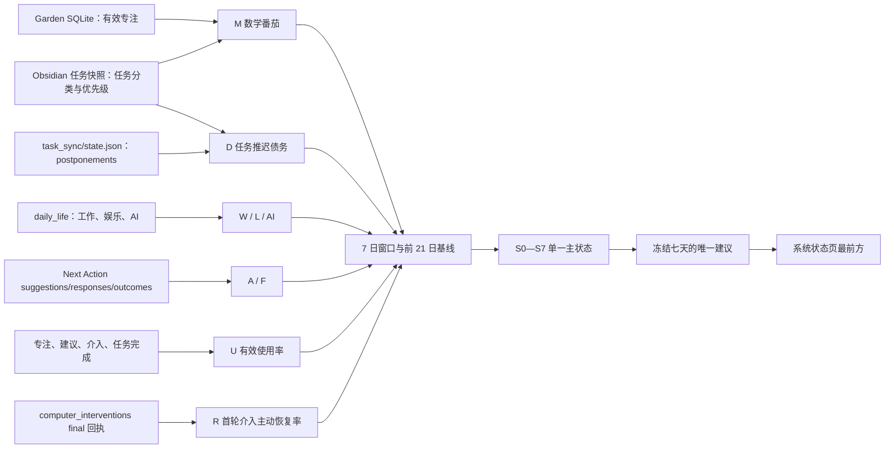

# 系统层控制&识别系统执行效果

<!-- ai_provenance: source=codex; date=2026-08-15; verification=pi-source-and-data-schema-checked; retrieved_notes="非笔记内容/工作流程与系统运维/我的专注花园/01-数据来源与处理.md,非笔记内容/工作流程与系统运维/我的专注花园/02-游戏架构.md,非笔记内容/工作流程与系统运维/我的专注花园/04-运维与扩展手册.md" -->

## 1. 目的与控制边界

本系统用于回答两个不同问题：

1. **结果是否变好或变坏？**——只看数学产出与任务推迟债务。
2. **为什么变好或变坏？**——再看可观测工作、娱乐、Next Action、系统使用和偏离后恢复。

核心目标是：

$$
\text{长期数学产出最大化}+\text{任务推迟债务最小化}.
$$

系统不生成“自律总分”。工作时间、娱乐时间、AI 使用和网站点击都不能单独决定奖惩。当前第一阶段只自动计算指标、识别一个主状态并给出一个下周期建议，不自动改变 Steam、Focus 或第二次强制介入等硬规则。

> [!important] 控制原则
> 产出决定系统是否有效，行为数据只用于解释为什么有效或失效。一周最多提出一个核心参数变化，识别结果冻结七天。

## 2. 权威数据流



Pi 生产目录 `/home/conrad/services/focus-garden` 是代码与 SQLite 的权威版本。Windows `D:\MyFocusGarden` 只是验证后的开发镜像，不参与正式写入。

## 3. 八项周级指标

### 3.1 M：数学番茄

**原始来源**

| 内容 | 权威位置 | 使用字段 |
| --- | --- | --- |
| 已完成专注 | `/home/conrad/services/focus-garden/data/focus-garden.sqlite3` 的 `focus_sessions` | `status`、`completed_at`、`credited_minutes`、`task_id`、`task_title` |
| 当前任务分类 | `/home/conrad/workspace/behavior-context-sync/context_snapshot.json` | `tasks.*[] -> task_id/title/category` |
| 已完成任务分类补充 | `/home/conrad/workspace/activitywatch-advisor/data/task_sync/state.json` | `completions[].task -> task_id/title/category` |

**过滤规则**

1. 只读取 `focus_sessions.status == "completed"`；
2. 使用 `credited_minutes`，暂停过的 session 已由 Garden 按现行规则折算；
3. 用 `task_id` 匹配任务分类，只有缺少 ID 时才以完整标题作兼容匹配；
4. `category` 含“数学”才进入 M；
5. 未绑定任务或无法匹配分类的专注不猜测为数学，只进入覆盖率分母。

$$
M_7=\frac{\sum\text{数学任务有效专注分钟}}{40}.
$$

UI 同时显示“数学任务匹配分钟 / 全部绑定任务专注分钟”。匹配率低于 50% 时 M 标为低质量，不允许它单独触发加严。

当前 Pi 的 `focus_sessions` 已有 `task_id`、`task_title`、`credited_minutes`，因此无需修改既有专注结算规则。

### 3.2 D：任务推迟债务

`D` 不使用 `due_date`，直接使用现有“推迟过 x 天”。

**原始来源**

| 内容 | 权威位置 | 使用字段 |
| --- | --- | --- |
| 累计推迟记录 | `/home/conrad/workspace/activitywatch-advisor/data/task_sync/state.json` | `postponements.<task_id>.postponed_days/postpone_count/last_postponed_at/current_scheduled_date` |
| 当前是否未完成、任务优先级 | `/home/conrad/workspace/behavior-context-sync/context_snapshot.json` | `tasks.*[] -> task_id/completed/priority` |

**计算步骤**

1. 汇总当前任务快照中的未完成任务；
2. 按 `task_id` 与 `postponements` 连接；
3. 已完成、已不存在或无法确认仍开放的任务不进入当前债务；
4. 同一 `task_id` 只计算一次；
5. 单任务累计天数封顶 7 天，避免一个长期任务永久支配状态。

优先级权重：

| priority | 权重 |
| --- | ---: |
| `highest` | 3 |
| `high` | 2 |
| `medium` | 1.5 |
| `normal` | 1 |
| `low` | 0.75 |
| `lowest` | 0.5 |

$$
D_t=\sum_{i\in\text{当前未完成且有推迟记录的任务}}w_i\min(p_i,7).
$$

其中 $p_i$ 是 `postponed_days`。截至 2026-08-15 核验时，Pi 有 2 个仍开放的推迟任务，当前 $D=4$，最大累计推迟 2 天。

为了判断变化，控制器每天保存一份不含任务正文的聚合快照：

```json
{
  "date": "2026-08-15",
  "delay_debt": 4.0,
  "postponed_task_count": 2,
  "max_postponed_days": 2,
  "weighted_new_days": 0.0
}
```

`weighted_new_days` 是与上一份日快照逐任务比较后新增的加权推迟天数；日快照内部可以保存 `task_id -> capped_days/weight` 以计算差值，但对 Web API 只返回聚合值。部署后的第一周没有历史 D 基线，因此只展示当前库存并标注“基线积累中”，不由 D 单独触发状态。

### 3.3 W：可观测工作时间

**来源**：`/home/conrad/workspace/activitywatch-advisor/data/statistics/daily_life/YYYY-MM-DD.json`

**字段**：`daily_totals.work_minutes`

$$
W_7=\sum_{d\in7\text{个完整日报日}}\text{work_minutes}_d.
$$

它来自手机、平板和电脑能识别出的工作活动，不覆盖学车、纸笔学习和其他离线事务。因此 W 只用于区分“数学少但仍在工作”和“数学、工作都少”，不作为成绩。

### 3.4 L：娱乐时间

**来源**：同一 `daily_life/YYYY-MM-DD.json`

**字段**：

- 总量：`daily_totals.entertainment_minutes`；
- 解释用拆分：`entertainment_breakdown.top_tasks`；
- 半小时偏离佐证：`mixing_metrics/YYYY-MM-DD/HH-MM.json -> all_entertainment_minutes/deviations`。

Web 控制接口只返回总分钟和变化，不返回娱乐内容名称或窗口证据。`mixing_metrics` 只作诊断交叉检查，避免与日报重复累加。

### 3.5 A：Next Action 接受率

**来源**

```text
data/next_action/suggestions/**/*.json
data/next_action/responses/**/*.json
```

**字段与过滤**

- 建议数：`suggestions.created_at` 落入窗口且 `suggestion_id` 唯一；
- 接受数：同 ID 的 response 满足 `result == "accepted"`；
- 重复文件按 `suggestion_id` 去重。

$$
A_7=\frac{\text{窗口内被接受的建议数}}{\text{窗口内生成的建议数}}.
$$

建议样本少于 5 条时标记低样本，不用它单独判断 S2。

### 3.6 F：接受后的完成率

**来源**

```text
data/next_action/responses/**/*.json
data/next_action/outcomes/**/*.json
```

先取窗口内 `result == "accepted"` 的 `suggestion_id`，再检查同 ID 是否存在 `outcome.result == "completed"`：

$$
F_7=\frac{\text{已经完成的本窗口已接受建议}}{\text{本窗口已接受建议}}.
$$

完成回执可以晚于接受窗口，但必须与窗口内接受的同一 ID 配对，避免出现完成率超过 100%。接受样本少于 3 条时标记低样本。

### 3.7 U：系统有效使用率

每个自然日只记 0 或 1。当天满足任一条件即为有效使用日：

- Garden 有一个 `completed` 专注；
- Next Action 有一个 `accepted` response；
- 首轮可选介入有一个 `accepted` final；
- `task_sync/state.json -> completions[]` 有一个任务完成实例。

$$
U_7=\frac{\text{最近 7 日有效使用日数}}7.
$$

打开网页、刷新状态、同步奖励、普通点击和被迫锁定不计入 U。

### 3.8 R：首次介入主动恢复率

`R_c` 不实现、不展示。

**来源**：`data/computer_interventions/responses/**/*final.json`

按 `request_id` 去重，只读取最终事件的 `event.decision`：

- 分母：`accepted`、`declined`、`ignored`；
- 分子：`accepted`，并且 `executions` 至少一项为成功；
- 排除：`forced`、`released`、`already_locked`、`legacy_release_ignored`、租约释放与手动 Focus 生命周期回执。

$$
R_7=\frac{\text{首轮可选介入中主动接受且执行成功}}{\text{首轮可选介入总数}}.
$$

这是“愿意在首次提醒时接受恢复动作”的指标，不宣称已经证明用户完成了原任务。样本少于 3 次时标记低样本。

## 4. AI 辅助诊断

来源仍是 `daily_life/YYYY-MM-DD.json -> ai_usage`：

| 展示项 | 计算字段 |
| --- | --- |
| `AI^task` | `by_activity.work` |
| `AI^free` | `by_activity.entertainment + by_activity.other` |
| 未判定 | `by_activity.uncertain` |

AI 不进入八项主状态的奖励函数。`AI^free` 上升只能作为 S4 的补充证据；`AI^task` 上升而 M 同时提高时不干预。

## 5. 时间窗口与基线

日内只采集和执行既有硬规则，不重新谈判参数。周级控制器使用：

- 当前窗口：最近 7 个完整日报日；
- 基线窗口：此前最多 21 日，换算成 7 日等价值；
- 日报少于 4/7 或最新日报陈旧超过 2 天：优先 S7；
- A、F、R 另受各自最小样本数约束；
- D 使用每日控制快照，与前一周冻结值比较。

第一版显著阈值：

$$
M_7<0.75M_{base},\quad W_7<0.75W_{base},\quad L_7>1.25L_{base}.
$$

比例指标除相对阈值外还要求足够样本。零基线不计算百分比变化，不用“从 0 增长无穷大”制造警报。

## 6. 单一状态机

状态选择优先级为：

$$
S5>S7>S1>S2>S3/S4>S6>S0.
$$

| 状态 | 识别条件摘要 | 唯一调整方向 |
| --- | --- | --- |
| S0 正常运行 | M、D 没有恶化，U 无危险组合 | 不调整核心参数 |
| S1 任务规划失配 | M 或 D 恶化，但 W 未下降、L 未升高 | 调整任务排序或拆分，不加娱乐限制 |
| S2 推荐失配 | A 明显下降而 F 正常 | 复核 Next Action 候选和拒绝原因 |
| S3 执行困难 | 已接受但难完成，且证据不足以归因娱乐 | 把行动缩为 20—40 分钟单元 |
| S4 娱乐性偏离 | 结果恶化、W 下降、L 升高，F/R 至少一个恶化 | 保持硬规则，只增强接受后的 Focus 建议 |
| S5 系统弃用风险 | U 下降且 M 或 D 同时恶化 | 立即停止加严，只排查一个系统摩擦点 |
| S6 自主稳定 | U 下降但 M、D 稳定 | 减少非必要提示，硬规则保持 |
| S7 不可判定/数据异常 | 数据不足，或 M/W 同降但 L 没升高 | 不调参数，只请求一次低摩擦现实情况标注 |

每周只输出一个主状态，不并列多个诊断。证据最多三条，按对本次状态判定的贡献排序。

## 7. 冻结与维护

### 每日

- 每日 04:15 生成 D 的匿名聚合日快照；
- 继续记录现有专注、任务、Next Action、行为日报和介入回执；
- 不改变控制参数。

### 每周

- 周日 21:10 生成控制快照；
- 如果上一快照仍在 `frozen_until` 之前，定时任务不覆盖；
- 保存状态、八项指标、三条以内证据与唯一建议；
- 冻结七天；
- 第一阶段 `automatic_parameter_mutation=false`。

### 每月

- 检查 M 分类覆盖率、D 快照连续性以及 A/F/R 样本量；
- 检查阈值是否频繁误判；
- 只有月级维护才能决定是否改变 Steam 等硬规则；
- 删除长期不产生决策价值的统计项。

## 8. Web API 设计

`GET /api/system-status` 在原有健康数据之前增加 `control`：

```json
{
  "control": {
    "schema_version": 1,
    "generated_at": "2026-08-15T12:00:00+08:00",
    "frozen_until": "2026-08-22T12:00:00+08:00",
    "snapshot_state": "frozen",
    "state": {
      "code": "S0",
      "name": "正常运行",
      "summary": "结果与系统使用没有出现需要调整的组合。",
      "evidence": ["当前窗口没有触发显著变化阈值"],
      "single_adjustment": "本周期不调整核心参数。"
    },
    "metrics": [
      {
        "id": "D",
        "label": "任务推迟债务",
        "value": 4,
        "baseline": null,
        "unit": "点",
        "quality": "collecting",
        "coverage": "2 个当前未完成推迟任务"
      }
    ],
    "ai": {
      "task_minutes": 0,
      "free_minutes": 0,
      "unknown_minutes": 0
    },
    "policy": {
      "automatic_parameter_mutation": false,
      "weekly_change_limit": 1
    }
  }
}
```

接口不得包含任务标题、`raw_line`、窗口标题、应用内容、AI 对话、介入证据正文或任何令牌。

## 9. “系统状态”页面 UI

控制面板必须位于页面最前，原有服务健康面板位于其后：

```text
┌────────────────────────────────────────────────────────────┐
│ 周级系统判断     S0 正常运行            冻结至 08-22       │
│ 本周唯一调整：不调整核心参数                              │
│ 证据 1 · 证据 2 · 证据 3                                 │
└────────────────────────────────────────────────────────────┘
┌ M ┐ ┌ D ┐ ┌ W ┐ ┌ L ┐
┌ A ┐ ┌ F ┐ ┌ U ┐ ┌ R ┐
┌──────────────── AI 用途结构 / 数据覆盖说明 ────────────────┐
┌──────────────── 原有 Pi 服务健康面板 ──────────────────────┐
```

每张指标卡显示当前值、基线、变化、角色、质量和覆盖范围。状态颜色只表达控制含义：绿色为稳定，黄色为需要计划调整，红色为 S4/S5 风险，灰蓝为不可判定。不能用红色表示“道德失败”。

桌面为 4×2 指标网格；窄屏为 2 列；状态、唯一建议和数据质量说明始终排在图表与运维信息之前。按钮仍只有“刷新状态”，刷新不会生成新的冻结状态，也不会修改任务或参数。

## 10. 部署、回滚与验收

部署前逐文件备份 Pi 当前的 `server.py`、新增聚合模块、前端三文件和 systemd unit；不覆盖整个生产目录。部署后依次验证：

1. Python 单元测试覆盖 D 去重/封顶/优先级、A/F 配对、R 排除项、U 有效日和 S5 优先级；
2. 前端 JavaScript 语法检查；
3. 周级脚本生成一次初始冻结快照，再次运行返回 `still_frozen`；
4. `GET /api/system-status` 返回 200，包含 8 个且仅 8 个主指标；
5. 响应中搜索确认不含测试任务正文；
6. `focus-garden.service` active，仍只监听 `127.0.0.1:8838`；
7. 周级 timer enabled，下一触发时间正确；
8. `https://pi.taild4d3f7.ts.net:8460/` 的系统状态页在桌面与手机宽度均可读；
9. 花园、专注、Next Action、任务与 `recent-context` 原功能不回归；
10. 验证后把同一版本镜像到 `D:\MyFocusGarden`，正式 SQLite 仍只有 Pi 写入。

回滚只恢复本次备份的代码和 unit，重启 Focus Garden；`data/control-review.json` 与 D 日快照可以保留为审计数据，也可以停止 timer 后移至备份目录。任何回滚都不恢复或覆盖正式 Garden SQLite。

## 11. 手动“同步状态”

==“同步状态”与原来的“刷新状态”职责不同：刷新只重新读取已经保存的系统健康信息；同步会重新汇总当前 M、D、W、L、A、F、U、R，强制更新当天 D 快照，并记录最近同步时间。==

==同步不能绕过周级冻结。若当前周结论仍在冻结期，按钮只更新指标值，继续保留原状态、证据、唯一调整和 `frozen_until`；页面显示“数据已同步 · 决策冻结”。若冻结期已经结束，则只显示临时预览，等待正常周评审生成新的七日冻结结论。==

接口为 `POST /api/control/sync`，只接受 JSON。实时聚合写入 `data/control-live.json`，周级权威结论仍是 `data/control-review.json`；生成新周结论时自动废弃旧实时聚合。接口响应与系统状态页仍只包含聚合量，不返回任务标题、原始活动或报告正文。

## 12. 收集足够数据后的系统改进

### 12.1 先设置数据准入门槛

==不能以“已经运行 28 天”代替数据质量。只有下面各自门槛满足时，对应指标才允许进入状态判断；未满足的指标继续显示，但不得触发策略变化。==

- ==W、L、AI：最近 28 天至少有 24 份完整日报，当前 7 天至少覆盖 6 天，最后一份数据不超过 48 小时。==
- ==M：28 日内有效专注至少 12P，任务 ID 或标题的数学分类匹配率至少 80%；当前窗口即使为 0P 也保留，因为“从稳定基线下降到 0”本身是有效结果。==
- ==D：最近 28 天至少保存 21 个日快照，并且存在早于当前七日窗口的快照；没有推迟任务时必须明确记录 0，而不是把缺文件解释成 0。==
- ==A：28 日至少 20 次建议，当前 7 日至少 5 次建议。F：28 日至少 10 次已接受建议；样本不足时不能区分 S2 与 S3。==
- ==U：28 日至少 24 天能够读取专注、Next Action、介入或任务完成事件。==
- ==R：28 日至少 20 次合格的首轮可选介入，当前窗口至少 3 次；否则 R 只作辅助说明，不参与 S4。==

==核心结果 M 与 D 至少一个达到可靠门槛，且所有参与判定的数据源通过新鲜度检查，系统才离开因数据不足产生的 S7。==

### 12.2 把基线从简单平均升级为匹配日基线

==数据充足后应分别维护工作日、周末和用户标注的特殊日，不再直接把不同类型日期混合比较。每个当前日优先与过去同类日期比较；使用中位数和 MAD 等稳健统计降低单日异常影响，同时保留 7 日汇总供界面阅读。==

==阈值不再只写成固定的 25% 上升或下降，而是同时要求“相对变化超过阈值”和“超过个人历史正常波动”。页面增加置信度与参与判定的样本量，不把低样本变化画成确定结论。==

### 12.3 状态对应的改进必须保持单一、可逆

- ==S0：不调整，也不因表现良好自动提高要求。==
- ==S1：只调整任务排序、任务拆分和 deadline/postponement 权重，不加强娱乐限制。==
- ==S2：调整 Next Action 推荐权重，并记录拒绝理由；不提高强制接受程度。==
- ==S3：把默认行动缩小到 1P 或一个明确题组，必要时降低单次任务粒度。==
- ==S4：允许把“接受 Next Action 后默认建议启动 Focus”作为可逆软参数；Steam 30/60/30 与第二次强制介入保持稳定。==
- ==S5：停止加严，优先减少操作摩擦、提示数量或无价值功能，每周只改一项。==
- ==S6：降低普通提示频率，让系统退居后台，硬规则不随 U 下降而自动解除。==
- ==S7：只请求一次低摩擦现实情况标注，并修复缺失或错误的数据源。==

### 12.4 用单人交叉实验验证调整效果

==前四个数据合格周只运行 shadow 判断，不执行建议。之后每次只测试一个可逆软参数七天，记录变更前值、目标状态、预期方向和回滚条件；效果首先由 M 与 D 判断，W、L、A、F、U、R 只用于解释原因。==

==如果调整后连续两个合格窗口出现 M 相对匹配基线下降至少 25%，或 D 增加至少 2 个加权点，并且没有特殊日/数据缺失解释，则自动建议回滚该软参数。系统不得因为单周噪声连续修改多个参数。==

### 12.5 自动化边界

==积累至少 8–12 个数据合格周并人工确认状态判断基本可信后，最多只允许自动应用低风险、可撤销的软参数，例如 Next Action 排序权重、默认任务粒度、普通提示频率和是否默认建议进入 Focus。每次仍只改一个，保存变更日志并冻结七天。==

==以下项目永久保留在月级人工维护层：Steam 提醒/强停/冷却时长、不可提前解除的锁定、第二次强制介入、任务日期与完成状态、奖励发放规则、数据保留与隐私边界。统计系统可以提出证据，但不能自行修改。==

### 12.6 UI 与审计继续升级

==系统状态页下一阶段应增加“数据就绪度”而不是总分：逐项显示 28 日覆盖、样本门槛、最近更新时间和未就绪原因；同时增加最近四次周结论及参数变更日志。任何自动或人工调整都必须能追溯到冻结快照、证据、操作者、开始时间和回滚结果。==

<!-- ai_provenance: source=codex; date=2026-08-15; verification=implemented-sync-boundary-and-design-reviewed; retrieved_notes="系统层控制&识别系统执行效果.md" -->
