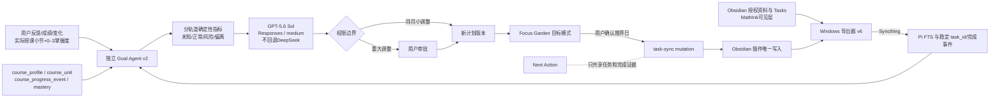
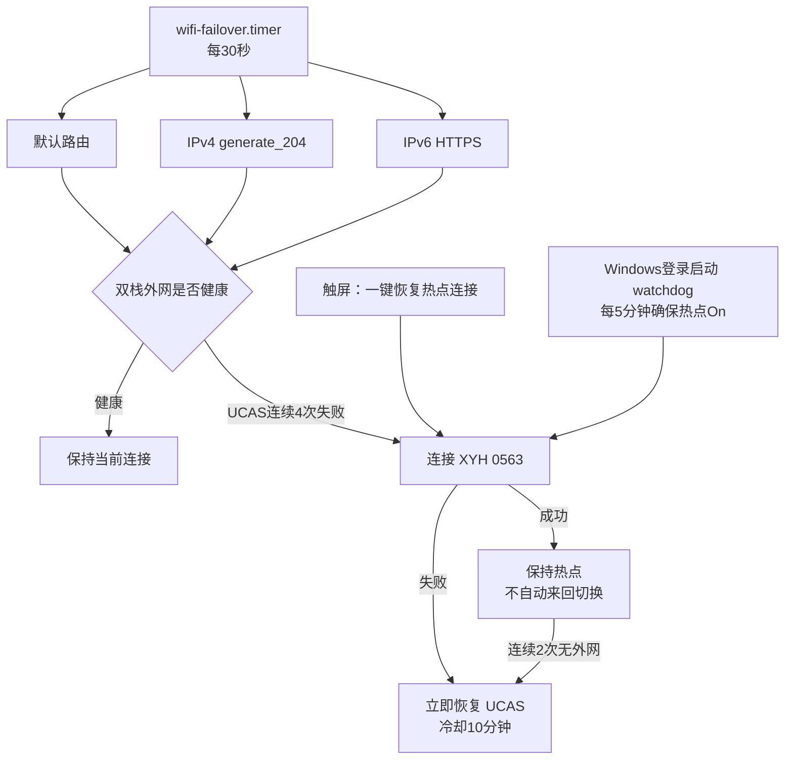

# 树莓派行为系统总流程图

<!-- ai_provenance: source=codex; date=2026-08-07; verification=server-verified; retrieved_notes="非笔记内容/工作流程与系统运维/树莓派行为数据与接口索引.md; Pi systemd/ss/tailscale inspection" -->

这张图用于快速理解目前整个系统：手机端、电脑端、平板端如何收集数据；树莓派如何接收、清洗、解释；AI 如何参与；网页和人工反馈如何回流。

==本 Markdown 内的 Mermaid 图是当前权威版本。目录中的 `树莓派行为系统总流程图-v3少线版.jpg` 是 2026-07 的历史快照，尚未包含已撤除的 `:10000`、Focus Garden `:8460` 和 2026-08-07 后的通知边界，不应用于当前运维判断。==

## 总流程图

```mermaid
flowchart LR
  %% =========================
  %% Device collection layer
  %% =========================

  subgraph Phone["手机端：vivo / Automate / 浏览器"]
    P1["Automate 前台应用日志"]
    P2["Automate 屏幕亮灭日志"]
    P3["Automate heartbeat"]
    P4["人工反馈：半小时解读是否正确"]
    P5["浏览器/PWA：下一步行动助手"]
    P6["Clash Meta 可保持开启"]
  end

  subgraph Tablet["平板端：监控恢复后"]
    T1["平板前台应用日志"]
    T2["平板屏幕亮灭日志"]
    T3["平板 heartbeat"]
  end

  subgraph Computer["电脑端：Windows / ActivityWatch / Obsidian"]
    C1["ActivityWatch 窗口与 AFK 数据"]
    C2["Obsidian Vault"]
    C3["Tasks / Profile / 番茄钟"]
    C4["behavior-context exporter\n每 20 分钟检查"]
    C5["Syncthing 发送 behavior context"]
  end

  %% =========================
  %% Network / ingress layer
  %% =========================

  subgraph Network["网络入口"]
    N1["Tailscale Funnel :443\nhttps://pi.taild4d3f7.ts.net"]
    N3["Tailscale Serve :8450\nNext Action tailnet-only"]
    N4["Tailscale Serve :8443\nMonaco Lite tailnet-only"]
    N5["Tailscale Serve :8460\nFocus Garden tailnet-only"]
  end

  %% =========================
  %% Raspberry Pi receiving layer
  %% =========================

  subgraph PiIngress["树莓派：接收层"]
    R1["phone-usage-receiver.service\n127.0.0.1:8765"]
    R2["/home/conrad/phone_usage/incoming/"]
    R3["/home/conrad/phone_usage/archive/YYYY-MM-DD/"]
    R4["syncthing@conrad.service"]
    R5["/home/conrad/workspace/activitywatch-sync"]
    R6["/home/conrad/workspace/behavior-context-sync/context_snapshot.json"]
  end

  %% =========================
  %% Processing layer
  %% =========================

  subgraph HalfHour["树莓派：半小时行为处理链"]
    H0["activitywatch-advisor.timer\n每小时 08 / 38 分"]
    H1["清洗电脑 facts\ndata/computer_facts/"]
    H2["清洗手机 facts\ndata/phone_facts/"]
    H3["清洗平板 facts\ndata/tablet_facts/"]
    H4["合并多设备 facts\ndata/combined_facts/"]
    H5["规则标签\ndata/tagged_facts/\nconfig/tag_rules.json"]
    H6["DeepSeek 语义时间线\ndata/semantic_timelines/"]
    H7["确定性混杂指标\ndata/mixing_metrics/"]
    H8["半小时 AI 解读\ndata/ai_reports/*.json / *.md"]
    H9["影子干预候选\ndata/intervention_candidates/"]
  end

  subgraph Context["树莓派：Obsidian / 任务上下文"]
    O1["读取 context_snapshot.json"]
    O2["规范化 Profile / Tasks / Pomodoro"]
    O3["data/context_cache/current.json"]
    O4["data/context_snapshots/"]
    O5["同步心跳 sync_heartbeat.json\n判断 source_changed / checked_age"]
  end

  subgraph Life["树莓派：生活统计与提醒"]
    L1["daily-life timer\n09:00 / 10:00 / 11:00"]
    L2["睡眠与生活统计\ndata/statistics/daily_life/"]
    L3["ntfy 日报回执\ndata/statistics/ntfy_receipts/daily_life/"]
    L4["bedtime-reminder.timer\n00:00–04:59"]
    L5["sysadmin-time-guard.timer\n每 3 分钟"]
    L6["phone-usage-maintenance.timer\n每日约 03:30"]
    L7["weekly-summary.timer\n周一 09:05"]
  end

  %% =========================
  %% AI and decision layer
  %% =========================

  subgraph AI["AI 层：DeepSeek"]
    A1["deepseek-v4-flash\n半小时语义/解释主流程"]
    A2["deepseek-v4-pro\n日报建议层"]
    A3["deepseek-v4-pro thinking enabled\nNext Action 决策"]
  end

  subgraph NextAction["树莓派：下一步行动助手"]
    X1["activitywatch-advisor-web.service\n127.0.0.1:8767"]
    X2["Tailnet + loopback 安全边界\n网页密码认证已关闭"]
    X3["build_decision_state()"]
    X4["读取最近报告 / mixing / context / 反馈"]
    X5["硬规则\n午饭午休 12:00–13:00\n番茄钟中等可靠"]
    X6["AI 生成建议\n只推荐一个行动"]
    X7["decision_trace\n可审计摘要，不保存完整思维链"]
    X8["state_snapshots / suggestions / active.json"]
  end

  subgraph Garden["树莓派：My Focus Garden"]
    G1["focus-garden.service\napp.py → 127.0.0.1:8838"]
    G2["focus_garden/server.py\nUI / API / Next Action 代理"]
    G3["Pi 权威 SQLite"]
    G4["focus-garden-backup.timer\n每分钟一致性快照"]
  end

  %% =========================
  %% Feedback layer
  %% =========================

  subgraph Feedback["反馈与校正"]
    F1["半小时报告反馈\nPOST /annotation"]
    F2["data/user_annotations/raw/"]
    F3["data/user_annotations/daily/"]
    F4["Next Action 即时反馈\n接受 / 换一个 / 现在不做"]
    F5["Next Action 执行结果\n完成 / 正在做 / 没开始"]
    F6["data/next_action/responses/"]
    F7["data/next_action/outcomes/"]
  end

  %% =========================
  %% Presentation layer
  %% =========================

  subgraph Output["展示与通知"]
    U1["本地半小时报告归档\n网页仅展示最新 3 条"]
    U2["ntfy\n日报 / 深夜 / 运维提醒"]
    U3["Next Action Web\n彩色卡片 + 少量 emoji"]
    U4["半小时报告网页视图\n仅最新 3 条\n去 Markdown 展示"]
    U5["Monaco Lite\n规则编辑 tailnet-only"]
    U6["PushPlus\n仅保留周报等独立通知"]
  end

  %% =========================
  %% Edges: collection to ingress
  %% =========================

  P1 --> N1
  P2 --> N1
  P3 --> N1
  T1 --> N1
  T2 --> N1
  T3 --> N1
  P4 --> N1
  P5 --> N3
  P6 -. "不影响 443 Funnel 上传" .-> N1

  C1 --> R5
  C2 --> C4
  C3 --> C4
  C4 --> C5
  C5 --> R4
  R4 --> R6

  N1 --> R1
  N3 --> X1
  N4 --> U5
  N5 --> G1
  G1 --> G2
  G2 --> G3
  G3 --> G4
  G2 --> X1
  R1 --> R2
  R1 --> R3
  R1 --> F1

  %% =========================
  %% Edges: half-hour processing
  %% =========================

  R3 --> H0
  R5 --> H0
  R6 --> H0
  H0 --> H1
  H0 --> H2
  H0 --> H3
  H1 --> H4
  H2 --> H4
  H3 --> H4
  H4 --> H5
  H5 --> H6
  H6 --> A1
  A1 --> H6
  H5 --> H7
  H6 --> H8
  H7 --> H8
  H8 --> H9
  H8 --> U1
  H9 --> U2

  %% =========================
  %% Edges: context and life
  %% =========================

  R6 --> O1
  O1 --> O2
  O2 --> O3
  O2 --> O4
  O5 --> O3
  R3 --> L1
  H8 --> L1
  L1 --> L2
  L2 --> A2
  A2 --> U2
  L2 --> L3
  R3 --> L4
  R3 --> L6
  R5 --> L5
  L4 --> U2
  L5 --> U2
  L7 --> U6

  %% =========================
  %% Edges: next action decision
  %% =========================

  X1 --> X2
  X2 --> X3
  O3 --> X3
  H8 --> X4
  H7 --> X4
  H6 --> X4
  L2 --> X4
  F3 --> X4
  F6 --> X4
  F7 --> X4
  X3 --> X4
  X4 --> X5
  X5 --> A3
  A3 --> X6
  X6 --> X7
  X7 --> X8
  X8 --> U3
  H8 --> U4

  %% =========================
  %% Edges: feedback loop
  %% =========================

  U4 --> F1
  F1 --> F2
  F2 --> F3
  F3 --> H8
  U3 --> F4
  U3 --> F5
  F4 --> F6
  F5 --> F7
  F6 --> X4
  F7 --> X4
```



## 读图方式

这套系统可以按五层理解：

1. 采集层：手机、平板、电脑、Obsidian 各自产生原始数据。
2. 接收层：树莓派通过 Funnel、Syncthing、ActivityWatch 同步接收数据。
3. 加工层：半小时处理链把原始数据变成 facts、tagged facts、semantic timelines、mixing metrics 和 AI reports。
4. 决策层：Next Action 在用户主动请求时读取摘要和反馈，调用 DeepSeek V4 Pro thinking，生成一个行动建议。
5. 反馈层：用户对半小时报告和行动建议的反馈会回流，作为之后修正规则和提高建议质量的依据。

## 关键入口

| 入口 | 地址 | 用途 |
|---|---|---|
| 手机上传 Funnel | `https://pi.taild4d3f7.ts.net` | Automate 上传手机/平板日志，提交半小时报告反馈 |
| Next Action tailnet-only | `https://pi.taild4d3f7.ts.net:8450` | Tailscale 内访问下一步行动助手 |
| Focus Garden tailnet-only | `https://pi.taild4d3f7.ts.net:8460` | 私有花园、系统状态和 Next Action 代理 |
| Monaco Lite | `https://pi.taild4d3f7.ts.net:8443` | tailnet-only 编辑规则 |

## 关键 API

### 手机上传服务

```text
GET  /health
PUT  /upload/foreground.jsonl
PUT  /upload/screen.jsonl
PUT  /upload/heartbeat.jsonl
PUT  /upload/tablet_foreground.jsonl
PUT  /upload/tablet_screen.jsonl
PUT  /upload/tablet_heartbeat.jsonl
POST /annotation
```

### Next Action Web

```text
GET  /login
POST /api/login
GET  /
GET  /next
POST /api/next-action
GET  /api/next-action/active
POST /api/next-action/{suggestion_id}/response
POST /api/next-action/{suggestion_id}/outcome
GET  /api/half-hour/reports
GET  /api/half-hour/report?path=...
POST /api/half-hour/feedback
```

## 最重要的数据回路

```text
设备日志
  → 半小时 AI 报告
  → 人工反馈
  → 修正规则/理解误差
  → 下一次半小时报告更准
```

```text
任务与行为摘要
  → Next Action 建议
  → 接受/拒绝/换一个
  → 完成/没开始/仍在做
  → 下一次建议更贴近真实执行
```

## 设计边界

- 半小时报告仍保留 Markdown 原文，但网页展示为去 Markdown 的手机阅读版。
- Next Action 只在用户主动点击时生成，不做持续自动决策。
- Next Action 的 `decision_trace` 只保存可审计摘要，不保存完整思维链。
- 番茄钟是中等可靠的正向证据，不是完成保证。
- Obsidian context 的内容年龄很大不一定是同步故障，要结合 sync heartbeat 判断。
- ==公网 Funnel 只暴露带令牌鉴权的手机上传/固定 Focus Bridge 白名单服务（443→8765）。Next Action `:8450`、Focus Garden `:8460`、Monaco `:8443` 均为 tailnet-only；不暴露 Cockpit、File Browser、SSH、Syncthing GUI或原始数据目录。==
- ==半小时报告继续归档并供网页读取，但不再发送 PushPlus；PushPlus 仅保留周报等独立通知。==

## 后续最值得补的一层

为了让系统不继续变乱，后续可以增加一个统一状态文件：

```text
data/current_state/next_action_context.json
```

它应当由树莓派定期或按需生成，集中收纳：

- 当前时间和例行规则；
- 最近 30 分钟、90 分钟状态；
- 当天累计工作/娱乐/休息；
- Obsidian tasks 和 Profile 摘要；
- 番茄钟摘要；
- 睡眠/恢复摘要；
- 最近半小时报告反馈；
- 最近 Next Action 接受/拒绝/执行结果。

这样后续任何 AI 或网页功能都优先读这个统一状态，而不是重新翻十几个目录。

## 2026-08-31：目标模式独立闭环



==Goal Agent 与 Next Action 不是同一个 AI。Goal Agent 的 SQLite、提示词、聊天、模型客户端、计划版本和资料检索独立；Next Action 仍只生成当前行动。外部入口沿用 Garden tailnet-only `:8460`，Garden 通过固定白名单代理到 Advisor loopback `:8767`。==

==Goal Agent 的公开搜索只允许非个人的招生/导师查询。用户成绩、简历和笔记正文不进入 Tavily；授权学习资料只由 Windows 逐项/按目录提取必要片段。MathInk 笔迹和图片二进制不离开 Vault。==

<!-- ai_provenance: source=codex; date=2026-08-31; verification=production-flow-and-security-boundaries-checked; retrieved_notes="计划模式/01-整体架构与数据流.md" -->

## 2026-08-31：UCAS 与电脑热点故障回退



==Windows Tailnet peer 只作诊断，不进入 H。电脑被带走而 UCAS 正常时，不触发热点切换。==

<!-- ai_provenance: source=codex; date=2026-08-31; verification=real-hotspot-and-revert-tests; retrieved_notes="树莓派UCAS无线漫游与电脑热点自动回退.md" -->
