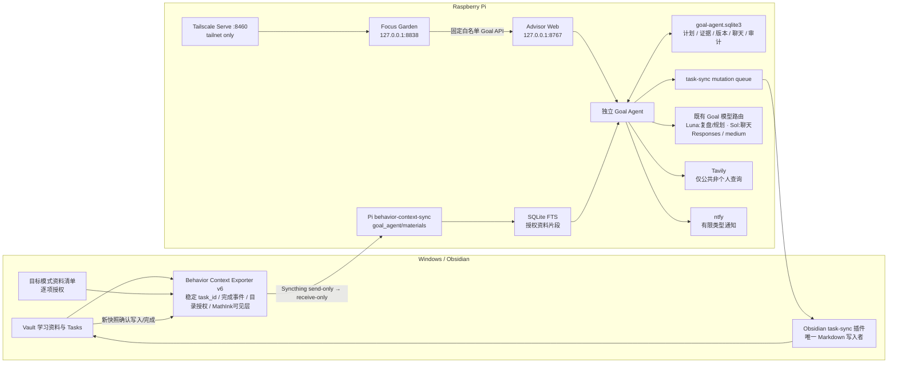
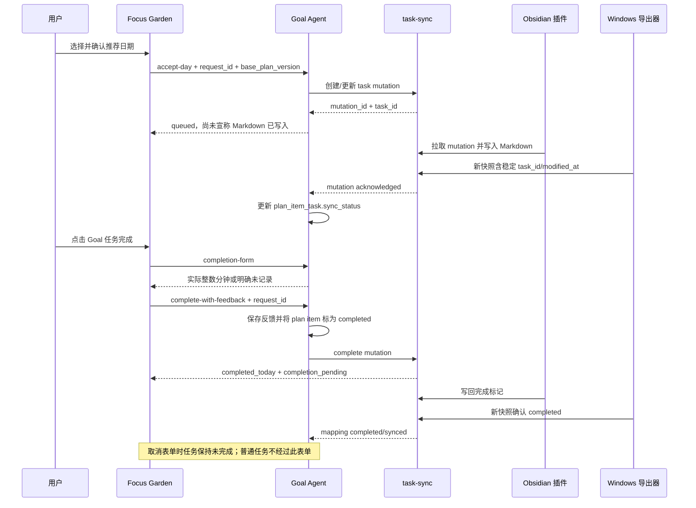
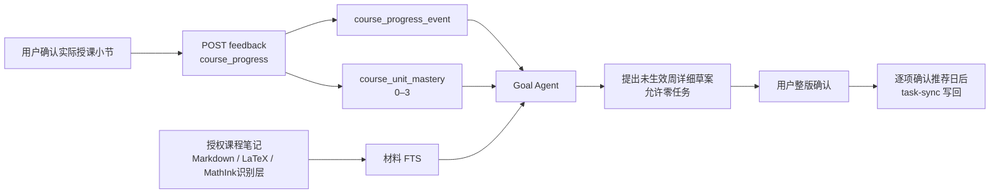
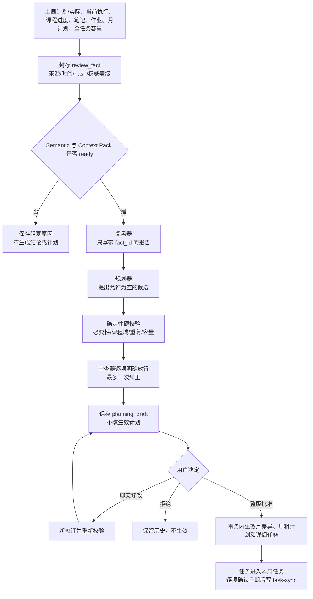
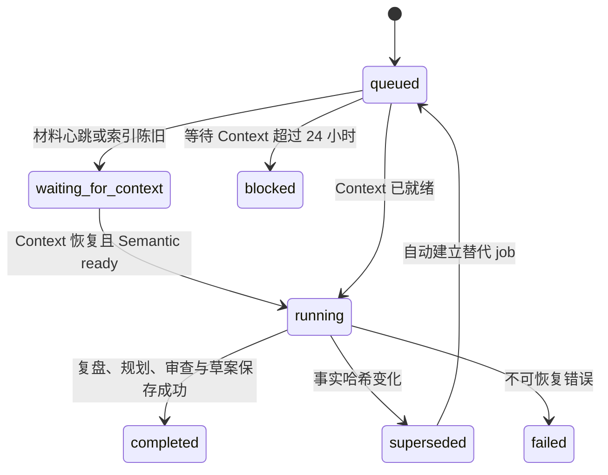

# 目标模式：整体架构与数据流

<!-- ai_provenance: source=codex; date=2026-08-31; verification=pi-production-code-api-and-service-checked; retrieved_notes="PI_SERVER_HANDOFF.md,树莓派行为数据与接口索引.md,我的专注花园/02-游戏架构.md" -->

<!-- ai_provenance: source=codex; date=2026-09-08; verification=pi-production-schema-v5-rolling-review-api-and-no-model-smoke; retrieved_notes="12-Goal Mode月计划与滚动周复盘部署验收-2026-09-08.md" -->

## 1. 整体架构



## 2. 组件职责

| 组件 | 权威职责 | 明确不做 |
|---|---|---|
| Focus Garden | 目标模式 UI、固定 API 代理、版本冲突显示 | 不保存 Goal SQLite，不直接改 Obsidian |
| Advisor Web | 在 `:8767` 暴露 Goal API，并限制 Garden bridge | 不把 Goal Agent 混入 Next Action 提示词或聊天 |
| Goal Agent | 计划、证据、进度估计、策略调整、审批、回退、资料检索 | 不自动联系导师，不绕过审批修改重大边界 |
| task-sync | 保存任务 mutation、快照确认、完成实例 | Pi 不直接写 Markdown |
| Obsidian 插件 | 应用 task-sync mutation，是唯一 Markdown 写入者 | 不计算长期目标策略 |
| Windows 导出器 v6 | 导出稳定任务 ID、近期完成事件、目录授权资料和 MathInk 可见文字 | 不调用 AI，不上传 Vault 全文，不读取未授权资料或笔迹载荷 |
| Tavily | 搜索招生、导师和公开规则 | 查询不得包含成绩、简历或笔记正文 |
| Goal 模型路由 | Luna 承担复盘/规划/审查，Sol 承担目标聊天；均在确定性事实和 Context Pack 上工作 | 沿用既有供应商与独立密钥、`medium` 推理；输出继续经过业务校验；不回退到 DeepSeek |

## 3. Goal Agent 数据模型

权威数据库：

```text
/home/conrad/workspace/activitywatch-advisor/data/goal_agent/goal-agent.sqlite3
```

主要实体：

| 表/实体 | 用途 |
|---|---|
| `portfolio` | 总目标、时间、容量和灰度开关 |
| `track` | 四轨道、权重、结果定义和截止日期 |
| `milestone` | 月度或跨月里程碑 |
| `monthly_plan` | 自然月目标、里程碑、容量、证据和生效版本 |
| `weekly_outline_item` | 未来周只公开 title 与 rough_minutes 的粗计划 |
| `weekly_plan` | 临近执行周的详细计划容器和来源复盘 |
| `monthly_week_allocation` | 跨月 ISO 周在各自然月中的分钟归属 |
| `plan_item` | 生效周详细任务、推荐日、确认日、完成表单类型、依据和状态 |
| `review_run` / `review_fact` | 复盘运行记录及不可变事实快照 |
| `planning_draft` | 未生效的月/周差异、详细候选和审查结果 |
| `course_assignment_reserve` | 每门必修课每周作业容量预留及消耗依据 |
| `evidence_event` | 耗时、完成量、得分、困难度、信心、阻塞和变化 |
| `progress_snapshot` | 每次评估后的确定性进度快照 |
| `plan_version` | 完整计划快照、差异、触发原因、actor 和回退来源 |
| `approval_request` | 重大修改的待确认请求和决定 |
| `source_record` | 官方来源、研究来源、等级、抓取时间、哈希和引用片段 |
| `chat_message` | 目标 Agent 独立对话历史 |
| `request_log` | 写请求幂等结果 |
| `plan_item_task` | `plan_item_id → task_id` 映射及同步状态 |
| `material_record` / `material_fts` | 授权资料文档元数据和可检索片段 |
| `course_profile` | 三门课教师、教材、考核比例、考试日期、课时冲突与确认状态 |
| `course_unit` | 大纲章节/小节的稳定 ID 与顺序 |
| `course_progress_event` | 用户确认的实际授课小节、习题结果、证明复述和说明 |
| `course_unit_mastery` | 每个小节当前 0–3 掌握度；历史保留在 progress event |

数据库只对 `conrad` 可读写，生产权限为 600。Garden 自身的 `focus-garden.sqlite3` 与 Goal SQLite 相互独立。

## 4. API

Garden 对外仍只有 Tailnet `https://pi.taild4d3f7.ts.net:8460`；以下路径由 Garden 固定白名单转发到 Advisor loopback：

| 方法 | 路径 | 作用 |
|---|---|---|
| GET | `/api/goal-agent/state` | 总目标、轨道进度、本周任务、资料缺口、来源、审批和边界 |
| GET | `/api/goal-agent/plan` | 自然月、未来周粗计划、当前周详细计划、作业预留和版本差异 |
| POST | `/api/goal-agent/feedback` | 写入学习、课程小节掌握度、成绩、阻塞或变化证据并重算 |
| POST | `/api/goal-agent/chat` | 目标范围内对话；`intent=revise_plan` 时只生成草案新修订 |
| POST | `/api/goal-agent/plan-items/{id}/accept-day` | 用户确认推荐日后提交任务 mutation |
| POST | `/api/goal-agent/review` | 封存事实并生成证据复盘与未生效草案 |
| GET | `/api/goal-agent/review-runs/{id}` | 读取报告、fact 依据、草案与审查结果 |
| POST | `/api/goal-agent/planning-drafts/{id}/decision` | 整版批准或拒绝草案；批准时原子生效 |
| GET | `/api/goal-agent/tasks/{task_id}/completion-form` | 读取 Goal 任务对应的完成反馈表单 |
| POST | `/api/goal-agent/tasks/{task_id}/complete-with-feedback` | 幂等保存反馈、更新 Goal 状态并提交完成 mutation |
| POST | `/api/goal-agent/approvals/{id}/decision` | 批准或拒绝重大修改 |
| POST | `/api/goal-agent/versions/{id}/rollback` | 从历史快照生成新的回退版本 |

所有写请求都带：

```json
{
  "request_id": "客户端生成的唯一安全字符串",
  "base_plan_version": 1
}
```

同一 `request_id` 重试返回原结果；旧 `base_plan_version` 返回 HTTP 409，整次请求不做部分写入。

## 5. 任务写回时序



## 6. 学习资料授权与检索

1. 用户只在 `非笔记内容/任务计划/目标模式资料清单.md` 勾选允许读取的条目；
2. 路径必须位于当前 Vault；既支持单文件，也支持带 `extensions=md,txt,pdf` 的目录递归授权；
3. Windows 导出器排除 `.ink.md`、冲突文件、隐藏目录和临时文件，并剥离普通 Markdown 内的 MathInk 笔迹载荷和内嵌 base64；
4. PDF 按页、文本按小段切分，保存页码、来源路径、修改时间和 SHA-256；
5. 压缩文件写入 `C:\Users\15345\BehaviorContextSync\goal_agent\materials\`；
6. Syncthing 把它送到 Pi 的 receive-only 目录；
7. Goal Agent 建立 SQLite FTS，只取当前判断需要的片段交给模型。

MathInk Forge 的资料边界：

- 普通 Markdown、LaTeX、`<!--inkedmark-text-->` 和分页忠实识别文字保留；
- `` 标准图片投影保留为引用，但不导出图片二进制；
- `<!-- mathink:image {...} -->` 画布坐标、压缩笔迹块和 base64 被移除；
- 只有可见文字或用户反馈能成为学习证据，手写占位符和图片路径本身不能。

取消勾选会阻止后续提取，但不会自动破坏性删除 Pi 上的旧副本；旧资料清理必须走明确的运维流程。

## 7. 课程进度闭环



## 8. 评估与改计划闭环



少于三个完整自然周或实际耗时覆盖率不足 80% 时，吞吐量继续使用 1590 分钟基准，不以计划耗时代替实际耗时。课程考核比例不完整、真实题源不足或教材范围未确认时，相应掌握度保持“待核验”。三门必修课作业预留初始每门每周 200 分钟，有至少两个可靠作业样本后按滚动中位数 +15% 调整并限制在 120–360 分钟。

## 9. 定时器与通知

- `goal-agent-review.timer`：每周日 20:30（Asia/Shanghai）触发完整复盘；
- 新成绩、课程变化、明显延期、重大困难或资料变化可通过反馈即时重算；
- 只有周复盘、重大偏离、待确认修改和资料失效使用既有 ntfy 通道；
- 通知失败不回滚已经成功提交的证据或计划版本，失败只记录为运维问题。

## 10. 安全与故障降级

- Garden 保持 `127.0.0.1:8838`，Advisor 保持 `127.0.0.1:8767`；
- `:8460` 只使用 Tailscale Serve，禁止 Funnel；
- Garden 代理只允许写死的 Goal API，不能成为任意上游代理；
- Tavily 密钥保存在 `tavily.env`；Goal Agent 模型密钥独立保存在 `goal-agent.env`，均不进入仓库、Vault、SQLite、日志或文档；
- GPT-5.6 Sol/Tavily 断网时，确定性评估、计划读取、反馈保存、审批和回退仍可工作；Goal Agent 不调用 DeepSeek 兜底；
- Syncthing 延迟时资料显示旧或待同步，不得假装已读取；
- 模型输出非法时拒绝计划 patch，保留模型错误状态，不破坏当前版本；
- SQLite、源码和配置均有部署前备份；恢复时不得用 Windows 镜像整树覆盖 Pi 生产树。

<!-- ai_provenance: source=codex; date=2026-09-09; verification=pi-production-schema-v6-real-background-review; retrieved_notes="PROJECT_STATE.md,DECISIONS.md,PI_SERVER_HANDOFF.md" -->

## 11. 后台复盘任务



浏览器只创建或复用活动 `review_job`，随后按 job id 轮询。独立 `goal-agent-review-worker.service` 使用数据库租约与心跳；浏览器关闭、Garden/Advisor 重启或 worker 崩溃后，未完成 job 仍可重领。结果发布前再次比较事实哈希，过期结果只能 supersede，不能生成生效草案。

## 12. 任务拒绝、恢复与优先级

- 未完成、未确认日期且没有 task-sync 映射的 Goal 任务可以拒绝；拒绝状态七个完整日内可恢复，期间从活动任务和容量中排除。
- 恢复时优先回到原计划周；原周已结束则移入当前详细周并重新计算推荐日。容量冲突时不恢复，只返回冲突依据。
- 优先级顺序为 `highest/high/medium/normal/low/lowest`。真实作业 DDL、有效结转、近期月度里程碑缺口与核验信息任务由确定性规则映射；`lowest` 只允许用户手动选择。
- 草案拒绝与任务拒绝都保留审计记录。草案拒绝不比较当前计划版本，草案批准仍必须比较 base_plan_version。

## 13. 材料新鲜度与每门课最新课堂笔记

Windows 导出心跳和材料索引任一超过 2700 秒，完整复盘进入 `waiting_for_context`，期间不得调用模型或生成草案。Context Pack 对每门课确定性加入最新已确认课堂记录，同时记录最新待确认课堂笔记的路径、修改时间、状态和未纳入原因；待确认笔记只能证明存在数据缺口，不能证明实际授课进度或掌握度。
