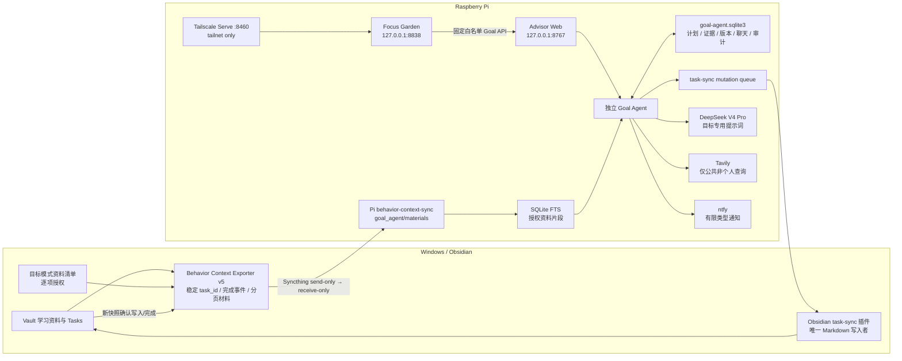
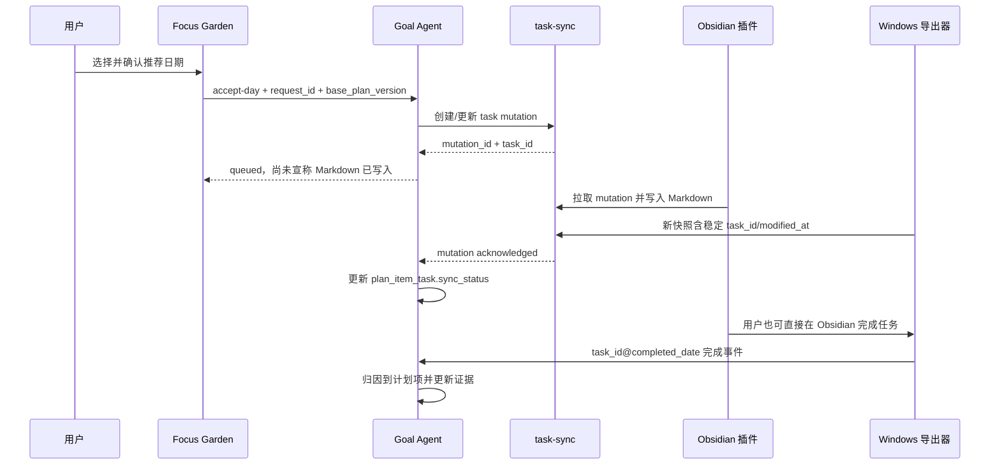
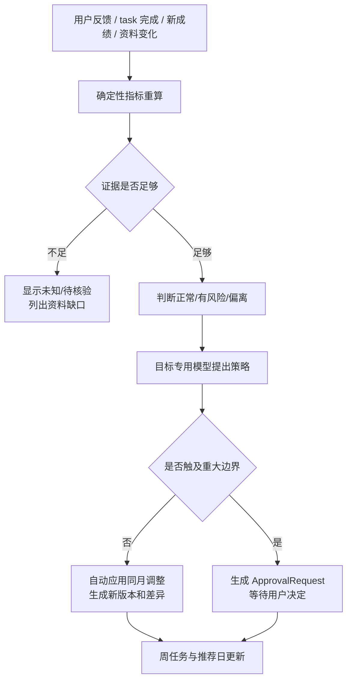

# 目标模式：整体架构与数据流

<!-- ai_provenance: source=codex; date=2026-08-31; verification=pi-production-code-api-and-service-checked; retrieved_notes="PI_SERVER_HANDOFF.md,树莓派行为数据与接口索引.md,我的专注花园/02-游戏架构.md" -->

## 1. 整体架构



## 2. 组件职责

| 组件 | 权威职责 | 明确不做 |
|---|---|---|
| Focus Garden | 目标模式 UI、固定 API 代理、版本冲突显示 | 不保存 Goal SQLite，不直接改 Obsidian |
| Advisor Web | 在 `:8767` 暴露 Goal API，并限制 Garden bridge | 不把 Goal Agent 混入 Next Action 提示词或聊天 |
| Goal Agent | 计划、证据、进度估计、策略调整、审批、回退、资料检索 | 不自动联系导师，不绕过审批修改重大边界 |
| task-sync | 保存任务 mutation、快照确认、完成实例 | Pi 不直接写 Markdown |
| Obsidian 插件 | 应用 task-sync mutation，是唯一 Markdown 写入者 | 不计算长期目标策略 |
| Windows 导出器 v5 | 导出稳定任务 ID、近期完成事件和授权资料分页文本 | 不调用 AI，不上传 Vault 全文，不读取未授权资料 |
| Tavily | 搜索招生、导师和公开规则 | 查询不得包含成绩、简历或笔记正文 |
| DeepSeek V4 Pro | 在确定性事实基础上生成解释和权限内计划建议 | 模型输出必须经过 JSON、权限和版本校验 |

## 3. Goal Agent 数据模型

权威数据库：

```text
/home/conrad/workspace/activitywatch-advisor/data/goal_agent/goal-agent.sqlite3
```

主要实体：

| 表/实体 | 用途 |
|---|---|
| `portfolio` | 总目标、时间、容量和灰度开关 |
| `track` | 四轨道、权重、结果定义和截止日期 |
| `milestone` | 月度或跨月里程碑 |
| `plan_item` | 周承诺、推荐日、确认日、深度分钟和状态 |
| `evidence_event` | 耗时、完成量、得分、困难度、信心、阻塞和变化 |
| `progress_snapshot` | 每次评估后的确定性进度快照 |
| `plan_version` | 完整计划快照、差异、触发原因、actor 和回退来源 |
| `approval_request` | 重大修改的待确认请求和决定 |
| `source_record` | 官方来源、研究来源、等级、抓取时间、哈希和引用片段 |
| `chat_message` | 目标 Agent 独立对话历史 |
| `request_log` | 写请求幂等结果 |
| `plan_item_task` | `plan_item_id → task_id` 映射及同步状态 |
| `material_record` / `material_fts` | 授权资料文档元数据和可检索片段 |

数据库只对 `conrad` 可读写，生产权限为 600。Garden 自身的 `focus-garden.sqlite3` 与 Goal SQLite 相互独立。

## 4. API

Garden 对外仍只有 Tailnet `https://pi.taild4d3f7.ts.net:8460`；以下路径由 Garden 固定白名单转发到 Advisor loopback：

| 方法 | 路径 | 作用 |
|---|---|---|
| GET | `/api/goal-agent/state` | 总目标、轨道进度、本周任务、资料缺口、来源、审批和边界 |
| GET | `/api/goal-agent/plan` | 里程碑、4 周计划与版本历史 |
| POST | `/api/goal-agent/feedback` | 写入学习/成绩/阻塞/变化证据并重算 |
| POST | `/api/goal-agent/chat` | 目标范围内的 AI 对话和权限内调整 |
| POST | `/api/goal-agent/plan-items/{id}/accept-day` | 用户确认推荐日后提交任务 mutation |
| POST | `/api/goal-agent/review` | 手动触发完整评估和公开来源刷新 |
| POST | `/api/goal-agent/approvals/{id}/decision` | 批准或拒绝重大修改 |
| POST | `/api/goal-agent/versions/{id}/rollback` | 从历史快照生成新的回退版本 |

所有写请求都带：

```json
{
  "request_id": "客户端生成的唯一安全字符串",
  "base_plan_version": 1
}
```

同一 `request_id` 重试返回原结果；旧 `base_plan_version` 返回 HTTP 409，整次请求不做部分写入。

## 5. 任务写回时序



## 6. 学习资料授权与检索

1. 用户只在 `非笔记内容/任务计划/目标模式资料清单.md` 勾选允许读取的条目；
2. 路径必须位于当前 Vault，格式为 PDF、Markdown 或纯文本；
3. Windows 导出器剥离 MathInk 笔迹载荷和内嵌 base64；
4. PDF 按页、文本按小段切分，保存页码、来源路径、修改时间和 SHA-256；
5. 压缩文件写入 `C:\Users\15345\BehaviorContextSync\goal_agent\materials\`；
6. Syncthing 把它送到 Pi 的 receive-only 目录；
7. Goal Agent 建立 SQLite FTS，只取当前判断需要的片段交给模型。

取消勾选会阻止后续提取，但不会自动破坏性删除 Pi 上的旧副本；旧资料清理必须走明确的运维流程。

## 7. 评估与改计划闭环



少于三周可比数据时，吞吐量预测必须保持“未知”。课程考核比例不完整、真实题源不足或教材范围未确认时，相应掌握度也保持“待核验”。

## 8. 定时器与通知

- `goal-agent-review.timer`：每周日 20:30（Asia/Shanghai）触发完整复盘；
- 新成绩、课程变化、明显延期、重大困难或资料变化可通过反馈即时重算；
- 只有周复盘、重大偏离、待确认修改和资料失效使用既有 ntfy 通道；
- 通知失败不回滚已经成功提交的证据或计划版本，失败只记录为运维问题。

## 9. 安全与故障降级

- Garden 保持 `127.0.0.1:8838`，Advisor 保持 `127.0.0.1:8767`；
- `:8460` 只使用 Tailscale Serve，禁止 Funnel；
- Garden 代理只允许写死的 Goal API，不能成为任意上游代理；
- Tavily 与模型密钥只放 Pi 私有环境文件，不进入仓库、Vault、SQLite、日志或文档；
- DeepSeek/Tavily 断网时，确定性评估、计划读取、反馈保存、审批和回退仍可工作；
- Syncthing 延迟时资料显示旧或待同步，不得假装已读取；
- 模型输出非法时拒绝计划 patch，保留模型错误状态，不破坏当前版本；
- SQLite、源码和配置均有部署前备份；恢复时不得用 Windows 镜像整树覆盖 Pi 生产树。

